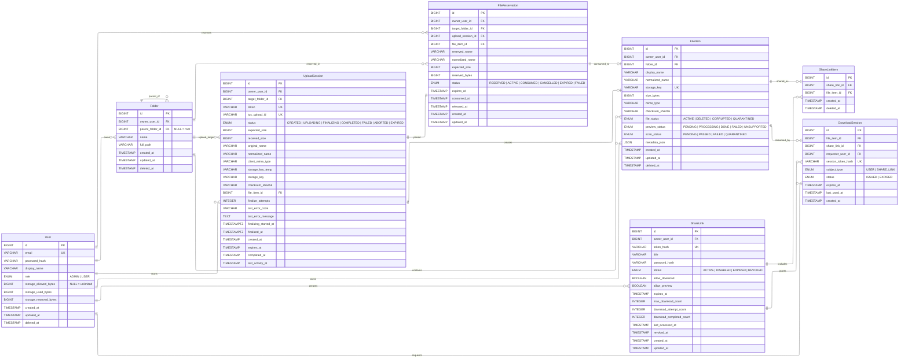

```mermaid
---

config:

  layout: elk

---

erDiagram

    direction LR

    User {

        BIGINT id PK ""  

        VARCHAR email UK ""  

        VARCHAR password_hash  ""  

        VARCHAR display_name  ""  

        ENUM role  "ADMIN | USER"  

        BIGINT storage_allowed_bytes  "NULL = unlimited"  

        BIGINT storage_used_bytes  ""  

        BIGINT storage_reserved_bytes  ""  

        TIMESTAMP created_at  ""  

        TIMESTAMP updated_at  ""  

        TIMESTAMP deleted_at  ""  

    }

  

    Folder {

        BIGINT id PK ""  

        BIGINT owner_user_id FK ""  

        BIGINT parent_folder_id FK "NULL = root"  

        VARCHAR name  ""  

        VARCHAR full_path  ""  

        TIMESTAMP created_at  ""  

        TIMESTAMP updated_at  ""  

        TIMESTAMP deleted_at  ""  

    }

  

    FileItem {

        BIGINT id PK ""  

        BIGINT owner_user_id FK ""  

        BIGINT folder_id FK ""  

        VARCHAR display_name  ""  

        VARCHAR normalized_name  ""  

        VARCHAR storage_key UK ""  

        BIGINT size_bytes  ""  

        VARCHAR mime_type  ""  

        VARCHAR checksum_sha256  ""  

        ENUM file_status  "ACTIVE | DELETED | CORRUPTED | QUARANTINED"  

        ENUM preview_status  "PENDING | PROCESSING | DONE | FAILED | UNSUPPORTED"  

        ENUM scan_status  "PENDING | PASSED | FAILED | QUARANTINED"  

        JSON metadata_json  ""  

        TIMESTAMP created_at  ""  

        TIMESTAMP updated_at  ""  

        TIMESTAMP deleted_at  ""  

    }

  

    UploadSession {

        BIGINT id PK ""  

        BIGINT owner_user_id FK ""  

        BIGINT target_folder_id FK ""  

        VARCHAR token UK ""  

        VARCHAR tus_upload_id UK ""  

        ENUM status  "CREATED | UPLOADING | FINALIZING | COMPLETED | FAILED | ABORTED | EXPIRED"  

        BIGINT expected_size  ""  

        BIGINT received_size  ""  

        VARCHAR original_name  ""  

        VARCHAR normalized_name  ""  

        VARCHAR client_mime_type  ""  

        VARCHAR storage_key_temp  ""  

        VARCHAR storage_key  ""  

        VARCHAR checksum_sha256  ""  

        BIGINT file_item_id FK ""  

        INTEGER finalize_attempts  ""  

        VARCHAR last_error_code  ""  

        TEXT last_error_message  ""  

        TIMESTAMPTZ finalizing_started_at  ""  

        TIMESTAMPTZ finalized_at  ""  

        TIMESTAMP created_at  ""  

        TIMESTAMP expires_at  ""  

        TIMESTAMP completed_at  ""  

        TIMESTAMP last_activity_at  ""  

    }

  

    FileReservation {

        BIGINT id PK ""  

        BIGINT owner_user_id FK ""  

        BIGINT target_folder_id FK ""  

        BIGINT upload_session_id FK ""  

        BIGINT file_item_id FK ""  

        VARCHAR reserved_name  ""  

        VARCHAR normalized_name  ""  

        BIGINT expected_size  ""  

        BIGINT reserved_bytes  ""  

        ENUM status  "RESERVED | ACTIVE | CONSUMED | CANCELLED | EXPIRED | FAILED"  

        TIMESTAMP expires_at  ""  

        TIMESTAMP consumed_at  ""  

        TIMESTAMP released_at  ""  

        TIMESTAMP created_at  ""  

        TIMESTAMP updated_at  ""  

    }

  

    ShareLink {

        BIGINT id PK ""  

        BIGINT owner_user_id FK ""  

        VARCHAR token_hash UK ""  

        VARCHAR title  ""  

        VARCHAR password_hash  ""  

        ENUM status  "ACTIVE | DISABLED | EXPIRED | REVOKED"  

        BOOLEAN allow_download  ""  

        BOOLEAN allow_preview  ""  

        TIMESTAMP expires_at  ""  

        INTEGER max_download_count  ""  

        INTEGER download_attempt_count  ""  

        INTEGER download_completed_count  ""  

        TIMESTAMP last_accessed_at  ""  

        TIMESTAMP revoked_at  ""  

        TIMESTAMP created_at  ""  

        TIMESTAMP updated_at  ""  

    }

  

    ShareLinkItem {

        BIGINT id PK ""  

        BIGINT share_link_id FK ""  

        BIGINT file_item_id FK ""  

        TIMESTAMP created_at  ""  

        TIMESTAMP deleted_at  ""  

    }

  

    DownloadSession {

        BIGINT id PK ""  

        BIGINT file_item_id FK ""  

        BIGINT share_link_id FK ""  

        BIGINT requester_user_id FK ""  

        VARCHAR session_token_hash UK ""  

        ENUM subject_type  "USER | SHARE_LINK"  

        ENUM status  "ISSUED | EXPIRED"  

        TIMESTAMP expires_at  ""  

        TIMESTAMP last_used_at  ""  

        TIMESTAMP created_at  ""  

    }

  

    User||--o{Folder:"owns"

    User||--o{FileItem:"owns"

    User||--o{UploadSession:"starts"

    User||--o{FileReservation:"reserves"

    User||--o{ShareLink:"creates"

    User||--o{DownloadSession:"requests"

    Folder||--o{Folder:"parent_of"

    Folder||--o{FileItem:"contains"

    Folder||--o{UploadSession:"upload_target"

    Folder||--o{FileReservation:"reserved_in"

    UploadSession||--||FileReservation:"paired"

    UploadSession||--o|FileItem:"creates"

    FileReservation||--o|FileItem:"consumed_to"

    ShareLink||--o{ShareLinkItem:"includes"

    FileItem||--o{ShareLinkItem:"shared_as"

    FileItem||--o{DownloadSession:"streamed_by"

    ShareLink||--o{DownloadSession:"grants"
```