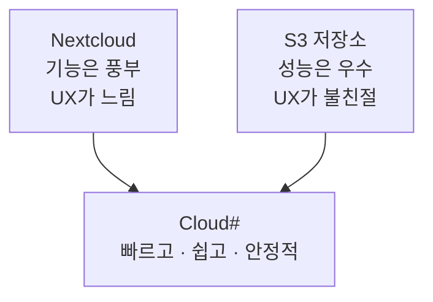
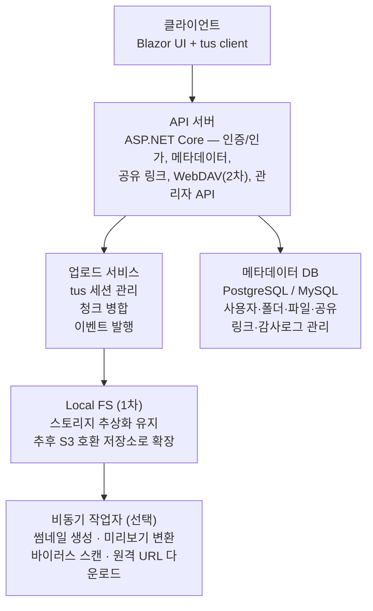

# Cloud# 서비스 제안서

## 목차

1. 프로젝트 개요
2. 문제 정의
3. 해결 방향
4. 핵심 가치 제안 및 차별점
5. 타겟 사용자
6. 기능 로드맵
7. 기술 아키텍처
8. 데이터 모델
9. 비기능 요구사항
10. 개발 일정
11. 성공 지표 (KPI)
12. 리스크 및 대응 전략
13. 기대 효과
---

## 1. 프로젝트 개요

|항목|내용|
|---|---|
|**서비스명**|Cloud#|
|**한 줄 소개**|느린 웹 기반 파일 관리의 UX를 개선하고, 1차는 Local FS로 단순하게 시작하되 향후 S3로 확장 가능한 파일 호스팅 서비스|
|**Backend**|ASP.NET Core|
|**Frontend**|Blazor (Server 또는 WASM + API 조합 검토)|
|**업로드 방식**|tus 프로토콜 (재개 가능한 대용량 업로드)|
|**저장소**|Local FS (1차), 추후 S3 호환 Object Storage로 확장|
|**개발 방식**|단계별 로드맵 — MVP → 확장 기능 → 커뮤니티 플랫폼|

---

## 2. 문제 정의

기존 파일 관리 솔루션은 두 가지 방향에서 한계를 드러냅니다.

### 2.1 Nextcloud 계열의 한계

- php 기반의 **체감 반응성 저하** — 탐색, 공유 설정, 미리보기, 페이지 전환에서 답답함 발생
- 구형 기술 스택 기반으로 **성능 최적화 및 유지보수 비용 증가**
- 무거운 기능 구조로 인해 기본적인 파일 관리 경험조차 느리게 느껴짐

### 2.2 S3 저장소의 한계

- 성능과 안정성은 우수하나 **파일 관리 UX 기능 부족**
- 폴더 구조, 공유 링크, 미리보기, 파일 정리 기능이 불친절하거나 부재
- **비개발자/일반 사용자에게 높은 진입 장벽** 존재

### 2.3 시장 공백

---

## 3. 해결 방향

**"Nextcloud의 기능성 + S3의 성능/확장성 + 현대적인 웹 UX"**

|기능성|성능·확장성|현대적 UX|
|---|---|---|
|Nextcloud 수준의 파일 관리|S3/Object Storage 기반 인프라|Blazor + 빠른 API 응답|

---

## 4. 핵심 가치 제안 및 차별점

### 4.1 핵심 가치 제안

|가치|설명|
|---|---|
|⚡ **빠르다**|클릭·탐색·미리보기 반응 속도 개선|
|🎯 **쉽다**|폴더·공유·정리 기능의 직관적 UX|
|🔒 **안정적이다**|tus 기반 대용량 업로드 중단 후 재개 가능|
|📈 **확장 가능하다**|S3 기반으로 저장소 교체·증설 용이|

### 4.2 경쟁 서비스 대비 차별점

| 구분          | Nextcloud | S3 직접 사용 | **Cloud#**       |
| ----------- | --------- | -------- | ---------------- |
| UI 반응 속도    | 느림        | 제한적      | **빠름 (최우선 목표)**  |
| 대용량 업로드 안정성 | 보통        | 지원       | **tus 기반 완전 지원** |
| 일반 사용자 친화성  | 보통        | 낮음       | **높음 (직관적 UX)**  |
| 저장소 확장성     | 제한적       | 우수       | **우수 (S3 호환)**   |
| WebDAV 지원   | 지원        | 미지원      | **2차 개발 예정**     |
| 커뮤니티/협업 기능  | 제한적       | 미지원      | **3차 개발 예정**     |

---

## 5. 타겟 사용자

### 5.1 1차 타겟

- 개인 개발자 / 홈서버 운영자
- 소규모 팀 (스터디, 프로젝트 팀, 동아리)
- NAS/클라우드 대체 솔루션을 탐색 중인 사용자

### 5.2 2차 타겟

- 크리에이터/디자이너 — 파일 공유·미리보기 수요 높음
- 내부 자료 공유가 필요한 팀/조직
- WebDAV 기반 마운트를 원하는 파워유저

### 5.3 사용자 니즈

- 빠른 업로드·다운로드
- 쉬운 폴더·파일 정리
- 링크 공유 및 권한 제어
- 브라우저에서의 미리보기
- OS 탐색기에서 직접 접근 (WebDAV)

---

## 6. 기능 로드맵

### Phase 1 — MVP (4~8주)

> 목표: 실사용 가능한 최소 제품 완성

**회원/인증**

- 회원가입, 로그인/로그아웃
- JWT Bearer 토큰 기반 인증
- 비밀번호 재설정 (이메일 기반)

**파일 관리**

- 파일 업로드 — tus 기반, 재개 가능
- 파일 다운로드 (Range 지원)
- 폴더 생성·이동·이름 변경·삭제
- 파일 이름 변경·이동·삭제
- 파일 목록 조회 (정렬/검색 기본)
- 휴지통 (소프트 삭제)

**공유**

- 공유 링크 생성
- 만료일·비밀번호 설정
- 읽기 전용 공유
- 링크 비활성화

**미리보기**

- 이미지 미리보기
- 텍스트/코드 파일 미리보기
- PDF 미리보기 (브라우저 내장 뷰어)

**관리자/운영**

- 사용자별 저장 용량 제한 (Quota)
- 파일 업로드 크기 제한
- 관리자용 사용자·용량 현황 조회

---

### Phase 2 — 확장 기능 (3~6주)

> 목표: 파워유저·운영자 사용성 강화

**WebDAV 지원**

- OS 탐색기/Finder에서 네트워크 드라이브처럼 접근
- 사용자별 권한 반영
- Windows/macOS 우선 지원

**외부 다운로드/수집** 

- URL 기반 파일 가져오기 (Remote Fetch)
- 서버 측 다운로드 큐 처리 및 진행률 표시

**고급 파일 관리**

- 태그·즐겨찾기
- 최근 파일
- 버전 관리 (간단 버전)
- 중복 파일 탐지 (해시 기반)

**운영 기능**

- 감사 로그 (업로드·삭제·공유 생성)
- 관리자 권한 정책 (RBAC)
- 알림 — 공유 링크 만료, 용량 초과 등

---

### Phase 3 — 커뮤니티 플랫폼 (추후)

> 목표: 파일 공유 중심 커뮤니티 플랫폼으로 확장

**공유 스페이스**

- 주제/팀 단위 공간 생성
- 공간별 권한 (관리자/멤버/읽기전용)
- 공간별 저장소·용량 할당

**커뮤니티/채팅**

- 파일 중심 채팅·피드
- 파일 업로드 후 즉시 공유·대화
- 링크·미디어·문서 프리뷰
- 파일·메시지 통합 검색

**장기 확장**

- 봇/자동화 업로드
- 팀 워크플로우 연동
- 실시간 협업 편집기 연동

---

## 7. 기술 아키텍처

### 기술 선택 근거

| 기술           | 선택 이유                               |
| ------------ | ----------------------------------- |
| ASP.NET Core | 높은 성능, WebDAV/S3 SDK 지원, 풍부한 생태계    |
| Blazor       | C# 풀스택으로 컨텍스트 전환 최소화                |
| tus 프로토콜     | 표준화된 재개 가능 업로드 — 네트워크 중단에 강인        |
| 스토리지 추상화 + Local FS | 1차 구현은 단순하게 가져가되, 추후 S3 호환 저장소로 확장 가능 |

---

## 8. 데이터 모델

|엔티티|설명|
|---|---|
|`User`|사용자 계정 — 인증 정보, quota 집계 캐시|
|`Folder`|사용자별 폴더 트리 메타데이터|
|`FileItem`|최종 저장 완료된 파일 메타데이터 및 접근 상태|
|`UploadSession`|tus 업로드 전송 상태와 finalize 메타데이터|
|`FileReservation`|파일명·폴더·quota 선점|
|`ShareLink`|외부 공유 링크 정책 단위|
|`ShareLinkItem`|공유 링크와 파일 연결|
|`DownloadSession`|실제 파일 스트리밍용 단명 세션 토큰|

---

## 9. 비기능 요구사항

### 9.1 성능

- 목록 조회·폴더 이동 UI 빠른 응답 — **체감 속도 최우선**
- 대용량 업로드 안정성 보장 (재개 가능)
- 썸네일·미리보기 캐싱으로 반복 요청 최적화

### 9.2 안정성

- 업로드 중단·재시도 처리
- 저장소 장애 대응 (재시도/에러 처리)
- 파일 메타데이터와 저장 객체 정합성 검증 배치

### 9.3 보안

- `Authorization` 헤더의 JWT Bearer 토큰 기반 인증
- 공유 링크 권한·만료·비밀번호 보호
- 악성 파일 업로드 대응 (백신 스캔 연계)
- 감사 로그 / 접근 로그
- HTTPS 전제

### 9.4 확장성

- 저장소 백엔드 교체 가능 (MinIO ↔ AWS S3 등)
- 모듈형 설계 — WebDAV·커뮤니티 기능 추가 용이
- API/도메인 분리로 수평 확장 대응

---

## 10. 개발 일정

|단계|기간|주요 내용|
|---|---|---|
|**Phase 0** — 기획/설계|1~2주|요구사항 확정, IA/화면 흐름 설계, DB·저장소 구조 설계, PoC (tus + Local FS + 미리보기)|
|**Phase 1** — MVP|4~8주|인증/회원, 파일/폴더 CRUD, tus 업로드·다운로드, 공유 링크, 미리보기 기본|
|**Phase 2** — 확장 기능|3~6주|WebDAV, URL 가져오기, 관리자 기능 강화, 감사 로그·알림|
|**Phase 3** — 커뮤니티|추후 협의|공유 스페이스, 채팅·피드, 공간 권한·통합 검색|

> 실제 일정은 인원수·숙련도·디자인 리소스에 따라 조정 필요

### 개발 우선순위

|우선순위|항목|
|---|---|
|**Must**|인증/회원, 파일/폴더 메타데이터, tus 업로드, 다운로드, 공유 링크, 이미지/PDF/텍스트 미리보기, Quota 설정|
|**Should**|휴지통, 즐겨찾기/최근 파일, 관리자 대시보드, 썸네일 캐싱 고도화|
|**Could**|WebDAV, URL 가져오기, 파일 버전 관리, 커뮤니티/채팅, 고급 검색/태그|

---

## 11. 성공 지표 (KPI)

### MVP 단계

|지표|설명|
|---|---|
|업로드 성공률|목표: 99%+|
|업로드 재개 성공률|중단 후 재개 성공 비율|
|파일 목록 조회 응답시간|목표: 200ms 이하|
|미리보기 생성 성공률|이미지·PDF·텍스트 기준|
|공유 링크 사용률|생성 대비 다운로드 전환율|
|DAU/WAU|초기 사용자 활성도|

### UX 중심

|지표|설명|
|---|---|
|TTFU|첫 파일 업로드까지 걸리는 시간|
|공유 링크 생성 클릭 수|생성까지 평균 클릭 수 최소화|
|사용자 만족도|체감 속도·사용성 설문|

---

## 12. 리스크 및 대응 전략

|리스크|원인|대응 전략|
|---|---|---|
|**빠른 UX 달성 실패**|서버 렌더링 지연, DB 쿼리 비효율|목록·탐색 API 최적화, 캐시 적용, 미리보기 비동기 생성, 성능 지표 관리|
|**대용량 업로드 안정성**|네트워크 중단, 청크 정합성 문제|tus 채택, 업로드 세션 상태 관리, 재시도 정책·체크섬 검증|
|**WebDAV 호환성**|OS별 클라이언트 동작 차이|2차 기능으로 분리, Windows/macOS 우선, 점진적 확장|
|**저작권·불법 사용**|외부 다운로드 기능 악용 가능성|사용자 소유/허가 콘텐츠 한정, 이용약관 명시, 신고·차단·로그 정책 마련|

---

## 13. 기대 효과

### 사용자 측면

- 기존 솔루션 대비 **빠른 파일 관리 경험** 제공
- 단순 저장소를 넘어선 **실사용 중심 파일 작업 공간**
- 대용량 업로드·공유·미리보기의 편의성 향상

### 개발·운영 측면

- 현대 기술 스택 기반 **유지보수성 향상**
- 저장소와 메타데이터 분리로 **확장성 확보**
- 단계적 기능 확장 — 파일 호스팅 → 팀 공유 → 커뮤니티 플랫폼
