# CloudSharp ERD 설계서

## 1. 문서 기준

이 문서는 현재 백엔드 EF Core 엔티티와 configuration을 기준으로 정리한 ERD다. 기준 코드는 `CloudSharp.Infrastructure/Persistence/Entities`와 `CloudSharp.Infrastructure/Persistence/Configurations`이다.

| 항목 | 기준 |
|---|---|
| DbContext | `CloudSharpDbContext` |
| 실제 테이블 소스 | `*Entity.cs` |
| 컬럼, 인덱스, 제약 조건 소스 | `*EntityConfiguration.cs` |
| 시간 타입 | `DateTimeOffset`은 PostgreSQL 기준 `timestamp with time zone` |
| JSON 타입 | PostgreSQL 기준 `jsonb`, 테스트 provider에서는 문자열 변환 |
| 삭제 동작 기본 | 명시된 관계 대부분 `NoAction`, 알림 일부만 `Cascade`, `SetNull`, `Restrict` |

## 2. 현재 테이블 목록

| 테이블 | 엔티티 | 설명 |
|---|---|---|
| `users` | `UserEntity` | 계정, 인증 정보, 시스템 역할, 사용자 상태 |
| `spaces` | `SpaceEntity` | 파일 저장과 공유의 최상위 공간, Space quota |
| `space_members` | `SpaceMemberEntity` | User와 Space의 멤버십 및 Space role |
| `space_invites` | `SpaceInviteEntity` | Space 링크 초대 |
| `folders` | `FolderEntity` | Space 내부 폴더 트리 |
| `file_items` | `FileItemEntity` | 최종 저장 완료된 파일 메타데이터 |
| `file_purge_requests` | `FilePurgeRequestEntity` | 휴지통 purge 작업 요청 기록 |
| `upload_sessions` | `UploadSessionEntity` | tus 업로드 세션 상태 |
| `file_reservations` | `FileReservationEntity` | 업로드 전 파일명과 용량 예약 |
| `share_links` | `ShareLinkEntity` | 외부 공유 링크 정책 |
| `share_link_targets` | `ShareLinkTargetEntity` | 공유 링크 대상 파일 또는 폴더 |
| `download_sessions` | `DownloadSessionEntity` | 다운로드 세션 토큰 기록 |
| `outbox_events` | `OutboxEventEntity` | 도메인 이벤트 outbox |
| `notifications` | `NotificationEntity` | 사용자 또는 Space visible notification |
| `notification_read_positions` | `NotificationReadPositionEntity` | 사용자별 notification 읽음 위치 |
| `mcp_tokens` | `McpTokenEntity` | MCP access token 발급 및 폐기 이력 |

## 3. Enum 타입

`CloudSharpDbContext`는 PostgreSQL 사용 시 아래 enum을 등록한다.

| DB enum | 값 |
|---|---|
| `system_role_t` | `ADMIN`, `USER` |
| `user_status_t` | `ACTIVE`, `DISABLED`, `LOCKED` |
| `space_status_t` | `ACTIVE`, `ARCHIVED`, `DELETED` |
| `space_member_role_t` | `OWNER`, `ADMIN`, `MEMBER`, `VIEWER` |
| `space_member_status_t` | `ACTIVE`, `INVITED`, `SUSPENDED`, `LEFT` |
| `file_status_t` | `ACTIVE`, `DELETED`, `CORRUPTED`, `QUARANTINED` |
| `preview_status_t` | `PENDING`, `PROCESSING`, `DONE`, `FAILED`, `UNSUPPORTED` |
| `scan_status_t` | `PENDING`, `PASSED`, `FAILED`, `QUARANTINED` |
| `upload_session_status_t` | `CREATED`, `UPLOADING`, `FINALIZING`, `COMPLETED`, `FAILED`, `ABORTED`, `EXPIRED` |
| `file_reservation_status_t` | `RESERVED`, `ACTIVE`, `CONSUMED`, `CANCELLED`, `EXPIRED`, `FAILED` |
| `share_link_status_t` | `ACTIVE`, `DISABLED`, `EXPIRED`, `REVOKED` |
| `share_link_target_type_t` | `FILE`, `FOLDER` |
| `download_subject_type_t` | `USER`, `SHARE_LINK` |
| `download_session_status_t` | `ISSUED`, `EXPIRED` |
| `mcp_token_status_t` | `ACTIVE`, `REVOKED` |

## 4. ERD

```mermaid
erDiagram
    USERS {
        BIGINT id PK
        VARCHAR email UK
        VARCHAR password_hash
        VARCHAR user_name
        VARCHAR display_name
        ENUM system_role
        ENUM status
        TIMESTAMPTZ created_at
        TIMESTAMPTZ updated_at
        TIMESTAMPTZ deleted_at
    }

    SPACES {
        BIGINT id PK
        BIGINT created_by_user_id FK
        VARCHAR name
        VARCHAR slug UK
        TEXT description
        BIGINT storage_allowed_bytes
        BIGINT storage_used_bytes
        BIGINT storage_reserved_bytes
        ENUM status
        TIMESTAMPTZ created_at
        TIMESTAMPTZ updated_at
        TIMESTAMPTZ deleted_at
    }

    SPACE_MEMBERS {
        BIGINT id PK
        BIGINT space_id FK
        BIGINT user_id FK
        ENUM role
        ENUM status
        TIMESTAMPTZ joined_at
        TIMESTAMPTZ created_at
        TIMESTAMPTZ updated_at
        TIMESTAMPTZ deleted_at
    }

    SPACE_INVITES {
        BIGINT id PK
        BIGINT space_id FK
        BIGINT inviter_user_id FK
        VARCHAR token_hash UK
        TIMESTAMPTZ expires_at
        TIMESTAMPTZ created_at
        TIMESTAMPTZ updated_at
    }

    FOLDERS {
        BIGINT id PK
        BIGINT space_id FK
        BIGINT parent_folder_id FK
        BIGINT created_by_user_id FK
        VARCHAR name
        TEXT full_path
        TIMESTAMPTZ created_at
        TIMESTAMPTZ updated_at
        TIMESTAMPTZ deleted_at
    }

    FILE_ITEMS {
        BIGINT id PK
        BIGINT space_id FK
        BIGINT folder_id FK
        BIGINT created_by_user_id FK
        VARCHAR display_name
        VARCHAR normalized_name
        VARCHAR storage_key UK
        VARCHAR storage_provider
        BIGINT size_bytes
        VARCHAR mime_type
        VARCHAR checksum_sha256
        ENUM file_status
        ENUM preview_status
        ENUM scan_status
        JSONB metadata_json
        TIMESTAMPTZ created_at
        TIMESTAMPTZ updated_at
        TIMESTAMPTZ deleted_at
    }

    FILE_PURGE_REQUESTS {
        BIGINT file_id PK
        BIGINT space_id
        VARCHAR storage_provider
        VARCHAR storage_key
        TIMESTAMPTZ requested_at
        TIMESTAMPTZ updated_at
        TIMESTAMPTZ completed_at
    }

    UPLOAD_SESSIONS {
        BIGINT id PK
        BIGINT requester_user_id FK
        BIGINT space_id FK
        BIGINT target_folder_id FK
        VARCHAR token UK
        VARCHAR tus_upload_id UK
        ENUM status
        BIGINT expected_size
        BIGINT received_size
        VARCHAR original_name
        VARCHAR normalized_name
        VARCHAR client_mime_type
        VARCHAR storage_key_temp
        VARCHAR storage_key
        VARCHAR checksum_sha256
        BIGINT file_item_id FK
        INTEGER finalize_attempts
        VARCHAR last_error_code
        TEXT last_error_message
        TIMESTAMPTZ finalizing_started_at
        TIMESTAMPTZ finalized_at
        TIMESTAMPTZ created_at
        TIMESTAMPTZ expires_at
        TIMESTAMPTZ completed_at
        TIMESTAMPTZ last_activity_at
    }

    FILE_RESERVATIONS {
        BIGINT id PK
        BIGINT requester_user_id FK
        BIGINT space_id FK
        BIGINT target_folder_id FK
        BIGINT upload_session_id FK
        BIGINT file_item_id FK
        VARCHAR reserved_name
        VARCHAR normalized_name
        BIGINT expected_size
        BIGINT reserved_bytes
        BOOLEAN is_reserved
        ENUM status
        TIMESTAMPTZ expires_at
        TIMESTAMPTZ consumed_at
        TIMESTAMPTZ released_at
        TIMESTAMPTZ created_at
        TIMESTAMPTZ updated_at
    }

    SHARE_LINKS {
        BIGINT id PK
        BIGINT space_id FK
        BIGINT created_by_user_id FK
        VARCHAR token_hash UK
        VARCHAR title
        VARCHAR password_hash
        ENUM status
        BOOLEAN allow_download
        BOOLEAN allow_preview
        TIMESTAMPTZ expires_at
        INTEGER max_download_count
        INTEGER download_attempt_count
        INTEGER download_completed_count
        TIMESTAMPTZ last_accessed_at
        TIMESTAMPTZ revoked_at
        TIMESTAMPTZ created_at
        TIMESTAMPTZ updated_at
    }

    SHARE_LINK_TARGETS {
        BIGINT id PK
        BIGINT share_link_id FK
        ENUM target_type
        BIGINT file_item_id FK
        BIGINT folder_id FK
        TIMESTAMPTZ created_at
        TIMESTAMPTZ deleted_at
    }

    DOWNLOAD_SESSIONS {
        BIGINT id PK
        BIGINT file_item_id FK
        BIGINT share_link_id FK
        BIGINT requester_user_id FK
        VARCHAR session_token_hash UK
        ENUM subject_type
        ENUM status
        TIMESTAMPTZ expires_at
        TIMESTAMPTZ last_used_at
        TIMESTAMPTZ created_at
    }

    OUTBOX_EVENTS {
        BIGINT id PK
        UUID event_id UK
        VARCHAR event_type
        INTEGER event_version
        VARCHAR aggregate_type
        BIGINT aggregate_id
        BIGINT space_id FK
        BIGINT actor_user_id FK
        JSONB payload
        JSONB headers
        VARCHAR status
        INTEGER attempts
        INTEGER max_attempts
        TIMESTAMPTZ occurred_at
        TIMESTAMPTZ enqueued_at
        TIMESTAMPTZ available_at
        VARCHAR worker_id
        TIMESTAMPTZ worker_locked_at
        TIMESTAMPTZ worker_lock_expires_at
        TIMESTAMPTZ published_at
        VARCHAR last_error_code
        TEXT last_error_message
    }

    NOTIFICATIONS {
        BIGINT id PK
        UUID notification_id UK
        VARCHAR type
        JSONB payload
        BIGINT recipient_user_id FK
        BIGINT space_id FK
        BIGINT actor_user_id FK
        VARCHAR aggregate_type
        BIGINT aggregate_id
        BIGINT outbox_event_id FK
        TIMESTAMPTZ occurred_at
        TIMESTAMPTZ created_at
        TIMESTAMPTZ expires_at
    }

    NOTIFICATION_READ_POSITIONS {
        BIGINT id PK
        BIGINT user_id FK
        BIGINT last_read_notification_id FK
        TIMESTAMPTZ last_read_at
        TIMESTAMPTZ updated_at
    }

    MCP_TOKENS {
        BIGINT id PK
        BIGINT owner_user_id FK
        VARCHAR name
        VARCHAR token_hash UK
        ENUM status
        TIMESTAMPTZ expires_at
        TIMESTAMPTZ last_used_at
        TIMESTAMPTZ created_at
        TIMESTAMPTZ revoked_at
        BIGINT revoked_by_user_id FK
    }

    USERS ||--o{ SPACES : creates
    USERS ||--o{ SPACE_MEMBERS : joins
    SPACES ||--o{ SPACE_MEMBERS : has

    SPACES ||--o{ SPACE_INVITES : has
    USERS ||--o{ SPACE_INVITES : sends

    SPACES ||--o{ FOLDERS : owns
    FOLDERS ||--o{ FOLDERS : parent_of
    USERS ||--o{ FOLDERS : creates

    SPACES ||--o{ FILE_ITEMS : owns
    FOLDERS ||--o{ FILE_ITEMS : contains
    USERS ||--o{ FILE_ITEMS : creates

    SPACES ||--o{ UPLOAD_SESSIONS : scopes
    USERS ||--o{ UPLOAD_SESSIONS : requests
    FOLDERS ||--o{ UPLOAD_SESSIONS : target
    FILE_ITEMS ||--o{ UPLOAD_SESSIONS : result

    SPACES ||--o{ FILE_RESERVATIONS : scopes
    USERS ||--o{ FILE_RESERVATIONS : requests
    FOLDERS ||--o{ FILE_RESERVATIONS : reserves_in
    UPLOAD_SESSIONS ||--|| FILE_RESERVATIONS : pairs
    FILE_ITEMS ||--o{ FILE_RESERVATIONS : consumes

    SPACES ||--o{ SHARE_LINKS : owns
    USERS ||--o{ SHARE_LINKS : creates
    SHARE_LINKS ||--o{ SHARE_LINK_TARGETS : has
    FILE_ITEMS ||--o{ SHARE_LINK_TARGETS : shared_file
    FOLDERS ||--o{ SHARE_LINK_TARGETS : shared_folder

    FILE_ITEMS ||--o{ DOWNLOAD_SESSIONS : streamed_by
    SHARE_LINKS ||--o{ DOWNLOAD_SESSIONS : grants
    USERS ||--o{ DOWNLOAD_SESSIONS : requests

    SPACES ||--o{ OUTBOX_EVENTS : scopes
    USERS ||--o{ OUTBOX_EVENTS : acts

    USERS ||--o{ NOTIFICATIONS : receives
    SPACES ||--o{ NOTIFICATIONS : targets
    USERS ||--o{ NOTIFICATIONS : acts
    OUTBOX_EVENTS ||--o| NOTIFICATIONS : projects
    USERS ||--o{ NOTIFICATION_READ_POSITIONS : reads
    NOTIFICATIONS ||--o{ NOTIFICATION_READ_POSITIONS : cursor

    USERS ||--o{ MCP_TOKENS : owns
    USERS ||--o{ MCP_TOKENS : revokes
```

`file_purge_requests.file_id`와 `space_id`는 현재 엔티티상 purge 작업을 위한 식별자로 보관되며 EF 관계는 구성되어 있지 않다.

## 5. 엔티티 상세

### 5.1 `users`

| 컬럼 | 타입 | Null | 제약/기본값 |
|---|---|---:|---|
| `id` | BIGINT | N | PK, identity |
| `email` | VARCHAR(320) | N | UNIQUE |
| `password_hash` | VARCHAR(255) | N |  |
| `user_name` | VARCHAR(100) | Y |  |
| `display_name` | VARCHAR(100) | Y |  |
| `system_role` | `system_role_t` | N | default `USER` |
| `status` | `user_status_t` | N | default `ACTIVE` |
| `created_at` | TIMESTAMPTZ | N | default `NOW()` |
| `updated_at` | TIMESTAMPTZ | N | default `NOW()` |
| `deleted_at` | TIMESTAMPTZ | Y |  |

### 5.2 `spaces`

| 컬럼 | 타입 | Null | 제약/기본값 |
|---|---|---:|---|
| `id` | BIGINT | N | PK, identity |
| `created_by_user_id` | BIGINT | N | FK `users.id`, `NoAction`, indexed |
| `name` | VARCHAR(200) | N |  |
| `slug` | VARCHAR(36) | N | UNIQUE |
| `description` | TEXT | Y |  |
| `storage_allowed_bytes` | BIGINT | Y | `NULL` means unlimited |
| `storage_used_bytes` | BIGINT | N | default `0` |
| `storage_reserved_bytes` | BIGINT | N | default `0` |
| `status` | `space_status_t` | N | default `ACTIVE` |
| `created_at` | TIMESTAMPTZ | N | default `NOW()` |
| `updated_at` | TIMESTAMPTZ | N | default `NOW()` |
| `deleted_at` | TIMESTAMPTZ | Y |  |

Checks:

| 이름 | 조건 |
|---|---|
| `chk_spaces_storage_allowed_non_negative` | `storage_allowed_bytes IS NULL OR storage_allowed_bytes >= 0` |
| `chk_spaces_storage_used_non_negative` | `storage_used_bytes >= 0` |
| `chk_spaces_storage_reserved_non_negative` | `storage_reserved_bytes >= 0` |

### 5.3 `space_members`

| 컬럼 | 타입 | Null | 제약/기본값 |
|---|---|---:|---|
| `id` | BIGINT | N | PK, identity |
| `space_id` | BIGINT | N | FK `spaces.id`, `NoAction` |
| `user_id` | BIGINT | N | FK `users.id`, `NoAction`, indexed |
| `role` | `space_member_role_t` | N |  |
| `status` | `space_member_status_t` | N | default `INVITED` |
| `joined_at` | TIMESTAMPTZ | Y |  |
| `created_at` | TIMESTAMPTZ | N | default `NOW()` |
| `updated_at` | TIMESTAMPTZ | N | default `NOW()` |
| `deleted_at` | TIMESTAMPTZ | Y |  |

Indexes:

| 이름 | 컬럼 | 조건 |
|---|---|---|
| `ux_space_members_active` | `(space_id, user_id)` | UNIQUE where `deleted_at IS NULL AND status IN ('ACTIVE', 'INVITED', 'SUSPENDED')` |
| `idx_space_members_user_id` | `user_id` |  |

### 5.4 `space_invites`

| 컬럼 | 타입 | Null | 제약/기본값 |
|---|---|---:|---|
| `id` | BIGINT | N | PK, identity |
| `space_id` | BIGINT | N | FK `spaces.id`, `NoAction`, indexed |
| `inviter_user_id` | BIGINT | N | FK `users.id`, `NoAction` |
| `token_hash` | VARCHAR(255) | N | UNIQUE |
| `expires_at` | TIMESTAMPTZ | Y |  |
| `created_at` | TIMESTAMPTZ | N | default `NOW()` |
| `updated_at` | TIMESTAMPTZ | N | default `NOW()` |

현재 API 계약상 초대 토큰 원문을 이 컬럼에 저장하지만 물리 컬럼명은 `token_hash`를 유지한다.

### 5.5 `folders`

| 컬럼 | 타입 | Null | 제약/기본값 |
|---|---|---:|---|
| `id` | BIGINT | N | PK, identity |
| `space_id` | BIGINT | N | FK `spaces.id`, `NoAction` |
| `parent_folder_id` | BIGINT | Y | self FK `folders.id`, `NoAction` |
| `created_by_user_id` | BIGINT | N | FK `users.id`, `NoAction` |
| `name` | VARCHAR(255) | N |  |
| `full_path` | TEXT | Y |  |
| `created_at` | TIMESTAMPTZ | N | default `NOW()` |
| `updated_at` | TIMESTAMPTZ | N | default `NOW()` |
| `deleted_at` | TIMESTAMPTZ | Y |  |

Checks and indexes:

| 종류 | 이름 | 조건/컬럼 |
|---|---|---|
| CHECK | `chk_folders_name_not_blank` | `BTRIM(name) <> ''` |
| INDEX | `idx_folders_space_parent` | `(space_id, parent_folder_id)` |
| UNIQUE | `ux_folders_space_root` | `space_id` where `parent_folder_id IS NULL AND deleted_at IS NULL` |
| UNIQUE | `ux_folders_parent_name_active` | `(parent_folder_id, name)` where `deleted_at IS NULL AND parent_folder_id IS NOT NULL` |

### 5.6 `file_items`

| 컬럼 | 타입 | Null | 제약/기본값 |
|---|---|---:|---|
| `id` | BIGINT | N | PK, identity |
| `space_id` | BIGINT | N | FK `spaces.id`, `NoAction` |
| `folder_id` | BIGINT | N | FK `folders.id`, `NoAction` |
| `created_by_user_id` | BIGINT | N | FK `users.id`, `NoAction` |
| `display_name` | VARCHAR(255) | N |  |
| `normalized_name` | VARCHAR(255) | N |  |
| `storage_key` | VARCHAR(512) | N | UNIQUE |
| `storage_provider` | VARCHAR(50) | N | default `local` |
| `size_bytes` | BIGINT | N |  |
| `mime_type` | VARCHAR(255) | Y |  |
| `checksum_sha256` | VARCHAR(64) | Y | indexed |
| `file_status` | `file_status_t` | N | default `ACTIVE` |
| `preview_status` | `preview_status_t` | N | default `PENDING` |
| `scan_status` | `scan_status_t` | N | default `PENDING` |
| `metadata_json` | JSONB | Y |  |
| `created_at` | TIMESTAMPTZ | N | default `NOW()` |
| `updated_at` | TIMESTAMPTZ | N | default `NOW()` |
| `deleted_at` | TIMESTAMPTZ | Y |  |

Checks and indexes:

| 종류 | 이름 | 조건/컬럼 |
|---|---|---|
| CHECK | `chk_file_items_size_non_negative` | `size_bytes >= 0` |
| UNIQUE | `ux_file_items_name_active` | `(space_id, folder_id, normalized_name)` where `deleted_at IS NULL AND file_status <> 'DELETED'` |
| INDEX | `idx_file_items_space_folder` | `(space_id, folder_id)` |
| INDEX | `idx_file_items_checksum_sha256` | `checksum_sha256` |

### 5.7 `file_purge_requests`

| 컬럼 | 타입 | Null | 제약/기본값 |
|---|---|---:|---|
| `file_id` | BIGINT | N | PK, value generated never |
| `space_id` | BIGINT | N | indexed, no EF FK |
| `storage_provider` | VARCHAR(50) | N |  |
| `storage_key` | VARCHAR(512) | N |  |
| `requested_at` | TIMESTAMPTZ | N |  |
| `updated_at` | TIMESTAMPTZ | N |  |
| `completed_at` | TIMESTAMPTZ | Y | indexed |

이 테이블은 purge worker용 작업 큐 성격이다. 현재 EF configuration에는 `file_items` 또는 `spaces` FK가 없다.

### 5.8 `upload_sessions`

| 컬럼 | 타입 | Null | 제약/기본값 |
|---|---|---:|---|
| `id` | BIGINT | N | PK, identity |
| `requester_user_id` | BIGINT | N | FK `users.id`, `NoAction`, indexed |
| `space_id` | BIGINT | N | FK `spaces.id`, `NoAction` |
| `target_folder_id` | BIGINT | N | FK `folders.id`, `NoAction`, indexed |
| `token` | VARCHAR(255) | N | UNIQUE |
| `tus_upload_id` | VARCHAR(255) | Y | UNIQUE |
| `status` | `upload_session_status_t` | N | default `CREATED` |
| `expected_size` | BIGINT | N |  |
| `received_size` | BIGINT | N | default `0` |
| `original_name` | VARCHAR(255) | N |  |
| `normalized_name` | VARCHAR(255) | N |  |
| `client_mime_type` | VARCHAR(255) | Y |  |
| `storage_key_temp` | VARCHAR(512) | Y |  |
| `storage_key` | VARCHAR(512) | Y |  |
| `checksum_sha256` | VARCHAR(64) | Y |  |
| `file_item_id` | BIGINT | Y | FK `file_items.id`, `NoAction` |
| `finalize_attempts` | INTEGER | N | default `0` |
| `last_error_code` | VARCHAR(100) | Y |  |
| `last_error_message` | TEXT | Y |  |
| `finalizing_started_at` | TIMESTAMPTZ | Y |  |
| `finalized_at` | TIMESTAMPTZ | Y |  |
| `created_at` | TIMESTAMPTZ | N | default `NOW()` |
| `expires_at` | TIMESTAMPTZ | Y |  |
| `completed_at` | TIMESTAMPTZ | Y |  |
| `last_activity_at` | TIMESTAMPTZ | N | default `NOW()` |

Checks and indexes:

| 종류 | 이름 | 조건/컬럼 |
|---|---|---|
| CHECK | `chk_upload_sessions_expected_size_non_negative` | `expected_size >= 0` |
| CHECK | `chk_upload_sessions_received_size_non_negative` | `received_size >= 0` |
| CHECK | `chk_upload_sessions_received_size_lte_expected` | `received_size <= expected_size` |
| CHECK | `chk_upload_sessions_finalize_attempts_non_negative` | `finalize_attempts >= 0` |
| INDEX | `idx_upload_sessions_space_status` | `(space_id, status)` |

### 5.9 `file_reservations`

| 컬럼 | 타입 | Null | 제약/기본값 |
|---|---|---:|---|
| `id` | BIGINT | N | PK, identity |
| `requester_user_id` | BIGINT | N | FK `users.id`, `NoAction` |
| `space_id` | BIGINT | N | FK `spaces.id`, `NoAction` |
| `target_folder_id` | BIGINT | N | FK `folders.id`, `NoAction`, indexed |
| `upload_session_id` | BIGINT | N | FK `upload_sessions.id`, `NoAction`, UNIQUE |
| `file_item_id` | BIGINT | Y | FK `file_items.id`, `NoAction` |
| `reserved_name` | VARCHAR(255) | N |  |
| `normalized_name` | VARCHAR(255) | N |  |
| `expected_size` | BIGINT | N |  |
| `reserved_bytes` | BIGINT | N |  |
| `is_reserved` | BOOLEAN | N | default `false` |
| `status` | `file_reservation_status_t` | N | default `RESERVED` |
| `expires_at` | TIMESTAMPTZ | Y |  |
| `consumed_at` | TIMESTAMPTZ | Y |  |
| `released_at` | TIMESTAMPTZ | Y |  |
| `created_at` | TIMESTAMPTZ | N | default `NOW()` |
| `updated_at` | TIMESTAMPTZ | N | default `NOW()` |

Checks and indexes:

| 종류 | 이름 | 조건/컬럼 |
|---|---|---|
| CHECK | `chk_file_reservations_expected_size_non_negative` | `expected_size >= 0` |
| CHECK | `chk_file_reservations_reserved_bytes_non_negative` | `reserved_bytes >= 0` |
| UNIQUE | `ux_file_reservations_name_active` | `(space_id, target_folder_id, normalized_name)` where `status IN ('RESERVED', 'ACTIVE')` |
| INDEX | `idx_file_reservations_space_status` | `(space_id, status)` |

### 5.10 `share_links`

| 컬럼 | 타입 | Null | 제약/기본값 |
|---|---|---:|---|
| `id` | BIGINT | N | PK, identity |
| `space_id` | BIGINT | N | FK `spaces.id`, `NoAction` |
| `created_by_user_id` | BIGINT | N | FK `users.id`, `NoAction` |
| `token_hash` | VARCHAR(255) | N | UNIQUE |
| `title` | VARCHAR(255) | Y |  |
| `password_hash` | VARCHAR(255) | Y |  |
| `status` | `share_link_status_t` | N | default `ACTIVE` |
| `allow_download` | BOOLEAN | N | default `true` |
| `allow_preview` | BOOLEAN | N | default `true` |
| `expires_at` | TIMESTAMPTZ | Y |  |
| `max_download_count` | INTEGER | Y |  |
| `download_attempt_count` | INTEGER | N | default `0` |
| `download_completed_count` | INTEGER | N | default `0` |
| `last_accessed_at` | TIMESTAMPTZ | Y |  |
| `revoked_at` | TIMESTAMPTZ | Y |  |
| `created_at` | TIMESTAMPTZ | N | default `NOW()` |
| `updated_at` | TIMESTAMPTZ | N | default `NOW()` |

Checks and indexes:

| 종류 | 이름 | 조건/컬럼 |
|---|---|---|
| CHECK | `chk_share_links_max_download_count_non_negative` | `max_download_count IS NULL OR max_download_count >= 0` |
| CHECK | `chk_share_links_attempt_count_non_negative` | `download_attempt_count >= 0` |
| CHECK | `chk_share_links_completed_count_non_negative` | `download_completed_count >= 0` |
| INDEX | `idx_share_links_space_status` | `(space_id, status)` |

PostgreSQL에서는 shadow property `xmin`을 row version으로 사용한다.

### 5.11 `share_link_targets`

| 컬럼 | 타입 | Null | 제약/기본값 |
|---|---|---:|---|
| `id` | BIGINT | N | PK, identity |
| `share_link_id` | BIGINT | N | FK `share_links.id`, `NoAction`, indexed |
| `target_type` | `share_link_target_type_t` | N |  |
| `file_item_id` | BIGINT | Y | FK `file_items.id`, `NoAction`, indexed |
| `folder_id` | BIGINT | Y | FK `folders.id`, `NoAction`, indexed |
| `created_at` | TIMESTAMPTZ | N | default `NOW()` |
| `deleted_at` | TIMESTAMPTZ | Y |  |

Check:

| 이름 | 조건 |
|---|---|
| `chk_share_link_targets_target_match` | file target이면 `file_item_id`만 있고 folder target이면 `folder_id`만 있음 |

### 5.12 `download_sessions`

| 컬럼 | 타입 | Null | 제약/기본값 |
|---|---|---:|---|
| `id` | BIGINT | N | PK, identity |
| `file_item_id` | BIGINT | N | FK `file_items.id`, `NoAction`, indexed |
| `share_link_id` | BIGINT | Y | FK `share_links.id`, `NoAction`, indexed |
| `requester_user_id` | BIGINT | Y | FK `users.id`, `NoAction`, indexed |
| `session_token_hash` | VARCHAR(255) | N | UNIQUE |
| `subject_type` | `download_subject_type_t` | N |  |
| `status` | `download_session_status_t` | N | default `ISSUED` |
| `expires_at` | TIMESTAMPTZ | N | indexed |
| `last_used_at` | TIMESTAMPTZ | Y |  |
| `created_at` | TIMESTAMPTZ | N | default `NOW()` |

Check:

| 이름 | 조건 |
|---|---|
| `chk_download_sessions_subject_match` | `USER`면 `requester_user_id`만 있고 `SHARE_LINK`면 `share_link_id`만 있음 |

### 5.13 `outbox_events`

| 컬럼 | 타입 | Null | 제약/기본값 |
|---|---|---:|---|
| `id` | BIGINT | N | PK, identity |
| `event_id` | UUID | N | UNIQUE |
| `event_type` | VARCHAR(200) | N | indexed with `occurred_at` |
| `event_version` | INTEGER | N | default `1` |
| `aggregate_type` | VARCHAR(100) | Y | indexed with `aggregate_id`, `occurred_at` |
| `aggregate_id` | BIGINT | Y |  |
| `space_id` | BIGINT | Y | FK `spaces.id`, `SetNull` |
| `actor_user_id` | BIGINT | Y | FK `users.id`, `SetNull` |
| `payload` | JSONB | N |  |
| `headers` | JSONB | N |  |
| `status` | VARCHAR(30) | N | default `PENDING` |
| `attempts` | INTEGER | N | default `0` |
| `max_attempts` | INTEGER | N | default `10` |
| `occurred_at` | TIMESTAMPTZ | N |  |
| `enqueued_at` | TIMESTAMPTZ | N | default `NOW()` |
| `available_at` | TIMESTAMPTZ | N | default `NOW()` |
| `worker_id` | VARCHAR(100) | Y |  |
| `worker_locked_at` | TIMESTAMPTZ | Y |  |
| `worker_lock_expires_at` | TIMESTAMPTZ | Y | indexed for processing rows |
| `published_at` | TIMESTAMPTZ | Y |  |
| `last_error_code` | VARCHAR(100) | Y |  |
| `last_error_message` | TEXT | Y |  |

Checks and polling indexes:

| 종류 | 이름 | 조건/컬럼 |
|---|---|---|
| CHECK | `chk_outbox_events_attempts_non_negative` | `attempts >= 0` |
| CHECK | `chk_outbox_events_max_attempts_positive` | `max_attempts > 0` |
| CHECK | `chk_outbox_events_event_version_positive` | `event_version > 0` |
| INDEX | `idx_outbox_events_polling` | `(available_at, id)` where `status IN ('PENDING', 'FAILED')` |
| INDEX | `idx_outbox_events_worker_lock_expires_at` | `worker_lock_expires_at` where `status = 'PROCESSING'` |

### 5.14 `notifications`

| 컬럼 | 타입 | Null | 제약/기본값 |
|---|---|---:|---|
| `id` | BIGINT | N | PK, identity |
| `notification_id` | UUID | N | UNIQUE |
| `type` | VARCHAR(100) | N | indexed with `occurred_at` |
| `payload` | JSONB | N |  |
| `recipient_user_id` | BIGINT | Y | FK `users.id`, `Cascade` |
| `space_id` | BIGINT | Y | FK `spaces.id`, `Cascade` |
| `actor_user_id` | BIGINT | Y | FK `users.id`, `SetNull` |
| `aggregate_type` | VARCHAR(100) | Y |  |
| `aggregate_id` | BIGINT | Y |  |
| `outbox_event_id` | BIGINT | Y | FK `outbox_events.id`, `Restrict`, UNIQUE when not null |
| `occurred_at` | TIMESTAMPTZ | N |  |
| `created_at` | TIMESTAMPTZ | N | default `NOW()` |
| `expires_at` | TIMESTAMPTZ | Y |  |

Checks and indexes:

| 종류 | 이름 | 조건/컬럼 |
|---|---|---|
| CHECK | `chk_notifications_target_exclusive` | `recipient_user_id IS NULL OR space_id IS NULL` |
| INDEX | `idx_notifications_recipient_id_desc` | `(recipient_user_id, id)` where `recipient_user_id IS NOT NULL` |
| INDEX | `idx_notifications_space_id_desc` | `(space_id, id)` where `space_id IS NOT NULL` |
| UNIQUE | `ux_notifications_outbox_event_id` | `outbox_event_id` where `outbox_event_id IS NOT NULL` |

PostgreSQL에서는 shadow property `xmin`을 row version으로 사용한다.

### 5.15 `notification_read_positions`

| 컬럼 | 타입 | Null | 제약/기본값 |
|---|---|---:|---|
| `id` | BIGINT | N | PK, identity |
| `user_id` | BIGINT | N | FK `users.id`, `Cascade`, UNIQUE |
| `last_read_notification_id` | BIGINT | N | FK `notifications.id`, `Restrict` |
| `last_read_at` | TIMESTAMPTZ | N |  |
| `updated_at` | TIMESTAMPTZ | N | default `NOW()` |

PostgreSQL에서는 shadow property `xmin`을 row version으로 사용한다.

### 5.16 `mcp_tokens`

| 컬럼 | 타입 | Null | 제약/기본값 |
|---|---|---:|---|
| `id` | BIGINT | N | PK, identity |
| `owner_user_id` | BIGINT | N | FK `users.id`, `NoAction` |
| `name` | VARCHAR(100) | N |  |
| `token_hash` | VARCHAR(255) | N | UNIQUE |
| `status` | `mcp_token_status_t` | N | default `ACTIVE` |
| `expires_at` | TIMESTAMPTZ | N |  |
| `last_used_at` | TIMESTAMPTZ | Y |  |
| `created_at` | TIMESTAMPTZ | N |  |
| `revoked_at` | TIMESTAMPTZ | Y |  |
| `revoked_by_user_id` | BIGINT | Y | FK `users.id`, `NoAction` |

Checks and indexes:

| 종류 | 이름 | 조건/컬럼 |
|---|---|---|
| CHECK | `chk_mcp_tokens_expires_after_created` | `expires_at > created_at` |
| UNIQUE | `ux_mcp_tokens_token_hash` | `token_hash` |
| INDEX | `idx_mcp_tokens_owner_created_at` | `(owner_user_id, created_at)` |
| INDEX | `idx_mcp_tokens_status_expires_at` | `(status, expires_at)` |

## 6. 관계 요약

| 관계 | 삭제 동작 | 설명 |
|---|---|---|
| `users.id -> spaces.created_by_user_id` | `NoAction` | Space 생성자 |
| `spaces.id -> space_members.space_id` | `NoAction` | Space membership |
| `users.id -> space_members.user_id` | `NoAction` | User membership |
| `spaces.id -> space_invites.space_id` | `NoAction` | Space invite |
| `users.id -> space_invites.inviter_user_id` | `NoAction` | 초대 발행자 |
| `spaces.id -> folders.space_id` | `NoAction` | Space 폴더 |
| `folders.id -> folders.parent_folder_id` | `NoAction` | 폴더 tree |
| `spaces.id -> file_items.space_id` | `NoAction` | Space 파일 |
| `folders.id -> file_items.folder_id` | `NoAction` | 폴더 파일 |
| `users.id -> file_items.created_by_user_id` | `NoAction` | 파일 생성자 |
| `upload_sessions.id -> file_reservations.upload_session_id` | `NoAction` | 업로드 세션과 예약의 1:1 대응 |
| `share_links.id -> share_link_targets.share_link_id` | `NoAction` | 공유 링크 대상 |
| `file_items.id -> download_sessions.file_item_id` | `NoAction` | 다운로드 대상 파일 |
| `spaces.id -> outbox_events.space_id` | `SetNull` | 이벤트 Space scope |
| `users.id -> outbox_events.actor_user_id` | `SetNull` | 이벤트 actor |
| `users.id -> notifications.recipient_user_id` | `Cascade` | 개인 알림 |
| `spaces.id -> notifications.space_id` | `Cascade` | Space 알림 |
| `users.id -> notifications.actor_user_id` | `SetNull` | 알림 actor |
| `outbox_events.id -> notifications.outbox_event_id` | `Restrict` | Outbox projection |
| `users.id -> notification_read_positions.user_id` | `Cascade` | 사용자별 read cursor |
| `notifications.id -> notification_read_positions.last_read_notification_id` | `Restrict` | 마지막 읽은 notification |
| `users.id -> mcp_tokens.owner_user_id` | `NoAction` | MCP token 소유자 |
| `users.id -> mcp_tokens.revoked_by_user_id` | `NoAction` | MCP token 폐기자 |

## 7. 설계 메모

- 파일, 폴더, 공유 링크, 업로드 세션, 파일 예약은 모두 `space_id`를 기준으로 Space에 귀속된다.
- `file_items.storage_provider`와 `file_purge_requests.storage_provider`는 현재 `local` 저장소 구현을 기본값으로 둔다.
- `file_purge_requests`는 현재 EF FK가 없는 작업 기록 테이블이다. 파일 삭제 이후 storage object 정리를 위해 식별자와 storage key를 별도로 보관한다.
- `outbox_events`는 이벤트 처리 실패와 재시도를 위해 상태, attempt, worker lock 컬럼을 가진다.
- `notifications`는 개인 알림(`recipient_user_id`) 또는 Space 알림(`space_id`) 중 하나만 직접 target으로 가진다.
- `notification_read_positions`는 사용자별 전체 inbox cursor 1개만 관리한다.
- `share_links`, `notifications`, `notification_read_positions`는 PostgreSQL에서 `xmin` row version을 사용한다.
