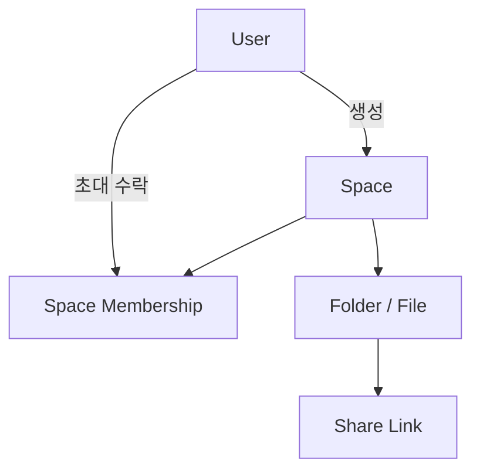
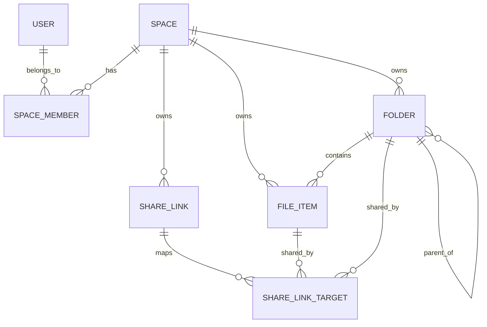

# CloudSharp - Space 기반 파일 호스팅 서비스 기획서

---

## 1. 서비스 개요

|항목|내용|
|---|---|
|서비스명|Cloud#|
|서비스 한 줄 소개|Space 단위로 독립된 파일 저장·공유·협업 환경을 제공하는 현대적 파일 호스팅 서비스|
|핵심 컨셉|사용자 개인 저장소가 아닌, **Space 중심의 완전 분리형 저장 공간**|
|주요 특징|대용량 업로드, 빠른 탐색, 공유 링크, Space 초대, Role 기반 권한 관리, AI 기반 파일 이해 및 자동화 연계|
|저장소 구조|논리적 파일 구조와 물리적 저장 구조를 분리|
|스토리지 전략|1차 Local FS, 추후 S3/Object Storage 확장|
|업로드 방식|tus 기반 재개 가능한 업로드|
|주요 타겟|개인 사용자, 팀, 프로젝트 그룹, 동아리, 소규모 조직|

---

## 2. 기획 배경

기존 파일 서비스는 대체로 두 방향으로 나뉜다.

첫째는 Nextcloud류처럼 기능은 풍부하지만 UX가 무겁고 반응 속도가 느린 방식이다.

둘째는 S3 같은 오브젝트 스토리지처럼 확장성과 안정성은 뛰어나지만, 일반 사용자가 바로 쓰기에는 관리 UX가 불친절한 방식이다. 기존 제안서 역시 이 간극을 해결하려는 방향을 갖고 있었다.

Cloud#는 이 사이의 공백을 겨냥한다.

즉, **S3 수준의 저장소 확장성 개념**과 **웹 기반 파일 서비스의 사용성**을 결합하되, 더 나아가 **Space 중심 권한 모델**을 도입해 팀/그룹 단위 사용성까지 자연스럽게 지원하는 구조를 목표로 한다.

### 2.1 고객이 가진 핵심 문제

파일을 저장하고 공유하는 사용자는 단순히 “파일을 올릴 수 있는가”보다 다음과 같은 문제를 더 크게 겪는다.

- **데이터 주권**: 내 파일이 외부 SaaS 사업자의 서버에 저장된다
- **속도와 안정성**: 대용량 파일 업로드/다운로드가 느리거나 실패 비용이 크다
- **비용**: 용량 증가에 따라 SaaS 비용이 계속 증가한다
- **협업 구조**: 공유 폴더 중심 구조에서는 소유와 권한이 개인에 종속되기 쉽다

### 2.2 왜 이런 문제가 생기는가

기존 상용 클라우드 서비스는 사용성과 외부 접근성은 뛰어나지만, 데이터가 외부 사업자 인프라에 종속되고 비용이 누적된다는 한계가 있다.

반대로 NAS 기반 셀프호스팅은 데이터 주권과 속도 측면의 장점이 있지만, 단순 공유 폴더(SMB/NFS)만으로는 외부 공유와 협업 권한 구조를 다루기 어렵고, Nextcloud 같은 대안은 기능은 풍부하지만 UX와 성능 측면에서 부담이 있다.

### 2.3 현재 고객들은 어떻게 문제를 해결하고 있는가

현재 사용자는 주로 다음과 같은 방식으로 문제를 해결하고 있다.

- **상용 클라우드 서비스 사용**: Google Drive, Dropbox 등
- **NAS + 공유 폴더 사용**: 내부망 중심 협업
- **Nextcloud 등 셀프호스팅 파일 서비스 사용**
- 필요에 따라 여러 서비스를 조합하여 사용

즉, 하나의 서비스가 데이터 주권, 속도, 사용성, 협업 구조를 동시에 만족시키지 못해 여러 대안을 조합하는 상황이 발생한다.

### 2.4 고객이 원하는 대안

고객이 원하는 대안은 복잡하지 않다.

> 데이터는 내 환경에 두면서, 사용하는 경험은 상용 클라우드처럼 편하고 속도적 답답함이 없는 구조

Cloud#은 바로 이 지점을 겨냥한다.

---

## 3. 핵심 서비스 컨셉

### 3.1 Space 중심 구조

이 서비스에서 가장 중요한 개념은 **Space**다.

Space는 하나의 독립된 파일 공간이며, 다음 특징을 가진다.

- Space와 Space는 서로 완전히 독립된다
- 하나의 Space는 자체적인 파일/폴더 구조를 가진다
- 사용자는 처음 가입 시 어떤 Space에도 속하지 않을 수 있다
- 사용자는 새로운 Space를 생성할 수 있다
- 사용자는 초대를 받아 여러 Space에 소속될 수 있다
- 파일 업로드/다운로드/공유의 기준 단위는 User가 아니라 Space다

즉, 기존의 “내 파일함” 개념을 일반화해서,

**개인도 사용할 수 있고 팀도 사용할 수 있는 버킷형 협업 저장 공간**으로 만든 것이다.

### 3.2 S3 Bucket과의 유사점, 그리고 차이점

Space는 개념적으로 S3의 Bucket과 유사하다.

유사한 점은 다음과 같다.

- 독립된 저장 공간 단위다
- 공간별 데이터가 분리된다
- 내부 파일 구조를 가진다
- 권한과 정책을 공간 단위로 적용할 수 있다

차이점은 다음과 같다.

- Space는 일반 사용자를 위한 **파일 관리 UX**를 가진다
- 폴더 탐색, 미리보기, 공유 링크, 초대 기반 협업을 제공한다
- 기술 사용자뿐 아니라 비개발자도 쉽게 사용할 수 있다
- Role 기반 권한을 통해 Discord 서버처럼 사람 중심 관리가 가능하다

### 3.3 저장 이후를 위한 파일 구조

기존 파일 서비스는 업로드와 저장, 공유에는 강하지만, 저장된 파일을 다시 찾고 활용하는 과정에는 상대적으로 약하다. 이 지점을 해결하기 위해 파일을 저장된 이후에도 다시 검색되고, 분류되고, 요약되고, 자동화 흐름으로 연결될 수 있는 대상으로 본다.

Cloud#은 다음 두 가지 방향을 함께 고려한다.

- MCP 기반 파일 활용: 저장된 파일을 AI가 더 쉽게 탐색하고 다시 활용할 수 있도록 지원
- 업로드 이벤트 기반 자동화: 파일 업로드 완료를 후속 작업의 시작점으로 삼아 외부 자동화 시스템과 연결

즉, Space가 파일을 “어떻게 저장하고 공유할 것인가”를 해결한다면, AI 연계는 저장된 파일을 “어떻게 다시 활용하고 다음 행동으로 이어질 것인가”를 해결한다.

---

## 4. 핵심 개념 정의

### 4.1 User

서비스에 가입한 계정 주체다.

User는 Space를 생성하거나, 초대를 받아 특정 Space에 참여할 수 있다.

### 4.2 Space

파일 저장과 공유의 최상위 단위다.

Space는 다음 속성을 가진다.

- 고유 이름
- 소유자
- 전체 Quota
- 구성원 목록
- Role/권한 정책
- 파일 및 폴더 트리
- 공유 링크 정책

### 4.3 Space Member

특정 사용자가 특정 Space에 속해 있음을 나타내는 소속 정보다.

한 사용자는 여러 Space에 속할 수 있으며, 각 Space마다 다른 Role을 가질 수 있다.

### 4.4 Role

Role은 **Space 전체에 대한 권한 단위**다.

권한은 개별 파일 단위가 아니라, 우선은 **Space 전체 범위** 기준으로 적용한다.

예시 Role은 다음과 같다.

|Role|설명|
|---|---|
|Owner|Space 생성자이자 최고 관리자|
|Admin|구성원 관리, 공유 정책 관리, 파일 관리 가능|
|Member|업로드/다운로드/수정 가능한 일반 참여자|
|Viewer|다운로드/열람만 가능한 읽기 전용 참여자|

초기 MVP에서는 너무 세분화하지 않고,

**Read / Write 중심의 단순 권한 체계**로 시작하는 것이 적절하다.

### 4.5 Share Link

Space 구성원이 아닌 외부 사용자에게 파일이나 폴더를 공유하기 위한 공개/비공개 링크다.

공유 방식은 두 가지로 나뉜다.

1. **링크 공유**
    - 특정 파일 또는 폴더를 선택해 공유 링크 생성
    - 만료일, 비밀번호, 다운로드 가능 여부 등의 정책 적용 가능
2. **구성원 초대**
    - 특정 사용자를 Space에 초대
    - 초대받은 사용자는 Space 멤버가 되어 내부 파일에 접근 가능
    - Role에 따라 업로드/다운로드/수정 권한이 달라짐

---

## 5. 서비스 구조 요약

이 구조에서 중요한 점은 다음과 같다.

- 파일은 User 소유 개념보다 **Space 소속 개념**이 더 중요하다
- 사용자의 권한은 파일 하나하나보다 **Space Membership + Role** 로 판단된다
- 외부 공유는 Share Link로, 내부 협업은 Membership으로 해결한다

### 5.1 아키텍처

---

## 6. 사용자 흐름

### 6.1 신규 사용자 흐름

1. 사용자가 회원가입한다
2. 처음에는 어떤 Space에도 속하지 않는다
3. 사용자는 직접 Space를 생성하거나 초대를 기다린다
4. Space를 생성하면 Owner가 된다
5. Owner는 다른 사람을 초대할 수 있다

### 6.2 Space 기반 파일 사용 흐름

1. 사용자가 특정 Space에 진입한다
2. 해당 Space 안에서 파일/폴더를 탐색한다
3. Role에 따라 업로드/다운로드/이름 변경/삭제를 수행한다
4. 외부 공유가 필요하면 파일 또는 폴더에 Share Link를 생성한다
5. 내부 협업이 필요하면 멤버를 초대한다

### 6.3 공유 흐름

### 외부 공유

- 파일 또는 폴더 선택
- 공유 링크 생성
- 만료일/비밀번호/권한 설정
- 링크 전달
- 외부 사용자는 링크를 통해 접근

### 내부 공유

- Space 설정에서 사용자 초대
- 초대받은 사용자가 수락
- Space 멤버십 생성
- Role에 따라 접근 권한 획득

---

## 7. 권한 모델

이 서비스의 권한은 **파일 개별 ACL 중심**이 아니라 **Space 전체 권한 중심**으로 시작한다.

### 7.1 권한 원칙

- 권한 판단의 기본 단위는 `Space Membership`
- 사용자는 Space에 속해야 내부 파일에 접근 가능
- Role은 Space 전체 범위에 적용
- Space 내 개인별 Quota는 두지 않음
- 저장 용량 제한은 **Space 전체 Quota** 기준으로만 관리

### 7.2 기본 권한 매트릭스 예시

|기능|Owner|Admin|Member|Viewer|
|---|---|---|---|---|
|Space 정보 조회|O|O|O|O|
|파일 다운로드|O|O|O|O|
|파일 업로드|O|O|O|X|
|파일 삭제/이동/이름변경|O|O|O|X|
|공유 링크 생성|O|O|O|X|
|구성원 초대|O|O|X|X|
|Role 변경|O|O|X|X|
|Space Quota 변경|O|X|X|X|
|Space 삭제|O|X|X|X|

초기에는 이 정도 단순한 모델이 적절하고,

추후 필요 시 폴더 단위 권한이나 세부 ACL로 확장할 수 있다.

---

## 8. Quota 정책

Quota는 개인 단위가 아니라 **Space 단위**로만 부여한다.

### 8.1 기본 정책

- 각 Space는 최대 저장 가능 용량을 가진다
- 파일 업로드 시 Space의 남은 용량을 기준으로 허용/차단한다
- 사용자 개인별 사용량 제한은 별도로 두지 않는다
- 동일 Space의 모든 멤버는 Space 용량을 공동으로 사용한다

### 8.2 장점

- 팀/프로젝트 중심 사용성에 잘 맞는다
- 권한 구조가 단순하다
- 사용자별 잔여 용량 계산이 필요 없다
- 과금 또는 플랜 정책을 Space 단위로 구성하기 쉽다

### 8.3 추후 확장 가능성

초기에는 개인별 Quota를 두지 않지만,

장기적으로는 다음과 같은 확장이 가능하다.

- Space별 요금제
- 구성원 수 제한
- Space별 업로드 크기 제한
- 특정 Role에 대한 업로드 제한 정책

---

## 9. 저장 구조 설계 원칙

기존 제안서의 스토리지 추상화 방향은 그대로 유지하되, Space 중심으로 재해석한다. 즉, 1차는 Local FS로 단순하게 구현하고, 이후 S3 호환 구조로 확장할 수 있게 설계한다.

### 9.1 논리 구조와 물리 구조 분리

사용자에게 보이는 구조와 실제 저장 구조는 같을 필요가 없다.

예를 들어 사용자에게는 다음처럼 보일 수 있다.

- `/프로젝트 문서/기획안.pdf`
- `/디자인/시안-01.png`

하지만 실제 저장소에는 다음처럼 저장될 수 있다.

- `space/18/objects/8f/13/uuid.bin`
- `space/18/objects/2c/77/uuid.bin`

즉,

- **논리 구조**: 파일명, 폴더 트리, 경로
- **물리 구조**: 해시/UUID 기반 객체 저장 경로

이 분리는 다음 장점을 준다.

- 파일명 변경 시 실제 파일 이동을 최소화할 수 있다
- 중복 방지, 충돌 회피가 쉽다
- S3/Object Storage 전환이 쉬워진다
- 내부 저장 구조를 노출하지 않아도 된다

### 9.2 저장 단위

모든 파일은 특정 Space에 소속된다.

즉, 파일 메타데이터에는 최소한 다음 정보가 필요하다.

- space_id
- parent_folder_id
- display_name
- logical_path 또는 트리 관계
- physical_storage_key
- size
- mime_type
- checksum
- creator_user_id

### 9.3 AI 활용을 위한 구조적 기반

Cloud#의 저장 구조에서 중요한 점은 논리 구조와 물리 구조를 분리한다는 것이다.

사용자에게 보이는 것은 파일명, 폴더 트리, 경로, Space 소속 같은 논리 구조이고, 실제 저장소에는 UUID 또는 해시 기반의 객체 키로 파일이 저장된다. 이 구조는 저장소 추상화와 S3 확장을 위해 필요할 뿐 아니라, 향후 AI 활용에도 유리한 기반이 된다.

기존 파일 시스템 중심 구조에서는 AI가 특정 파일을 찾으려면 실제 디렉터리를 순회하거나 파일 시스템 I/O를 반복해야 한다. 반면 Cloud#은 파일의 핵심 맥락을 DB에 정형화해 두기 때문에, 파일명, 경로, Space 소속, 업로드 시각, MIME 타입, 생성자 정보, 권한 상태를 DB 질의만으로 빠르게 조회할 수 있다.

이 구조는 다음과 같은 장점을 가진다.

- 자연어 기반 파일 탐색에 유리하다
- Space 권한 체크를 메타데이터 질의와 함께 처리할 수 있다
- 물리 파일 경로와 무관하게 논리적 파일 맥락을 유지할 수 있다
- AI가 파일을 다시 활용하기 위한 기반 정보를 안정적으로 제공할 수 있다

즉, Cloud#의 논리/물리 분리 구조는 단순한 저장 최적화 설계를 넘어, 향후 자연어 기반 파일 탐색과 자동화 기능을 가능하게 하는 구조적 기반이 된다.

---

## 10. 핵심 기능 범위

### 10.1 MVP 기능

### 계정/접근

- 회원가입
- 로그인/로그아웃
- Space 생성
- Space 초대 및 참여

### Space 관리

- Space 목록 조회
- Space 상세 조회
- Space 이름 변경
- Space 멤버 관리
- Role 변경

### 파일 관리

- 파일 업로드
- 파일 다운로드
- 폴더 생성
- 파일/폴더 이름 변경
- 파일/폴더 이동
- 파일/폴더 삭제
- 파일 목록 조회
- 정렬/검색 기본 기능

### 공유

- 파일/폴더 공유 링크 생성
- 링크 만료일 설정
- 비밀번호 설정
- 읽기 전용 링크 제공

### 정책/운영

- Space별 Quota 설정
- 업로드 가능 여부 사전 검사
- 관리자용 Space/사용량 조회

### AI 보조 기능

- 업로드 파일의 기본 유형 판별
- 파일명/문서 유형 기반 자동 태그 생성
- 업로드 완료 후 이벤트 발행(Webhook)
- 향후 외부 자동화 툴과 연계 가능한 구조 제공

### 10.2 2차 확장 기능

- Space 썸네일/아이콘
- 최근 파일
- 즐겨찾기
- 감사 로그
- 활동 내역 피드
- WebDAV
- S3 연동
- 미리보기 고도화
- 버전 관리
- 휴지통

---

## 11. 데이터 모델 초안

### 11.1 주요 엔티티

|엔티티|설명|
|---|---|
|User|계정 정보|
|Space|독립 저장 공간|
|SpaceMember|사용자와 Space의 소속 관계|
|Role|권한 정의|
|Folder|Space 내부 폴더|
|FileItem|Space 내부 파일 메타데이터|
|ShareLink|외부 공유 링크|
|ShareLinkTarget|링크와 파일/폴더의 연결|
|UploadSession|업로드 진행 상태|
|AuditLog|주요 행위 로그|

### 11.2 관계 요약

---

## 12. 차별점

### 12.1 개인 드라이브가 아닌 공간 드라이브

보통의 파일 서비스는 “내 파일” 중심이다.

Cloud#는 이를 “이 Space의 파일” 중심으로 바꾼다.

이 구조는 다음에 유리하다.

- 팀 프로젝트
- 스터디 자료방
- 동아리 공용 저장소
- 회사 내부 공유 폴더
- 개인이 운영하는 목적별 저장 버킷

### 12.2 링크 공유와 멤버 초대를 동시에 제공

대부분 서비스는 둘 중 하나에 치우치는 경우가 많다.

Cloud#는

- 외부 공개/전달은 **링크 공유**
- 내부 협업/지속 접근은 **멤버 초대**

로 명확히 분리해 사용성을 높인다.

### 12.3 기술 구현과 UX의 균형

- 내부는 S3 같은 객체 저장 개념을 수용
- 외부는 일반 사용자 친화적 폴더 UX 제공
- 스토리지 확장성과 사용 편의성을 동시에 노림

### 12.4 저장 이후를 위한 AI 연계 구조

대부분의 파일 서비스는 업로드와 저장, 공유를 중심으로 설계된다. 즉 파일은 보관 대상으로 취급된다.

Cloud#은 여기서 한 단계 더 나아가, 저장된 파일을 다시 활용하는 구조를 차별점으로 둔다.

AI 연계는 두 방향으로 구성될 수 있다.

#### (1) MCP 기반 파일 활용

Cloud#은 논리 구조와 물리 구조를 분리하고 파일 메타데이터를 정형화하기 때문에, 저장된 파일을 AI가 다시 활용하기 좋은 구조를 가진다.

예를 들어 사용자는 다음과 같은 요청을 할 수 있다.

- 지난주에 올린 PDF 찾아서 요약해줘
- 이 프로젝트 Space에서 내가 올린 보고서만 보여줘
- 이 결과를 보고서 폴더에 저장해줘

이 경우 AI는 실제 저장소의 디렉터리를 직접 순회하는 대신, DB에 저장된 파일 메타데이터를 기반으로 더 빠르게 관련 파일을 찾고 활용할 수 있다.

#### (2) 업로드 이벤트 기반 자동화

Cloud#에서 파일은 저장 대상일 뿐 아니라, 다음 워크플로우의 시작점이 될 수 있다.

파일 업로드가 완료되면 비동기 Worker가 업로드 완료 이벤트를 발행하고, 이를 외부 자동화 시스템이나 AI 서비스와 연결할 수 있다.

예를 들면 다음과 같은 흐름이 가능하다.

- 계약서 PDF 업로드 → 외부 AI가 핵심 조항 추출 → 요약본 생성
- 보고서 업로드 → 자동 요약 후 Slack/메일 발송
- 특정 폴더에 파일 추가 → 외부 서비스 자동 트리거

이 구조를 통해 Cloud#은 파일을 저장한 뒤 끝나는 서비스가 아니라, 파일이 다음 행동으로 이어지는 서비스로 확장될 수 있다.

---

## 13. 기대 효과

### 사용자 측면

- 팀이나 그룹이 하나의 파일 공간을 자연스럽게 공유할 수 있다
- 개인 저장소보다 목적 단위 정리가 쉽다
- 외부 링크 공유와 내부 협업을 모두 지원한다
- 빠른 업로드/다운로드와 단순한 권한 구조를 경험할 수 있다
- 저장된 파일을 다시 찾고 활용하는 비용을 줄일 수 있다
- 파일 업로드 이후의 반복 작업을 자동화 흐름으로 연결할 수 있다
- 단순 저장소를 넘어, 파일 기반 작업 흐름의 출발점으로 사용할 수 있다

### 서비스 측면

- 멀티테넌트 구조로 확장성이 좋다
- Space 단위 과금/정책 적용이 쉽다
- 개인 중심 서비스보다 협업 서비스로 확장 가능성이 높다
- Local FS에서 시작해도 추후 S3 구조로 자연스럽게 전환 가능하다
- AI 탐색 및 자동화 기능을 통해 저장 서비스 이상의 확장성을 가진다
- 외부 자동화 도구 및 AI 서비스와의 연계 지점을 확보할 수 있다
- Space 중심 저장 구조 위에 검색, 분류, 요약, 워크플로우 기능을 점진적으로 얹을 수 있다

---

## 14. 한 줄 정리

**Cloud#는 사용자 개인 저장소를 일반화해, S3 버킷처럼 독립적이면서도 Discord 서버처럼 사람과 권한을 수용하는 “Space 기반 파일 호스팅 서비스”다.**

---