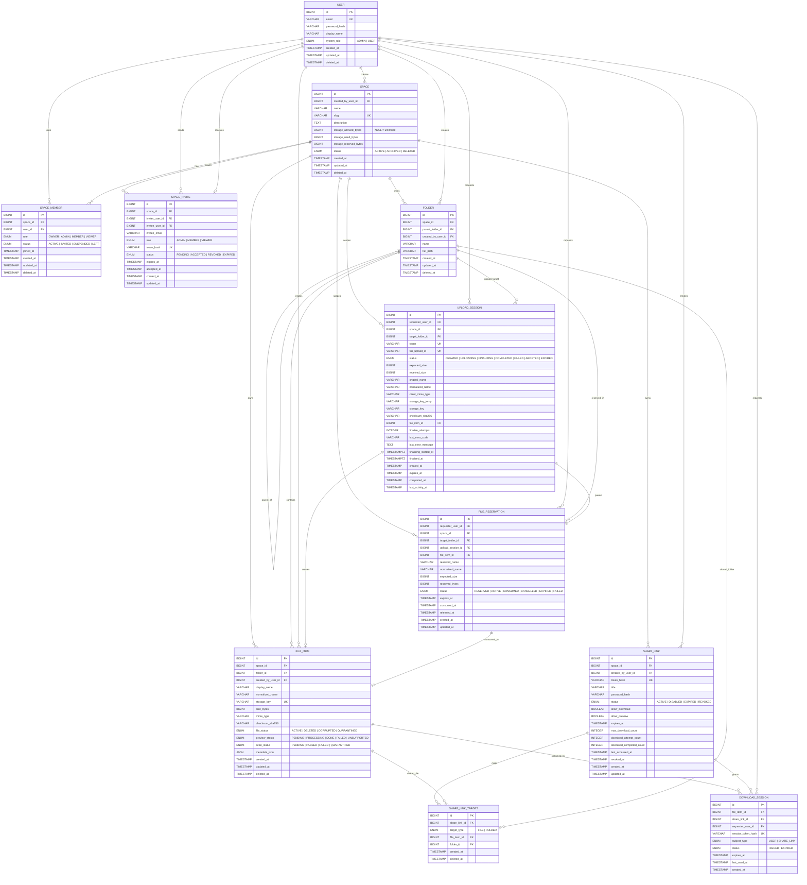
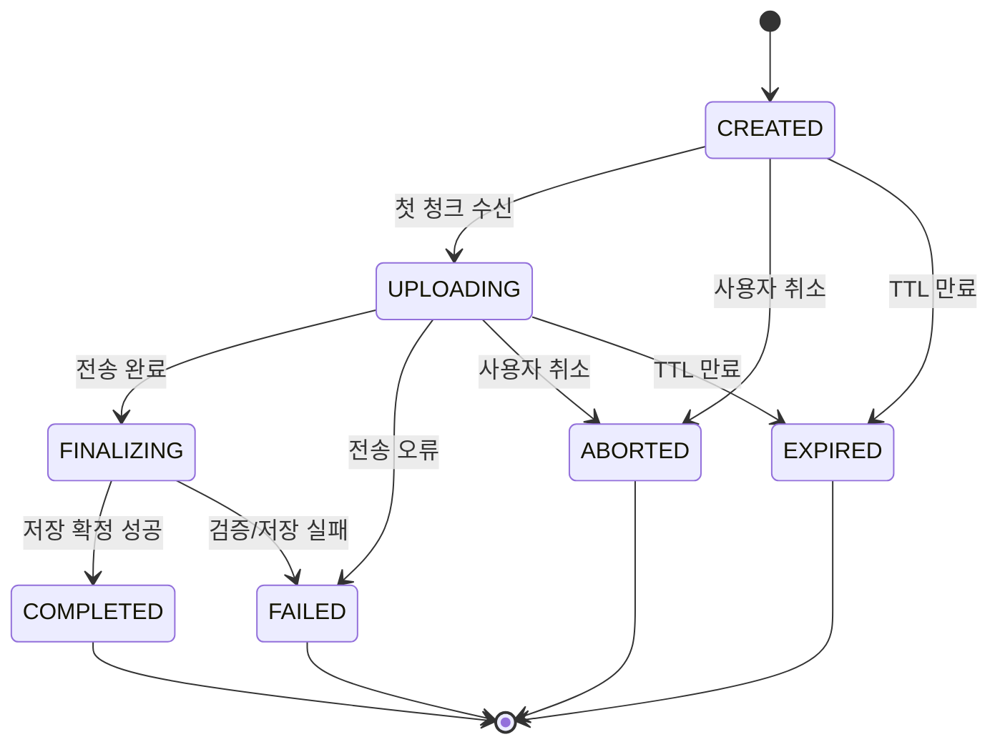
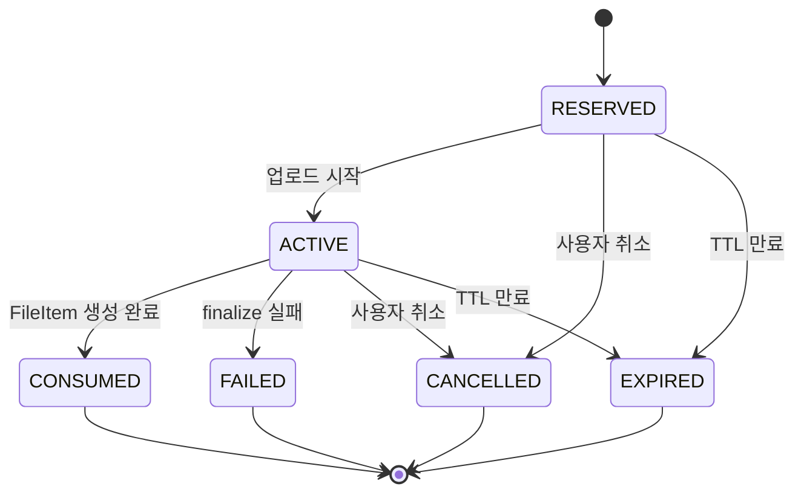
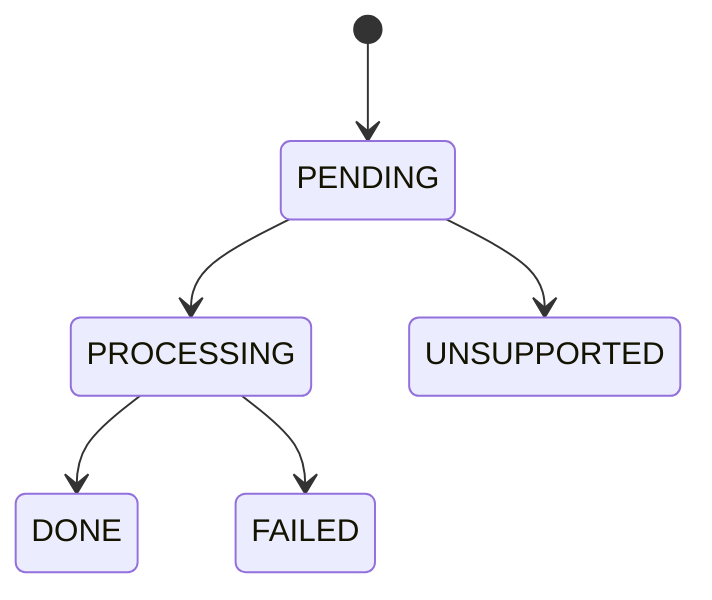
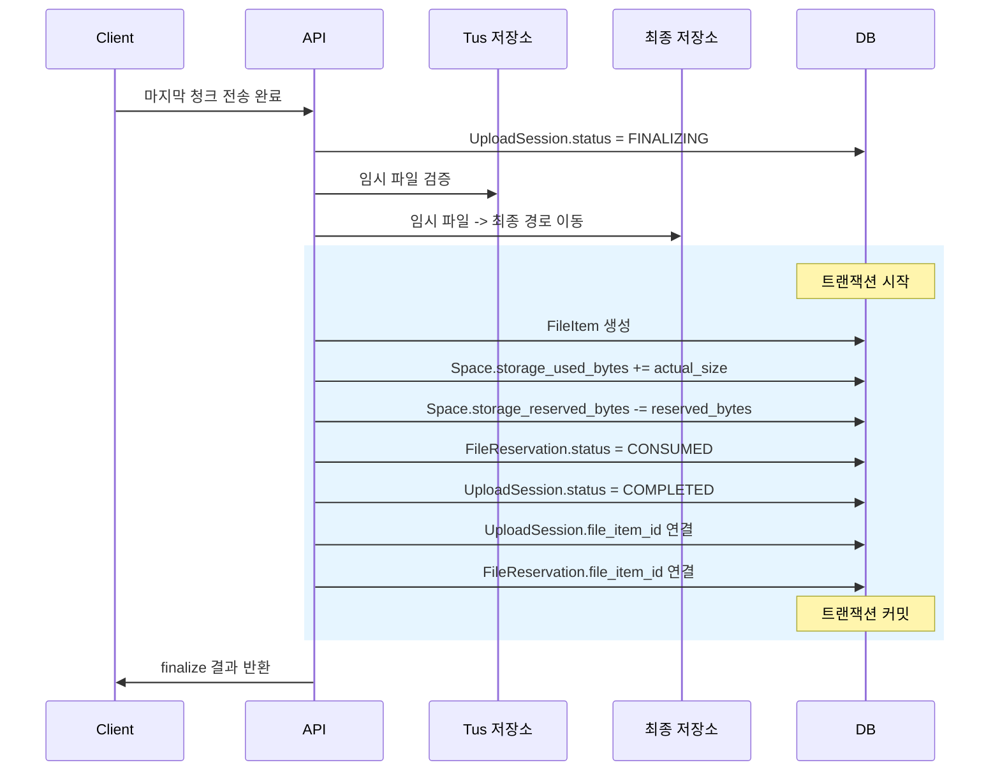

# Cloud# — Space 중심 통합 ERD 설계서

## 1. 문서 개요

본 문서는 Cloud#의 파일 서비스 데이터 모델을 **Space 중심 구조**로 재정의한 통합 ERD 설계서다.  
기존 설계의 강점인 `UploadSession → FileReservation → FileItem` 업로드 파이프라인과 `ShareLink → DownloadSession` 다운로드 파이프라인은 유지하되, 기존의 `User 소유 파일 구조`를 `Space 소유 구조`로 전환한다. 이를 통해 팀/프로젝트 단위의 독립 저장 공간, 멤버십 기반 권한, Space 단위 Quota, 파일/폴더 외부 공유를 하나의 모델로 일관되게 표현한다.

---

## 2. 핵심 설계 원칙

|원칙|설명|
|---|---|
|Space 중심 소유 구조|파일, 폴더, 공유 링크는 User가 아니라 Space에 소속된다|
|행위자와 소유자 분리|생성자/요청자는 User로 남기고, 실질 소유 주체는 Space로 둔다|
|권한은 Membership 기반|권한 판단의 기본 단위는 `Space Membership`이며 Role은 Space 전체 범위에 적용한다|
|Quota는 Space 단위|`storage_used_bytes`, `storage_reserved_bytes`, `storage_allowed_bytes`는 Space 기준으로 관리한다|
|업로드와 저장 확정 분리|전송 완료와 최종 파일 생성은 분리하며 `FINALIZING` 상태를 유지한다|
|자원 선점 분리|업로드 전송 상태는 `UploadSession`, 파일명/용량 선점은 `FileReservation`이 담당한다|
|외부 공유와 내부 협업 분리|외부 공유는 `ShareLink`, 내부 협업은 `SpaceMember`와 `SpaceInvite`로 처리한다|
|파일/폴더 공유 지원|공유 링크는 파일뿐 아니라 폴더도 대상으로 가질 수 있어야 한다|
|단명 다운로드 세션|실제 스트리밍은 `DownloadSession` 기반의 짧은 TTL 세션으로 처리한다|

이 원칙은 기획 문서의 Space, SpaceMember, Share Link, Space 단위 Quota 요구와 기존 설계 문서의 업로드/다운로드 상태 모델을 통합한 것이다.

---

## 3. 주요 엔티티 개요

|엔티티|설명|
|---|---|
|`User`|계정 주체, 인증 정보, 시스템 레벨 역할|
|`Space`|파일 저장과 공유의 최상위 독립 공간|
|`SpaceMember`|사용자와 Space의 소속 관계 및 역할|
|`SpaceInvite`|Space 멤버 초대 흐름 관리|
|`Folder`|Space 내부 폴더 트리|
|`FileItem`|최종 저장 완료된 파일 메타데이터|
|`UploadSession`|tus 기반 업로드 전송 상태 추적|
|`FileReservation`|파일명 및 용량 선점|
|`ShareLink`|외부 공유 링크 정책 단위|
|`ShareLinkTarget`|공유 링크와 파일/폴더의 연결|
|`DownloadSession`|실제 다운로드용 단명 세션|

기획 문서에서 Space는 파일/폴더 구조, 멤버, Role, Quota, 공유 링크 정책을 갖는 독립 단위로 정의되고, 기존 설계 문서는 업로드/다운로드 파이프라인용 핵심 엔티티를 이미 갖고 있다. 본 설계는 이를 하나로 합친 형태다.

---

## 4. 통합 ERD

이 ERD의 핵심은 `Space`가 파일/폴더/공유의 기준 단위가 되고, `User`는 생성자·요청자·멤버로 참여하는 구조라는 점이다. 이는 기획 문서의 “파일은 User 소유 개념보다 Space 소속 개념이 더 중요하다”는 정의와 일치한다. 또한 기존 설계 문서의 `UploadSession ↔ FileReservation ↔ FileItem`, `ShareLink ↔ DownloadSession` 관계를 그대로 계승한다.

---

## 5. 관계 요약

|관계|카디널리티|설명|
|---|---|---|
|`User → Space`|1 : N|한 사용자는 여러 Space를 생성 가능|
|`Space → SpaceMember`|1 : N|하나의 Space는 여러 멤버를 가짐|
|`User → SpaceMember`|1 : N|한 사용자는 여러 Space에 참여 가능|
|`Space → Folder`|1 : N|하나의 Space는 여러 폴더를 가짐|
|`Folder → Folder`|1 : N|폴더는 하위 폴더를 가짐|
|`Space → FileItem`|1 : N|하나의 Space는 여러 파일을 가짐|
|`Folder → FileItem`|1 : N|하나의 폴더는 여러 파일을 포함|
|`Space → UploadSession`|1 : N|업로드 세션은 특정 Space 범위에 속함|
|`UploadSession → FileReservation`|1 : 1|업로드 세션과 예약은 1:1 대응|
|`UploadSession → FileItem`|1 : 0..1|완료된 세션만 최종 파일 생성|
|`FileReservation → FileItem`|1 : 0..1|소비된 예약만 파일과 연결|
|`Space → ShareLink`|1 : N|공유 링크는 특정 Space에 속함|
|`ShareLink → ShareLinkTarget`|1 : N|하나의 링크는 여러 대상 연결 가능|
|`FileItem → ShareLinkTarget`|1 : N|하나의 파일은 여러 링크로 공유 가능|
|`Folder → ShareLinkTarget`|1 : N|하나의 폴더도 여러 링크로 공유 가능|
|`FileItem → DownloadSession`|1 : N|하나의 파일은 여러 다운로드 세션을 가질 수 있음|
|`ShareLink → DownloadSession`|1 : N|링크 기반 다운로드는 여러 세션 발급 가능|

기획 문서는 외부 공유와 내부 협업을 분리하고, 공유 링크의 대상이 파일 또는 폴더가 될 수 있어야 한다고 설명한다. 기존 설계는 파일 공유 중심이었으므로, 이를 `ShareLinkTarget`으로 일반화했다.

---

## 6. 엔티티 상세

### 6.1 User

> 서비스의 계정 주체이자 인증 대상이다.  
> 파일의 소유 주체는 아니며, 생성자·요청자·멤버 역할로 참여한다.

|컬럼명|타입|Null|설명|
|---|---|---|---|
|`id`|BIGINT|NOT NULL|PK|
|`email`|VARCHAR|NOT NULL|로그인 식별자, UNIQUE|
|`password_hash`|VARCHAR|NOT NULL|해시된 비밀번호|
|`display_name`|VARCHAR|NULL|사용자 표시 이름|
|`system_role`|ENUM|NOT NULL|`ADMIN \| USER`|
|`created_at`|TIMESTAMP|NOT NULL|생성 일시|
|`updated_at`|TIMESTAMP|NOT NULL|수정 일시|
|`deleted_at`|TIMESTAMP|NULL|소프트 삭제 일시|

**설계 포인트**

- 기존 설계의 `storage_used_bytes`, `storage_reserved_bytes`, `storage_allowed_bytes`는 User가 아니라 Space로 이동한다.
    
- User는 전역 관리자 여부 같은 시스템 레벨 역할만 가진다.
    
- 실질적인 파일 접근 권한은 `SpaceMember`를 통해 판별한다.
    

---

### 6.2 Space

> 파일 저장과 공유의 최상위 단위다.  
> Quota, 멤버, 권한, 파일/폴더 트리, 공유 링크 정책의 기준점이다.

|컬럼명|타입|Null|설명|
|---|---|---|---|
|`id`|BIGINT|NOT NULL|PK|
|`created_by_user_id`|FK → User|NOT NULL|Space 생성자|
|`name`|VARCHAR|NOT NULL|Space 이름|
|`slug`|VARCHAR|NOT NULL|URL/식별자용 슬러그, UNIQUE|
|`description`|TEXT|NULL|설명|
|`storage_allowed_bytes`|BIGINT|NULL|허용 용량, NULL = 무제한|
|`storage_used_bytes`|BIGINT|NOT NULL|실제 사용량|
|`storage_reserved_bytes`|BIGINT|NOT NULL|업로드 예약 용량|
|`status`|ENUM|NOT NULL|`ACTIVE \| ARCHIVED \| DELETED`|
|`created_at`|TIMESTAMP|NOT NULL|생성 일시|
|`updated_at`|TIMESTAMP|NOT NULL|수정 일시|
|`deleted_at`|TIMESTAMP|NULL|소프트 삭제 일시|

**설계 포인트**

- Quota는 개인이 아니라 Space 단위로만 관리한다.
    
- 파일 업로드 허용 여부는 `allowed - used - reserved` 기준으로 판정한다.
    
- 동일 Space의 모든 멤버는 동일 Quota 풀을 공동 사용한다.
    

---

### 6.3 SpaceMember

> 사용자가 특정 Space에 속해 있음을 표현하는 멤버십 테이블이다.

|컬럼명|타입|Null|설명|
|---|---|---|---|
|`id`|BIGINT|NOT NULL|PK|
|`space_id`|FK → Space|NOT NULL|소속 Space|
|`user_id`|FK → User|NOT NULL|소속 사용자|
|`role`|ENUM|NOT NULL|`OWNER \| ADMIN \| MEMBER \| VIEWER`|
|`status`|ENUM|NOT NULL|`ACTIVE \| INVITED \| SUSPENDED \| LEFT`|
|`joined_at`|TIMESTAMP|NULL|가입 일시|
|`created_at`|TIMESTAMP|NOT NULL|생성 일시|
|`updated_at`|TIMESTAMP|NOT NULL|수정 일시|
|`deleted_at`|TIMESTAMP|NULL|소프트 삭제 일시|

**설계 포인트**

- 권한 판단의 기본 단위는 `Space Membership`이다.
    
- Role은 파일 개별 단위가 아니라 Space 전체 범위에 적용한다.
    
- MVP에서는 별도 Role 테이블보다 enum 기반 Role이 더 단순하고 적합하다.
    

---

### 6.4 SpaceInvite

> Space 멤버 초대를 관리한다.

|컬럼명|타입|Null|설명|
|---|---|---|---|
|`id`|BIGINT|NOT NULL|PK|
|`space_id`|FK → Space|NOT NULL|대상 Space|
|`inviter_user_id`|FK → User|NOT NULL|초대한 사용자|
|`invitee_user_id`|FK → User|NULL|초대 대상 사용자|
|`invitee_email`|VARCHAR|NULL|이메일 기반 초대용|
|`role`|ENUM|NOT NULL|부여 예정 Role|
|`token_hash`|VARCHAR|NOT NULL|초대 토큰 해시, UNIQUE|
|`status`|ENUM|NOT NULL|`PENDING \| ACCEPTED \| REVOKED \| EXPIRED`|
|`expires_at`|TIMESTAMP|NULL|만료 시각|
|`accepted_at`|TIMESTAMP|NULL|수락 시각|
|`created_at`|TIMESTAMP|NOT NULL|생성 일시|
|`updated_at`|TIMESTAMP|NOT NULL|수정 일시|

**설계 포인트**

- 내부 협업 흐름은 `ShareLink`가 아니라 초대 수락을 통해 `SpaceMember`를 생성하는 방식으로 처리한다.
    
- 이메일 기반 초대와 사용자 지정 초대를 함께 수용할 수 있다.
    

---

### 6.5 Folder

> Space 내부의 논리적 폴더 트리를 표현한다.

|컬럼명|타입|Null|설명|
|---|---|---|---|
|`id`|BIGINT|NOT NULL|PK|
|`space_id`|FK → Space|NOT NULL|소속 Space|
|`parent_folder_id`|FK → Folder|NULL|부모 폴더, NULL = 루트|
|`created_by_user_id`|FK → User|NOT NULL|생성자|
|`name`|VARCHAR|NOT NULL|폴더 이름|
|`full_path`|VARCHAR|NULL|전체 경로 캐시|
|`created_at`|TIMESTAMP|NOT NULL|생성 일시|
|`updated_at`|TIMESTAMP|NOT NULL|수정 일시|
|`deleted_at`|TIMESTAMP|NULL|소프트 삭제 일시|

**설계 포인트**

- 기존 `owner_user_id` 기반 폴더 구조를 `space_id` 기반 구조로 전환한다.
    
- `full_path`는 조회 최적화용 캐시다.
    
- 동일 Space 내 같은 부모 폴더 아래 동일 폴더명은 금지한다.
    

---

### 6.6 FileItem

> 업로드 완료 후 최종 저장 확정된 파일 메타데이터다.

|컬럼명|타입|Null|설명|
|---|---|---|---|
|`id`|BIGINT|NOT NULL|PK|
|`space_id`|FK → Space|NOT NULL|소속 Space|
|`folder_id`|FK → Folder|NOT NULL|소속 폴더|
|`created_by_user_id`|FK → User|NOT NULL|업로드/생성자|
|`display_name`|VARCHAR|NOT NULL|사용자 표시 파일명|
|`normalized_name`|VARCHAR|NOT NULL|충돌 비교용 정규화 이름|
|`storage_key`|VARCHAR|NOT NULL|실제 저장소 객체 키, UNIQUE|
|`size_bytes`|BIGINT|NOT NULL|파일 크기|
|`mime_type`|VARCHAR|NULL|서버 기준 MIME 타입|
|`checksum_sha256`|VARCHAR|NULL|무결성 해시|
|`file_status`|ENUM|NOT NULL|파일 접근 상태|
|`preview_status`|ENUM|NOT NULL|미리보기 상태|
|`scan_status`|ENUM|NOT NULL|바이러스 스캔 상태|
|`metadata_json`|JSON|NULL|가변 메타데이터|
|`created_at`|TIMESTAMP|NOT NULL|생성 일시|
|`updated_at`|TIMESTAMP|NOT NULL|수정 일시|
|`deleted_at`|TIMESTAMP|NULL|소프트 삭제 일시|

**`file_status` 값**

|값|의미|
|---|---|
|`ACTIVE`|정상 접근 가능|
|`DELETED`|삭제 처리됨|
|`CORRUPTED`|손상 상태|
|`QUARANTINED`|격리 상태, 다운로드 차단|

**`preview_status` 값**

|값|의미|
|---|---|
|`PENDING`|생성 대기|
|`PROCESSING`|생성 중|
|`DONE`|생성 완료|
|`FAILED`|생성 실패|
|`UNSUPPORTED`|미지원 형식|

**`scan_status` 값**

|값|의미|
|---|---|
|`PENDING`|스캔 대기|
|`PASSED`|스캔 통과|
|`FAILED`|스캔 실패|
|`QUARANTINED`|감염 또는 정책상 격리|

**설계 포인트**

- 파일의 소유자는 User가 아니라 Space다.
    
- 파일명과 실제 저장 키는 분리한다.
    
- 후처리 상태는 다운로드 허용/차단 정책과 연결된다.
    

---

### 6.7 UploadSession

> tus 기반 업로드 전송 상태와 finalize 메타데이터를 추적한다.

|컬럼명|타입|Null|설명|
|---|---|---|---|
|`id`|BIGINT|NOT NULL|PK|
|`requester_user_id`|FK → User|NOT NULL|업로드 요청자|
|`space_id`|FK → Space|NOT NULL|대상 Space|
|`target_folder_id`|FK → Folder|NOT NULL|업로드 대상 폴더|
|`token`|VARCHAR|NOT NULL|외부 공개 식별자, UNIQUE|
|`tus_upload_id`|VARCHAR|NULL|tus 저장소 ID, UNIQUE|
|`status`|ENUM|NOT NULL|업로드 상태|
|`expected_size`|BIGINT|NOT NULL|전체 파일 크기|
|`received_size`|BIGINT|NOT NULL|현재 수신 크기|
|`original_name`|VARCHAR|NOT NULL|원본 파일명|
|`normalized_name`|VARCHAR|NOT NULL|정규화 파일명|
|`client_mime_type`|VARCHAR|NULL|클라이언트 전달 MIME|
|`storage_key_temp`|VARCHAR|NULL|임시 저장 경로|
|`storage_key`|VARCHAR|NULL|최종 저장소 키|
|`checksum_sha256`|VARCHAR|NULL|최종 검증 해시|
|`file_item_id`|FK → FileItem|NULL|완료 후 생성된 파일|
|`finalize_attempts`|INTEGER|NOT NULL|finalize 시도 횟수|
|`last_error_code`|VARCHAR|NULL|마지막 실패 코드|
|`last_error_message`|TEXT|NULL|마지막 실패 상세|
|`finalizing_started_at`|TIMESTAMPTZ|NULL|FINALIZING 진입 시각|
|`finalized_at`|TIMESTAMPTZ|NULL|저장 확정 완료 시각|
|`created_at`|TIMESTAMP|NOT NULL|생성 일시|
|`expires_at`|TIMESTAMP|NULL|만료 시각|
|`completed_at`|TIMESTAMP|NULL|완료 시각|
|`last_activity_at`|TIMESTAMP|NOT NULL|마지막 활동 시각|

**설계 포인트**

- 기존 업로드 파이프라인의 상태 구조를 그대로 유지한다.
    
- `owner_user_id`는 `requester_user_id`로 의미를 바꾼다.
    
- Space 권한 검증은 세션 생성 시점과 finalize 시점에 모두 확인해야 한다.
    

---

### 6.8 FileReservation

> 업로드 전 파일명과 용량을 선점한다.

|컬럼명|타입|Null|설명|
|---|---|---|---|
|`id`|BIGINT|NOT NULL|PK|
|`requester_user_id`|FK → User|NOT NULL|예약 요청자|
|`space_id`|FK → Space|NOT NULL|대상 Space|
|`target_folder_id`|FK → Folder|NOT NULL|대상 폴더|
|`upload_session_id`|FK → UploadSession|NOT NULL|연결된 업로드 세션|
|`file_item_id`|FK → FileItem|NULL|최종 생성 파일|
|`reserved_name`|VARCHAR|NOT NULL|예약 파일명|
|`normalized_name`|VARCHAR|NOT NULL|정규화 파일명|
|`expected_size`|BIGINT|NOT NULL|예상 파일 크기|
|`reserved_bytes`|BIGINT|NOT NULL|선점 용량|
|`status`|ENUM|NOT NULL|예약 상태|
|`expires_at`|TIMESTAMP|NULL|만료 시각|
|`consumed_at`|TIMESTAMP|NULL|FileItem 생성 반영 시각|
|`released_at`|TIMESTAMP|NULL|예약 해제 시각|
|`created_at`|TIMESTAMP|NOT NULL|생성 일시|
|`updated_at`|TIMESTAMP|NOT NULL|수정 일시|

**`status` 값**

|값|의미|
|---|---|
|`RESERVED`|선점 완료|
|`ACTIVE`|업로드 진행 중|
|`CONSUMED`|최종 파일 생성에 사용됨|
|`CANCELLED`|사용자 취소|
|`EXPIRED`|만료|
|`FAILED`|finalize 실패|

**설계 포인트**

- quota는 User가 아니라 Space 기준으로 선점한다.
    
- 파일명 충돌 검사는 같은 Space/Folder 안의 활성 파일 및 활성 예약을 함께 봐야 한다.
    
- 성공 시 `CONSUMED`, 실패/취소/만료 시 용량을 반환한다.
    

---

### 6.9 ShareLink

> 외부 사용자에게 파일이나 폴더를 공유하기 위한 링크 정책 단위다.

|컬럼명|타입|Null|설명|
|---|---|---|---|
|`id`|BIGINT|NOT NULL|PK|
|`space_id`|FK → Space|NOT NULL|소속 Space|
|`created_by_user_id`|FK → User|NOT NULL|생성자|
|`token_hash`|VARCHAR|NOT NULL|공유 토큰 해시, UNIQUE|
|`title`|VARCHAR|NULL|링크 제목|
|`password_hash`|VARCHAR|NULL|비밀번호 해시|
|`status`|ENUM|NOT NULL|링크 상태|
|`allow_download`|BOOLEAN|NOT NULL|다운로드 허용 여부|
|`allow_preview`|BOOLEAN|NOT NULL|미리보기 허용 여부|
|`expires_at`|TIMESTAMP|NULL|만료 시각|
|`max_download_count`|INTEGER|NULL|최대 허용 다운로드 횟수|
|`download_attempt_count`|INTEGER|NOT NULL|시도 횟수|
|`download_completed_count`|INTEGER|NOT NULL|완료 횟수|
|`last_accessed_at`|TIMESTAMP|NULL|마지막 접근 시각|
|`revoked_at`|TIMESTAMP|NULL|철회 시각|
|`created_at`|TIMESTAMP|NOT NULL|생성 일시|
|`updated_at`|TIMESTAMP|NOT NULL|수정 일시|

**`status` 값**

|값|의미|
|---|---|
|`ACTIVE`|정상 사용 가능|
|`DISABLED`|비활성화|
|`EXPIRED`|만료|
|`REVOKED`|명시적 폐기|

**설계 포인트**

- 공유 링크는 Space 내부 자원에 대해 생성되며, 외부 공유 전용이다.
    
- 토큰 원문 저장 대신 해시 저장을 권장한다.
    
- 내부 협업은 ShareLink가 아니라 멤버 초대로 처리한다.
    

---

### 6.10 ShareLinkTarget

> 하나의 공유 링크와 실제 공유 대상을 연결한다.

|컬럼명|타입|Null|설명|
|---|---|---|---|
|`id`|BIGINT|NOT NULL|PK|
|`share_link_id`|FK → ShareLink|NOT NULL|공유 링크|
|`target_type`|ENUM|NOT NULL|`FILE \| FOLDER`|
|`file_item_id`|FK → FileItem|NULL|파일 대상일 경우|
|`folder_id`|FK → Folder|NULL|폴더 대상일 경우|
|`created_at`|TIMESTAMP|NOT NULL|연결 생성 시각|
|`deleted_at`|TIMESTAMP|NULL|연결 해제 시각|

**설계 포인트**

- 기존 설계의 `ShareLinkItem`은 파일만 공유했지만, 기획 요구에 맞춰 폴더까지 지원하도록 일반화했다.
    
- `target_type='FILE'`이면 `file_item_id` 필수, `target_type='FOLDER'`이면 `folder_id` 필수다.
    

---

### 6.11 DownloadSession

> 실제 파일 스트리밍에 사용되는 단명 세션 토큰이다.

|컬럼명|타입|Null|설명|
|---|---|---|---|
|`id`|BIGINT|NOT NULL|PK|
|`file_item_id`|FK → FileItem|NOT NULL|다운로드 대상 파일|
|`share_link_id`|FK → ShareLink|NULL|공유 링크 기반 요청일 경우|
|`requester_user_id`|FK → User|NULL|인증 사용자 요청일 경우|
|`session_token_hash`|VARCHAR|NOT NULL|세션 토큰 해시, UNIQUE|
|`subject_type`|ENUM|NOT NULL|`USER \| SHARE_LINK`|
|`status`|ENUM|NOT NULL|`ISSUED \| EXPIRED`|
|`expires_at`|TIMESTAMP|NOT NULL|세션 만료 시각|
|`last_used_at`|TIMESTAMP|NULL|마지막 사용 시각|
|`created_at`|TIMESTAMP|NOT NULL|생성 일시|

**설계 포인트**

- 다운로드 자체는 짧은 TTL의 세션으로 처리한다.
    
- 인증 사용자 다운로드와 링크 기반 다운로드를 모두 수용한다.
    
- 세션은 파일과 요청 주체에 바인딩된다.
    

---

## 7. 제약 조건 요약

### 7.1 User

|제약|내용|
|---|---|
|PK|`id`|
|UNIQUE|`email`|

### 7.2 Space

|제약|내용|
|---|---|
|PK|`id`|
|FK|`created_by_user_id → User.id`|
|UNIQUE|`slug`|
|CHECK|`storage_used_bytes >= 0`|
|CHECK|`storage_reserved_bytes >= 0`|

### 7.3 SpaceMember

|제약|내용|
|---|---|
|PK|`id`|
|FK|`space_id → Space.id`|
|FK|`user_id → User.id`|
|UNIQUE|`(space_id, user_id)` 활성 데이터 기준|

### 7.4 SpaceInvite

|제약|내용|
|---|---|
|PK|`id`|
|FK|`space_id → Space.id`|
|FK|`inviter_user_id → User.id`|
|FK|`invitee_user_id → User.id` NULL 허용|
|UNIQUE|`token_hash`|

### 7.5 Folder

|제약|내용|
|---|---|
|PK|`id`|
|FK|`space_id → Space.id`|
|FK|`parent_folder_id → Folder.id`|
|FK|`created_by_user_id → User.id`|
|UNIQUE|`(space_id, parent_folder_id, name)` 활성 데이터 기준|

### 7.6 FileItem

|제약|내용|
|---|---|
|PK|`id`|
|FK|`space_id → Space.id`|
|FK|`folder_id → Folder.id`|
|FK|`created_by_user_id → User.id`|
|UNIQUE|`storage_key`|
|UNIQUE|`(space_id, folder_id, normalized_name)` 활성 데이터 기준|
|CHECK|`size_bytes >= 0`|

### 7.7 UploadSession

|제약|내용|
|---|---|
|PK|`id`|
|FK|`requester_user_id → User.id`|
|FK|`space_id → Space.id`|
|FK|`target_folder_id → Folder.id`|
|FK|`file_item_id → FileItem.id`|
|UNIQUE|`token`|
|UNIQUE|`tus_upload_id` NULL 제외|
|CHECK|`expected_size >= 0`|
|CHECK|`received_size >= 0`|
|CHECK|`received_size <= expected_size`|

### 7.8 FileReservation

|제약|내용|
|---|---|
|PK|`id`|
|FK|`requester_user_id → User.id`|
|FK|`space_id → Space.id`|
|FK|`target_folder_id → Folder.id`|
|FK|`upload_session_id → UploadSession.id`|
|FK|`file_item_id → FileItem.id`|
|UNIQUE|`upload_session_id`|
|UNIQUE|`(space_id, target_folder_id, normalized_name)` 활성 상태 기준|
|CHECK|`expected_size >= 0`|
|CHECK|`reserved_bytes >= 0`|

### 7.9 ShareLink

|제약|내용|
|---|---|
|PK|`id`|
|FK|`space_id → Space.id`|
|FK|`created_by_user_id → User.id`|
|UNIQUE|`token_hash`|
|CHECK|`download_attempt_count >= 0`|
|CHECK|`download_completed_count >= 0`|
|CHECK|`max_download_count IS NULL OR max_download_count >= 0`|

### 7.10 ShareLinkTarget

|제약|내용|
|---|---|
|PK|`id`|
|FK|`share_link_id → ShareLink.id`|
|FK|`file_item_id → FileItem.id` NULL 허용|
|FK|`folder_id → Folder.id` NULL 허용|
|CHECK|`target_type = 'FILE'`이면 `file_item_id` 필수|
|CHECK|`target_type = 'FOLDER'`이면 `folder_id` 필수|

### 7.11 DownloadSession

|제약|내용|
|---|---|
|PK|`id`|
|FK|`file_item_id → FileItem.id`|
|FK|`share_link_id → ShareLink.id` NULL 허용|
|FK|`requester_user_id → User.id` NULL 허용|
|UNIQUE|`session_token_hash`|
|CHECK|`subject_type = 'USER'`이면 `requester_user_id` 필수|
|CHECK|`subject_type = 'SHARE_LINK'`이면 `share_link_id` 필수|

기존 설계 문서의 제약 조건을 Space 기준으로 치환한 버전이다. 특히 파일명 중복과 용량 선점은 User가 아니라 동일 Space/Folder 범위에서 판단해야 한다.

---

## 8. 상태 전이 요약

### 8.1 UploadSession 상태

### 8.2 FileReservation 상태

### 8.3 FileItem 후처리 상태

업로드 완료와 최종 파일 생성은 분리되며, `FINALIZING`은 임시 파일 검증과 최종 저장소 이동, DB 반영 사이를 잇는 핵심 상태다. 이 구조는 기존 설계 문서의 업로드 완료 처리 흐름을 그대로 유지한다.

---

## 9. 업로드 완료 처리 흐름

원래 설계에서는 `User.storage_used_bytes`, `User.storage_reserved_bytes`를 갱신했지만, Space 중심 구조에서는 이를 `Space` 기준으로 치환하는 것이 맞다. 나머지 처리 순서는 동일하게 유지해도 된다.

---

## 10. 최종 정리

이 통합 설계의 핵심은 **업로드/다운로드 파이프라인은 그대로 두고, 소유·권한·Quota의 기준축만 Space로 올리는 것**이다.  
즉:

- `User`는 계정과 행위자
    
- `Space`는 파일 저장과 공유의 최상위 독립 단위
    
- `SpaceMember`는 내부 권한 모델
    
- `ShareLink`는 외부 공유 모델
    
- `UploadSession / FileReservation / FileItem / DownloadSession`은 기존 파이프라인을 유지한 실행 모델