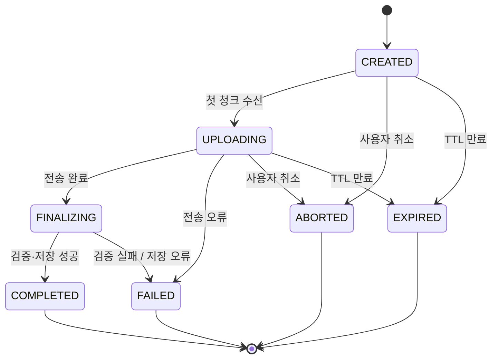
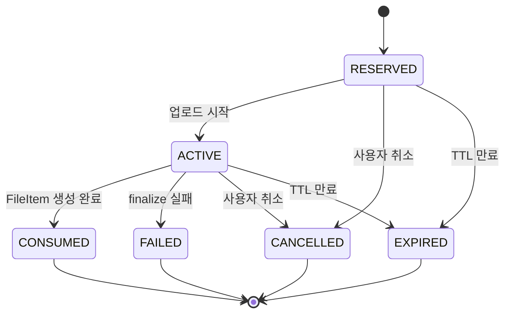
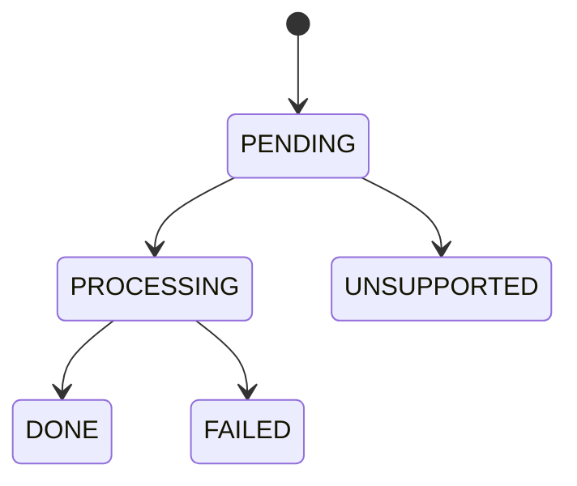
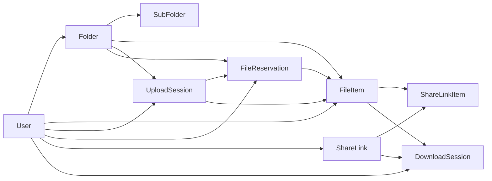
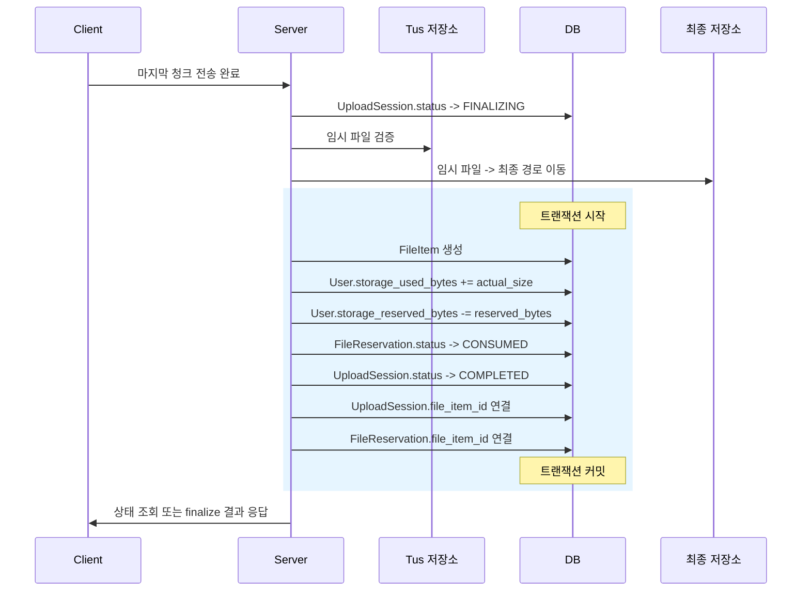

# Cloud# — 통합 ERD 설계서

## 1. 개요

본 문서는 파일 업로드, 저장 확정, 공유 링크, 다운로드 세션 발급까지 포함하는 파일 서비스의 전체 데이터 모델을 정의한다.  
업로드는 `UploadSession`과 `FileReservation`을 중심으로 전송 상태와 비즈니스 자원 선점을 분리하고, 다운로드는 인증 사용자와 공유 링크 사용자를 모두 지원하는 구조를 기준으로 설계한다. 또한 전송 완료와 저장 확정을 구분하기 위해 `FINALIZING` 상태를 유지하고, 후처리 결과를 파일 접근 정책과 연결할 수 있도록 `FileItem` 상태를 확장한다.

## 2. 핵심 설계 원칙

|원칙|설명|
|---|---|
|전송과 확정 분리|청크 업로드 완료와 최종 저장 확정을 구분한다|
|자원 선점 분리|업로드 전송은 `UploadSession`, quota·파일명 선점은 `FileReservation`이 담당한다|
|최종 파일만 `FileItem` 생성|업로드 중에는 `FileItem`을 만들지 않고 완료 후에만 생성한다|
|공유 정책 분리|외부 공유는 `ShareLink`와 `ShareLinkItem`으로 관리한다|
|단명 다운로드 세션|실제 스트리밍은 `DownloadSession`으로 최소 범위·최소 수명 원칙을 따른다|
|후처리와 접근 정책 연결|스캔·미리보기 결과를 파일 상태와 연결한다|

이 문서의 구조는 기존 업로드 파이프라인의 상태 중심 설계와 다운로드 파이프라인의 권한 검증 → 세션 발급 → 스트리밍 구조를 함께 반영한다.

---

## 3. 엔티티 개요

|엔티티|설명|
|---|---|
|`User`|사용자 인증 정보 및 quota 집계 캐시 관리|
|`Folder`|사용자별 폴더 트리 구조|
|`FileItem`|최종 저장 완료된 파일 메타데이터 및 접근 상태|
|`UploadSession`|tus 기반 업로드 전송 상태 + finalize 메타데이터|
|`FileReservation`|파일명·폴더·quota 선점|
|`ShareLink`|외부 공유 링크 정책 단위|
|`ShareLinkItem`|공유 링크와 파일 연결|
|`DownloadSession`|실제 다운로드 스트리밍용 단명 세션 토큰|

기존 설계서의 기본 엔티티는 `User`, `Folder`, `FileItem`, `UploadSession`, `FileReservation`이며, 다운로드 문서의 공유 링크 사용자와 다운로드 세션 발급 구조를 반영해 `ShareLink`, `ShareLinkItem`, `DownloadSession`을 추가했다.

---

## 4. 통합 ERD 다이어그램

```mermaid
---

config:

  layout: elk

---

erDiagram

    direction LR

    User {

        BIGINT id PK ""  

        VARCHAR email UK ""  

        VARCHAR password_hash  ""  

        VARCHAR display_name  ""  

        ENUM role  "ADMIN | USER"  

        BIGINT storage_allowed_bytes  "NULL = unlimited"  

        BIGINT storage_used_bytes  ""  

        BIGINT storage_reserved_bytes  ""  

        TIMESTAMP created_at  ""  

        TIMESTAMP updated_at  ""  

        TIMESTAMP deleted_at  ""  

    }

  

    Folder {

        BIGINT id PK ""  

        BIGINT owner_user_id FK ""  

        BIGINT parent_folder_id FK "NULL = root"  

        VARCHAR name  ""  

        VARCHAR full_path  ""  

        TIMESTAMP created_at  ""  

        TIMESTAMP updated_at  ""  

        TIMESTAMP deleted_at  ""  

    }

  

    FileItem {

        BIGINT id PK ""  

        BIGINT owner_user_id FK ""  

        BIGINT folder_id FK ""  

        VARCHAR display_name  ""  

        VARCHAR normalized_name  ""  

        VARCHAR storage_key UK ""  

        BIGINT size_bytes  ""  

        VARCHAR mime_type  ""  

        VARCHAR checksum_sha256  ""  

        ENUM file_status  "ACTIVE | DELETED | CORRUPTED | QUARANTINED"  

        ENUM preview_status  "PENDING | PROCESSING | DONE | FAILED | UNSUPPORTED"  

        ENUM scan_status  "PENDING | PASSED | FAILED | QUARANTINED"  

        JSON metadata_json  ""  

        TIMESTAMP created_at  ""  

        TIMESTAMP updated_at  ""  

        TIMESTAMP deleted_at  ""  

    }

  

    UploadSession {

        BIGINT id PK ""  

        BIGINT owner_user_id FK ""  

        BIGINT target_folder_id FK ""  

        VARCHAR token UK ""  

        VARCHAR tus_upload_id UK ""  

        ENUM status  "CREATED | UPLOADING | FINALIZING | COMPLETED | FAILED | ABORTED | EXPIRED"  

        BIGINT expected_size  ""  

        BIGINT received_size  ""  

        VARCHAR original_name  ""  

        VARCHAR normalized_name  ""  

        VARCHAR client_mime_type  ""  

        VARCHAR storage_key_temp  ""  

        VARCHAR storage_key  ""  

        VARCHAR checksum_sha256  ""  

        BIGINT file_item_id FK ""  

        INTEGER finalize_attempts  ""  

        VARCHAR last_error_code  ""  

        TEXT last_error_message  ""  

        TIMESTAMPTZ finalizing_started_at  ""  

        TIMESTAMPTZ finalized_at  ""  

        TIMESTAMP created_at  ""  

        TIMESTAMP expires_at  ""  

        TIMESTAMP completed_at  ""  

        TIMESTAMP last_activity_at  ""  

    }

  

    FileReservation {

        BIGINT id PK ""  

        BIGINT owner_user_id FK ""  

        BIGINT target_folder_id FK ""  

        BIGINT upload_session_id FK ""  

        BIGINT file_item_id FK ""  

        VARCHAR reserved_name  ""  

        VARCHAR normalized_name  ""  

        BIGINT expected_size  ""  

        BIGINT reserved_bytes  ""  

        ENUM status  "RESERVED | ACTIVE | CONSUMED | CANCELLED | EXPIRED | FAILED"  

        TIMESTAMP expires_at  ""  

        TIMESTAMP consumed_at  ""  

        TIMESTAMP released_at  ""  

        TIMESTAMP created_at  ""  

        TIMESTAMP updated_at  ""  

    }

  

    ShareLink {

        BIGINT id PK ""  

        BIGINT owner_user_id FK ""  

        VARCHAR token_hash UK ""  

        VARCHAR title  ""  

        VARCHAR password_hash  ""  

        ENUM status  "ACTIVE | DISABLED | EXPIRED | REVOKED"  

        BOOLEAN allow_download  ""  

        BOOLEAN allow_preview  ""  

        TIMESTAMP expires_at  ""  

        INTEGER max_download_count  ""  

        INTEGER download_attempt_count  ""  

        INTEGER download_completed_count  ""  

        TIMESTAMP last_accessed_at  ""  

        TIMESTAMP revoked_at  ""  

        TIMESTAMP created_at  ""  

        TIMESTAMP updated_at  ""  

    }

  

    ShareLinkItem {

        BIGINT id PK ""  

        BIGINT share_link_id FK ""  

        BIGINT file_item_id FK ""  

        TIMESTAMP created_at  ""  

        TIMESTAMP deleted_at  ""  

    }

  

    DownloadSession {

        BIGINT id PK ""  

        BIGINT file_item_id FK ""  

        BIGINT share_link_id FK ""  

        BIGINT requester_user_id FK ""  

        VARCHAR session_token_hash UK ""  

        ENUM subject_type  "USER | SHARE_LINK"  

        ENUM status  "ISSUED | EXPIRED"  

        TIMESTAMP expires_at  ""  

        TIMESTAMP last_used_at  ""  

        TIMESTAMP created_at  ""  

    }

  

    User||--o{Folder:"owns"

    User||--o{FileItem:"owns"

    User||--o{UploadSession:"starts"

    User||--o{FileReservation:"reserves"

    User||--o{ShareLink:"creates"

    User||--o{DownloadSession:"requests"

    Folder||--o{Folder:"parent_of"

    Folder||--o{FileItem:"contains"

    Folder||--o{UploadSession:"upload_target"

    Folder||--o{FileReservation:"reserved_in"

    UploadSession||--||FileReservation:"paired"

    UploadSession||--o|FileItem:"creates"

    FileReservation||--o|FileItem:"consumed_to"

    ShareLink||--o{ShareLinkItem:"includes"

    FileItem||--o{ShareLinkItem:"shared_as"

    FileItem||--o{DownloadSession:"streamed_by"

    ShareLink||--o{DownloadSession:"grants"
```

이 관계도는 기존 업로드 엔티티 관계를 유지하면서, 공유 링크 및 다운로드 세션 발급 구조를 추가한 형태다. 업로드는 `UploadSession ↔ FileReservation ↔ FileItem` 축으로, 다운로드는 `ShareLink ↔ ShareLinkItem ↔ FileItem ↔ DownloadSession` 축으로 이해하면 된다.

---

## 5. 엔티티 상세

### User

> 사용자의 인증 정보와 스토리지 한도를 관리한다.

|컬럼명|타입|Null|설명|
|---|---|---|---|
|`id`|BIGINT|NOT NULL|PK|
|`email`|VARCHAR|NOT NULL|로그인 식별자. **UNIQUE**|
|`password_hash`|VARCHAR|NOT NULL|해시된 비밀번호|
|`display_name`|VARCHAR|NULL|표시 이름|
|`role`|ENUM|NOT NULL|`ADMIN` \| `USER`|
|`storage_allowed_bytes`|BIGINT|NULL|허용 용량. `NULL = 무제한`|
|`storage_used_bytes`|BIGINT|NOT NULL|확정 파일 기준 실제 사용량|
|`storage_reserved_bytes`|BIGINT|NOT NULL|업로드 진행 중 예약 용량|
|`created_at`|TIMESTAMP|NOT NULL|계정 생성 일시|
|`updated_at`|TIMESTAMP|NOT NULL|마지막 수정 일시|
|`deleted_at`|TIMESTAMP|NULL|소프트 삭제 일시|

**설계 포인트**

- `storage_used_bytes`, `storage_reserved_bytes`는 집계 캐시 컬럼이다.
    
- quota 계산은 `allowed - used - reserved` 기준으로 수행한다.
    
- 업로드 시작, 완료, 실패, 취소, 만료 시 반드시 트랜잭션 내 동기화한다.
    

이 내용은 기존 설계서의 quota 캐시 설계를 그대로 따른다.

---

### Folder

> 사용자별 폴더 트리를 자기참조 구조로 표현한다.

|컬럼명|타입|Null|설명|
|---|---|---|---|
|`id`|BIGINT|NOT NULL|PK|
|`owner_user_id`|FK → User|NOT NULL|소유 사용자|
|`parent_folder_id`|FK → Folder|NULL|부모 폴더. `NULL = 루트`|
|`name`|VARCHAR|NOT NULL|폴더 이름|
|`full_path`|VARCHAR|NULL|전체 경로 캐시|
|`created_at`|TIMESTAMP|NOT NULL|생성 일시|
|`updated_at`|TIMESTAMP|NOT NULL|수정 일시|
|`deleted_at`|TIMESTAMP|NULL|소프트 삭제 일시|

**설계 포인트**

- `full_path`는 조회 최적화용 캐시다.
    
- 같은 부모 아래 동일 폴더명은 금지한다.
    
- 사용자당 루트 폴더 1개를 권장한다.
    

이 구조는 기존 설계서의 폴더 자기참조 모델을 유지한다.

---

### FileItem

> 업로드 완료 후 최종 확정된 파일의 메타데이터와 접근 상태를 관리한다.

|컬럼명|타입|Null|설명|
|---|---|---|---|
|`id`|BIGINT|NOT NULL|PK|
|`owner_user_id`|FK → User|NOT NULL|소유 사용자|
|`folder_id`|FK → Folder|NOT NULL|소속 폴더|
|`display_name`|VARCHAR|NOT NULL|사용자 표시 파일명|
|`normalized_name`|VARCHAR|NOT NULL|충돌 비교용 정규화 파일명|
|`storage_key`|VARCHAR|NOT NULL|실제 저장소 객체 키. **UNIQUE**|
|`size_bytes`|BIGINT|NOT NULL|파일 크기|
|`mime_type`|VARCHAR|NULL|서버 기준 MIME 타입|
|`checksum_sha256`|VARCHAR|NULL|무결성 검증 해시|
|`file_status`|ENUM|NOT NULL|파일 접근 상태|
|`preview_status`|ENUM|NOT NULL|미리보기 파이프라인 상태|
|`scan_status`|ENUM|NOT NULL|바이러스 스캔 상태|
|`metadata_json`|JSON|NULL|파일 종류별 가변 메타데이터|
|`created_at`|TIMESTAMP|NOT NULL|생성 일시|
|`updated_at`|TIMESTAMP|NOT NULL|수정 일시|
|`deleted_at`|TIMESTAMP|NULL|소프트 삭제 일시|

**`file_status` 값**

|값|의미|
|---|---|
|`ACTIVE`|정상 접근 가능|
|`DELETED`|삭제 처리됨|
|`CORRUPTED`|저장소 또는 메타데이터 손상|
|`QUARANTINED`|격리 상태, 다운로드 차단|

**`preview_status` 값**

|값|의미|
|---|---|
|`PENDING`|생성 대기|
|`PROCESSING`|생성 중|
|`DONE`|생성 완료|
|`FAILED`|생성 실패|
|`UNSUPPORTED`|미지원 형식|

**`scan_status` 값**

|값|의미|
|---|---|
|`PENDING`|스캔 대기|
|`PASSED`|스캔 통과|
|`FAILED`|스캔 실패|
|`QUARANTINED`|감염 또는 정책상 격리|

**설계 포인트**

- `display_name`과 `storage_key`를 분리한다.
    
- 미리보기 실패는 접근 차단 사유가 아니며 UI에서 플레이스홀더로 처리한다.
    
- 바이러스 스캔 완료 전 다운로드는 허용하지만, 스캔 실패 또는 감염 탐지 시 `QUARANTINED`로 전환한다.
    
- 다운로드 전 사전 검증에서는 `DELETED`, `CORRUPTED`, `QUARANTINED`를 차단 대상으로 본다.
    

후처리와 파일 접근 정책의 연결은 업로드 후처리 설계와 다운로드 사전 검증 규칙을 함께 반영한 것이다.

---

### UploadSession

> tus 기반 대용량 업로드의 전송 상태와 finalize 메타데이터를 추적한다.

|컬럼명|타입|Null|설명|
|---|---|---|---|
|`id`|BIGINT|NOT NULL|PK|
|`owner_user_id`|FK → User|NOT NULL|업로드 요청 사용자|
|`target_folder_id`|FK → Folder|NOT NULL|업로드 대상 폴더|
|`token`|VARCHAR|NOT NULL|외부 공개용 식별자. **UNIQUE**|
|`tus_upload_id`|VARCHAR|NULL|tus 저장소 매핑 ID|
|`status`|ENUM|NOT NULL|업로드 상태|
|`expected_size`|BIGINT|NOT NULL|전체 파일 크기|
|`received_size`|BIGINT|NOT NULL|현재 수신 크기|
|`original_name`|VARCHAR|NOT NULL|원본 파일명|
|`normalized_name`|VARCHAR|NOT NULL|정규화 파일명|
|`client_mime_type`|VARCHAR|NULL|클라이언트 전달 MIME|
|`storage_key_temp`|VARCHAR|NULL|임시 저장 경로|
|`storage_key`|VARCHAR(512)|NULL|최종 저장소 키|
|`checksum_sha256`|VARCHAR(64)|NULL|최종 검증 해시|
|`file_item_id`|FK → FileItem|NULL|완료 후 생성된 파일|
|`finalize_attempts`|INTEGER|NOT NULL|finalize 시도 횟수|
|`last_error_code`|VARCHAR(64)|NULL|마지막 실패 코드|
|`last_error_message`|TEXT|NULL|마지막 실패 상세|
|`finalizing_started_at`|TIMESTAMPTZ|NULL|`FINALIZING` 진입 시각|
|`finalized_at`|TIMESTAMPTZ|NULL|최종 확정 완료 시각|
|`created_at`|TIMESTAMP|NOT NULL|생성 일시|
|`expires_at`|TIMESTAMP|NULL|만료 일시|
|`completed_at`|TIMESTAMP|NULL|완료 일시|
|`last_activity_at`|TIMESTAMP|NOT NULL|마지막 활동 시각|

**설계 포인트**

- `token`과 내부 PK를 분리한다.
    
- `storage_key_temp`와 `storage_key`를 분리해 파일 이동 전후를 구분한다.
    
- `finalize_attempts`, `last_error_*`, `finalizing_started_at`은 recovery worker 판단에 사용한다.
    
- `status = FINALIZING`은 CAS 점유 성공 후의 확정 단계다.
    

이 엔티티는 기존 업로드 파이프라인의 핵심 상태 머신과 finalize 메타데이터 요구를 반영한다.

---

### FileReservation

> 업로드 세션 생성 시 파일명, 폴더, quota를 선점한다.

|컬럼명|타입|Null|설명|
|---|---|---|---|
|`id`|BIGINT|NOT NULL|PK|
|`owner_user_id`|FK → User|NOT NULL|예약 요청 사용자|
|`target_folder_id`|FK → Folder|NOT NULL|예약 대상 폴더|
|`upload_session_id`|FK → UploadSession|NOT NULL|연결된 업로드 세션. **UNIQUE**|
|`file_item_id`|FK → FileItem|NULL|소비된 최종 파일|
|`reserved_name`|VARCHAR|NOT NULL|예약 파일명|
|`normalized_name`|VARCHAR|NOT NULL|정규화 파일명|
|`expected_size`|BIGINT|NOT NULL|예상 파일 크기|
|`reserved_bytes`|BIGINT|NOT NULL|quota 선점 크기|
|`status`|ENUM|NOT NULL|예약 상태|
|`expires_at`|TIMESTAMP|NULL|만료 시각|
|`consumed_at`|TIMESTAMP|NULL|FileItem 생성에 사용된 시각|
|`released_at`|TIMESTAMP|NULL|예약 해제 시각|
|`created_at`|TIMESTAMP|NOT NULL|생성 일시|
|`updated_at`|TIMESTAMP|NOT NULL|수정 일시|

**`status` 값**

|값|의미|
|---|---|
|`RESERVED`|자원 선점 완료, 업로드 시작 전|
|`ACTIVE`|업로드 진행 중|
|`CONSUMED`|최종 `FileItem` 생성에 사용됨|
|`CANCELLED`|사용자 취소|
|`EXPIRED`|TTL 만료|
|`FAILED`|finalize 실패|

**설계 포인트**

- 파일명 충돌 검사는 `FileItem + 활성 FileReservation` 기준으로 수행한다.
    
- quota 선점은 업로드 시작 전에 이루어진다.
    
- 성공 시 `CONSUMED`, 실패·취소·만료 시 예약은 해제된다.
    

이 구조는 기존 업로드 설계서의 자원 선점 모델을 그대로 따른다.

---

### ShareLink

> 외부 공유 링크의 정책 단위를 관리한다.

|컬럼명|타입|Null|설명|
|---|---|---|---|
|`id`|BIGINT|NOT NULL|PK|
|`owner_user_id`|FK → User|NOT NULL|링크 생성 사용자|
|`token_hash`|VARCHAR|NOT NULL|외부 공유 토큰 해시. **UNIQUE**|
|`title`|VARCHAR|NULL|링크 제목|
|`password_hash`|VARCHAR|NULL|링크 비밀번호 해시|
|`status`|ENUM|NOT NULL|링크 상태|
|`allow_download`|BOOLEAN|NOT NULL|다운로드 허용 여부|
|`allow_preview`|BOOLEAN|NOT NULL|미리보기 허용 여부|
|`expires_at`|TIMESTAMP|NULL|링크 만료 시각|
|`max_download_count`|INTEGER|NULL|최대 다운로드 허용 횟수|
|`download_attempt_count`|INTEGER|NOT NULL|다운로드 시도 수|
|`download_completed_count`|INTEGER|NOT NULL|다운로드 완료 수|
|`last_accessed_at`|TIMESTAMP|NULL|마지막 접근 시각|
|`revoked_at`|TIMESTAMP|NULL|철회 시각|
|`created_at`|TIMESTAMP|NOT NULL|생성 일시|
|`updated_at`|TIMESTAMP|NOT NULL|수정 일시|

**`status` 값**

|값|의미|
|---|---|
|`ACTIVE`|정상 사용 가능|
|`DISABLED`|관리자가 비활성화|
|`EXPIRED`|만료됨|
|`REVOKED`|명시적으로 폐기됨|

**설계 포인트**

- 외부 노출 토큰은 원문 저장 대신 `token_hash`로 관리한다.
    
- 링크 단위로 다운로드 허용 여부, 만료, 비밀번호, 횟수 제한을 설정한다.
    
- 현재 다운로드 세션 즉시 revoke는 지원하지 않지만, 링크 자체의 상태 전이는 별도 관리한다.
    

다운로드 문서의 공유 링크 검증 요구와 공유 기반 다운로드 흐름을 반영한 엔티티다.

---

### ShareLinkItem

> 하나의 공유 링크와 하나 이상의 파일을 연결한다.

|컬럼명|타입|Null|설명|
|---|---|---|---|
|`id`|BIGINT|NOT NULL|PK|
|`share_link_id`|FK → ShareLink|NOT NULL|공유 링크|
|`file_item_id`|FK → FileItem|NOT NULL|공유 대상 파일|
|`created_at`|TIMESTAMP|NOT NULL|연결 생성 시각|
|`deleted_at`|TIMESTAMP|NULL|연결 해제 시각|

**설계 포인트**

- `ShareLink : FileItem`을 N:M으로 확장 가능하게 유지한다.
    
- 현재는 파일 공유 기준이지만, 향후 폴더 공유를 추가해도 기존 구조를 깨지 않는다.
    
- 활성 연결 기준으로 `(share_link_id, file_item_id)` 중복은 금지한다.
    

이 엔티티는 공유 링크와 파일의 매핑을 분리해 공유 확장성을 높이기 위한 테이블이다. 다운로드 문서의 “공유 링크 사용자” 흐름을 데이터 모델에 반영할 때 가장 자연스럽다.

---

### DownloadSession

> 실제 파일 스트리밍에 사용되는 단명 다운로드 세션 토큰을 관리한다.

|컬럼명|타입|Null|설명|
|---|---|---|---|
|`id`|BIGINT|NOT NULL|PK|
|`file_item_id`|FK → FileItem|NOT NULL|다운로드 대상 파일|
|`share_link_id`|FK → ShareLink|NULL|공유 링크 기반 요청일 경우 연결|
|`requester_user_id`|FK → User|NULL|인증 사용자 요청일 경우 연결|
|`session_token_hash`|VARCHAR|NOT NULL|다운로드 세션 토큰 해시. **UNIQUE**|
|`subject_type`|ENUM|NOT NULL|`USER` \| `SHARE_LINK`|
|`status`|ENUM|NOT NULL|세션 상태|
|`expires_at`|TIMESTAMP|NOT NULL|세션 만료 시각|
|`last_used_at`|TIMESTAMP|NULL|마지막 사용 시각|
|`created_at`|TIMESTAMP|NOT NULL|발급 시각|

**`status` 값**

|값|의미|
|---|---|
|`ISSUED`|발급되어 사용 가능|
|`EXPIRED`|만료됨|

**설계 포인트**

- 세션은 파일 ID와 요청자 식별자에 바인딩된다.
    
- TTL 동안 동일 URL 재요청, 단일 Range resume, 네트워크 재시도를 허용한다.
- 한 HTTP 요청 안의 multi-range는 지원하지 않는다.
    
- 즉시 revoke는 지원하지 않으므로 현재는 `ISSUED`, `EXPIRED`만 운영한다.
    
- 인증 사용자 다운로드와 공유 링크 다운로드를 모두 수용하기 위해 `subject_type + share_link_id/requester_user_id` 구조를 둔다.
    

이 엔티티는 다운로드 문서의 단명 세션 발급 원칙과 브라우저 호환성 요구를 반영한다.

---

## 6. 상태 전이 차트

### UploadSession 상태 전이

### FileReservation 상태 전이

### FileItem 후처리 상태 흐름

업로드와 예약의 상태 전이는 기존 업로드 문서의 핵심 상태 머신을 따른다. `FINALIZING`은 전송 완료 후 검증·이동·DB 반영을 수행하는 단계이며, 실패 시 `FAILED`, 사용자 취소 시 `ABORTED/CANCELLED`, TTL 만료 시 `EXPIRED`로 정리된다.

---

## 7. 관계 정의

|관계|카디널리티|설명|
|---|---|---|
|User → Folder|1 : N|한 사용자는 여러 폴더를 소유|
|Folder → Folder|1 : N|폴더는 하위 폴더를 가짐|
|User → FileItem|1 : N|한 사용자는 여러 파일을 소유|
|Folder → FileItem|1 : N|한 폴더는 여러 파일을 포함|
|User → UploadSession|1 : N|한 사용자는 여러 업로드 세션을 가짐|
|Folder → UploadSession|1 : N|한 폴더는 여러 업로드의 목적지|
|User → FileReservation|1 : N|한 사용자는 여러 예약을 생성 가능|
|Folder → FileReservation|1 : N|한 폴더는 여러 예약 대상이 될 수 있음|
|UploadSession → FileReservation|1 : 1|업로드 세션과 예약은 1:1|
|UploadSession → FileItem|1 : 0..1|완료된 세션만 최종 파일 생성|
|FileReservation → FileItem|1 : 0..1|소비된 예약만 파일과 연결|
|User → ShareLink|1 : N|한 사용자는 여러 공유 링크 생성 가능|
|ShareLink → ShareLinkItem|1 : N|하나의 링크는 여러 파일 매핑 가능|
|FileItem → ShareLinkItem|1 : N|하나의 파일은 여러 링크로 공유 가능|
|FileItem → DownloadSession|1 : N|하나의 파일은 여러 다운로드 세션을 가질 수 있음|
|ShareLink → DownloadSession|1 : N|링크 기반 다운로드는 여러 세션 발급 가능|

업로드 관계는 기존 ERD 관계 정의를 유지했고, 공유 링크와 다운로드 세션 관계만 추가했다.

---

## 8. 제약 조건 요약

### User

|제약|내용|
|---|---|
|PK|`id`|
|UNIQUE|`email`|
|CHECK|`storage_used_bytes >= 0`|
|CHECK|`storage_reserved_bytes >= 0`|

### Folder

|제약|내용|
|---|---|
|PK|`id`|
|FK|`owner_user_id → User.id`|
|FK|`parent_folder_id → Folder.id`|
|UNIQUE|`(owner_user_id, parent_folder_id, name)` 활성 데이터 기준|

### FileItem

|제약|내용|
|---|---|
|PK|`id`|
|FK|`owner_user_id → User.id`|
|FK|`folder_id → Folder.id`|
|UNIQUE|`storage_key`|
|UNIQUE|`(owner_user_id, folder_id, normalized_name)` 활성 데이터 기준|
|CHECK|`size_bytes >= 0`|

### UploadSession

|제약|내용|
|---|---|
|PK|`id`|
|FK|`owner_user_id → User.id`|
|FK|`target_folder_id → Folder.id`|
|FK|`file_item_id → FileItem.id`|
|UNIQUE|`token`|
|UNIQUE|`tus_upload_id` (NULL 제외)|
|CHECK|`expected_size >= 0`|
|CHECK|`received_size >= 0`|
|CHECK|`received_size <= expected_size`|

### FileReservation

|제약|내용|
|---|---|
|PK|`id`|
|FK|`owner_user_id → User.id`|
|FK|`target_folder_id → Folder.id`|
|FK|`upload_session_id → UploadSession.id`|
|FK|`file_item_id → FileItem.id`|
|UNIQUE|`upload_session_id`|
|UNIQUE|`(owner_user_id, target_folder_id, normalized_name)` 활성 상태 기준|
|CHECK|`expected_size >= 0`|
|CHECK|`reserved_bytes >= 0`|

### ShareLink

|제약|내용|
|---|---|
|PK|`id`|
|FK|`owner_user_id → User.id`|
|UNIQUE|`token_hash`|
|CHECK|`download_attempt_count >= 0`|
|CHECK|`download_completed_count >= 0`|
|CHECK|`max_download_count IS NULL OR max_download_count >= 0`|

### ShareLinkItem

|제약|내용|
|---|---|
|PK|`id`|
|FK|`share_link_id → ShareLink.id`|
|FK|`file_item_id → FileItem.id`|
|UNIQUE|`(share_link_id, file_item_id)` 활성 데이터 기준|

### DownloadSession

|제약|내용|
|---|---|
|PK|`id`|
|FK|`file_item_id → FileItem.id`|
|FK|`share_link_id → ShareLink.id` NULL 허용|
|FK|`requester_user_id → User.id` NULL 허용|
|UNIQUE|`session_token_hash`|
|CHECK|`subject_type = 'USER'`이면 `requester_user_id` 필수|
|CHECK|`subject_type = 'SHARE_LINK'`이면 `share_link_id` 필수|

---

## 9. 업로드 완료 처리 흐름

파일 이동과 DB 반영을 분리하는 구조, `FINALIZING` 진입, 사용량 반영, 예약 소비는 기존 업로드 파이프라인의 핵심 완료 흐름을 따른다. 파일 이동 성공 후 DB 실패 시 고아 파일 정리 또는 보상 절차가 필요하다는 점도 그대로 유지된다.

---

## 10. 설계 결정 사항

|#|결정 사항|이유|
|---|---|---|
|1|`storage_used_bytes`, `storage_reserved_bytes`를 집계 캐시로 유지|quota 계산을 빠르게 수행하기 위해|
|2|`UploadSession`과 `FileReservation`을 분리|전송 상태와 자원 선점 책임을 분리하기 위해|
|3|`FINALIZING` 상태 유지|전송 완료와 저장 확정을 명확히 구분하기 위해|
|4|finalize 관련 컬럼은 `UploadSession`에 둠|recovery, CAS 점유, 실패 추적이 업로드 세션 문맥이기 때문|
|5|`FileItem.file_status`, `scan_status` 추가|후처리 결과와 접근 정책을 연결하기 위해|
|6|`ShareLink` 추가|외부 공유 링크의 수명·비밀번호·다운로드 정책을 관리하기 위해|
|7|`ShareLinkItem` 추가|링크와 파일을 유연하게 N:M으로 연결하기 위해|
|8|`DownloadSession` 추가|단명 다운로드 세션과 브라우저 호환 다운로드를 지원하기 위해|
|9|다운로드 세션 즉시 revoke는 미지원|현재 정책상 TTL 기반 자연 만료를 사용하기 때문|
|10|파일명 최종 충돌 정책은 실패 반환|서버가 임의 리네임하지 않고 사용자에게 다른 이름을 유도하기 위해|
