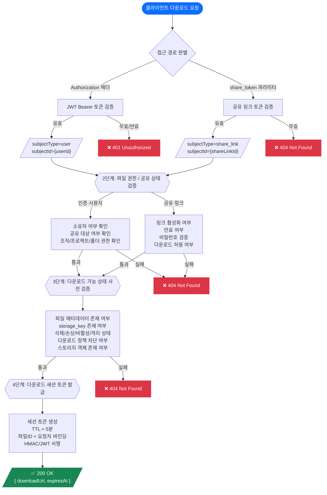
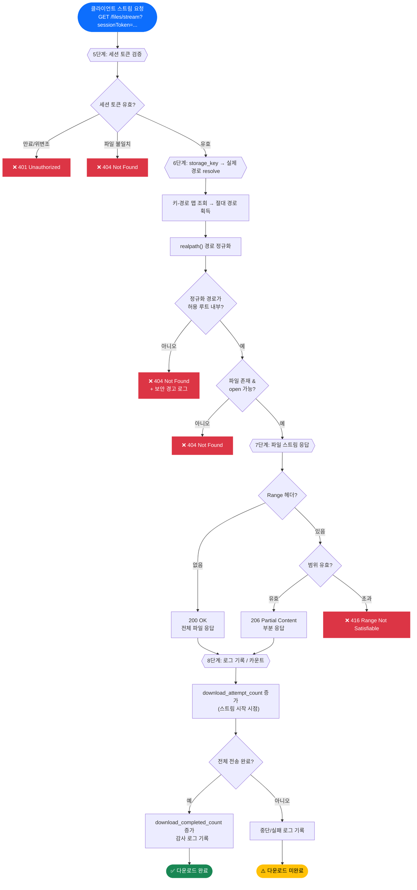
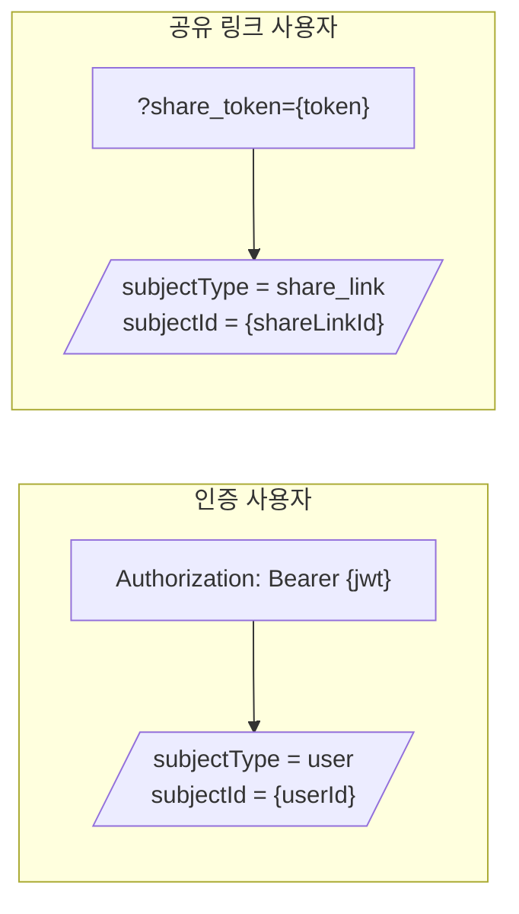
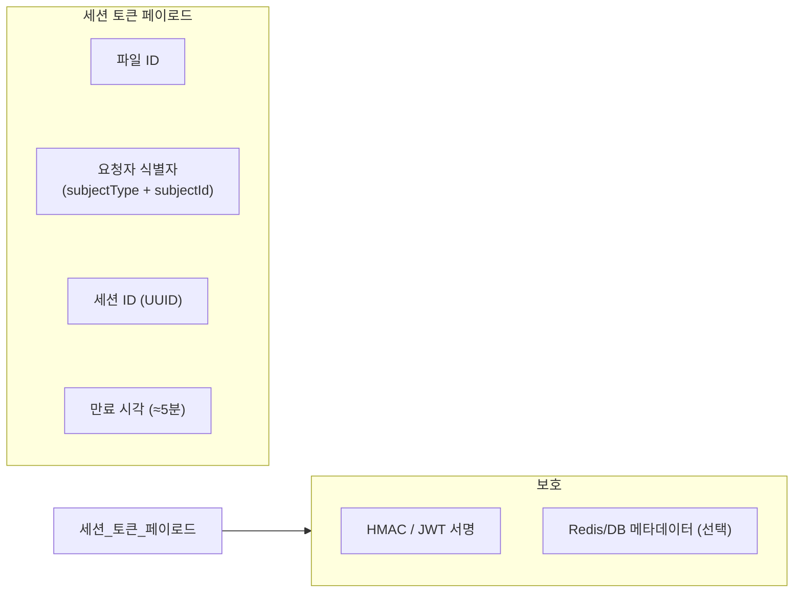
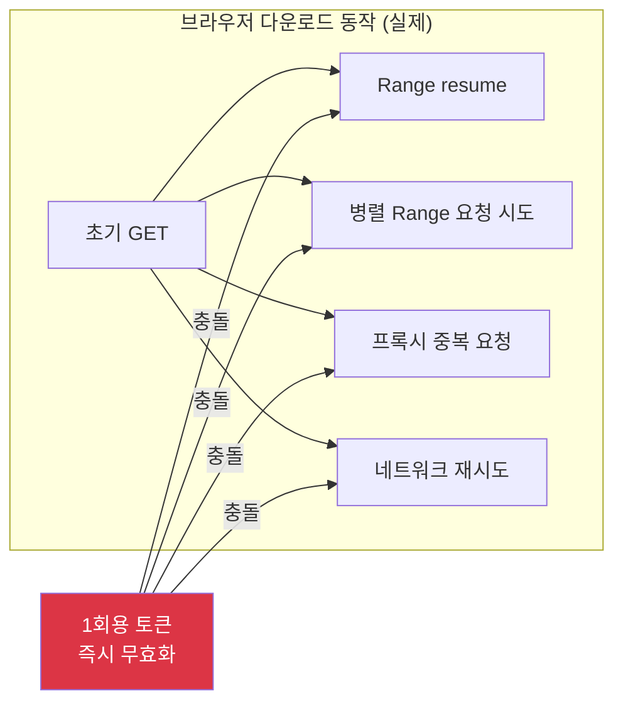
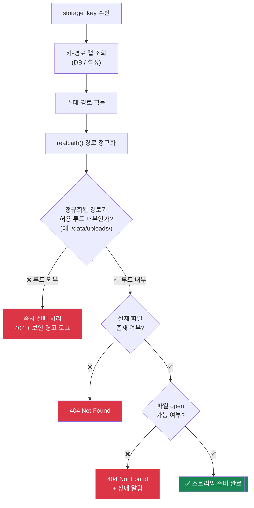
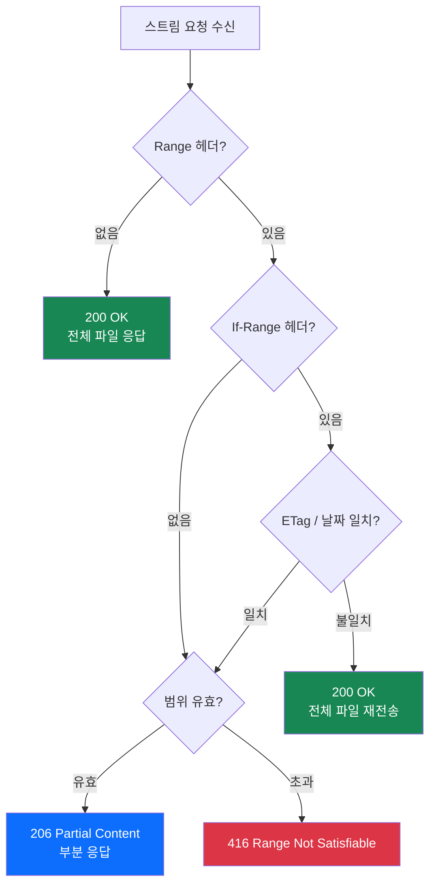
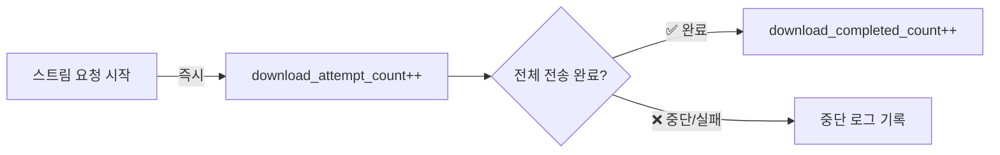
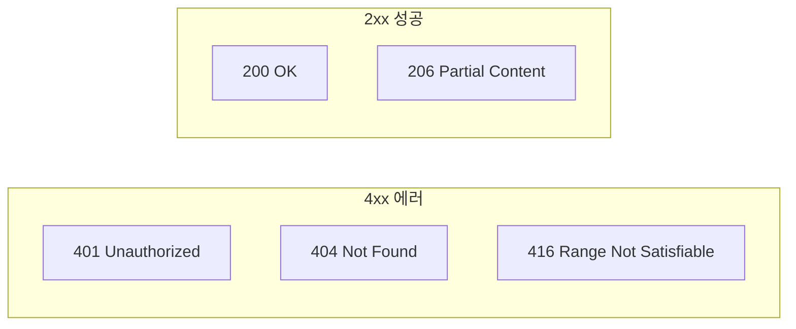
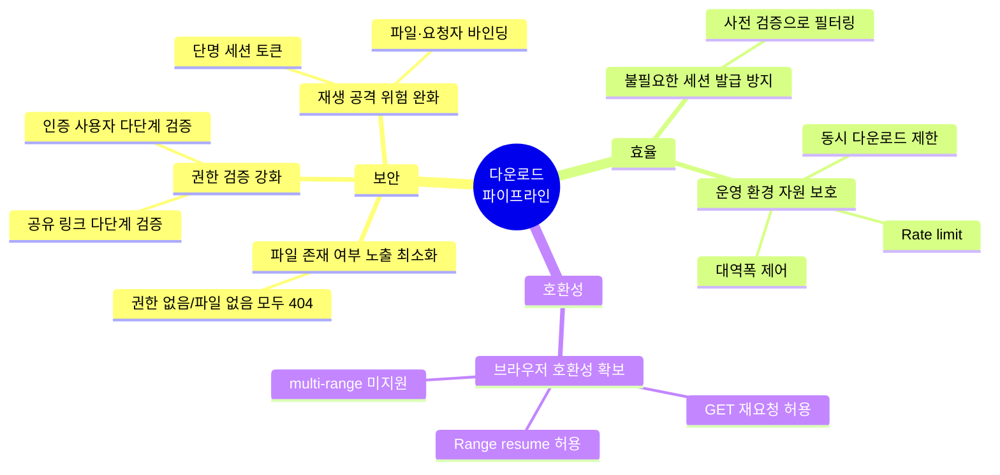

본 문서는 **인증 사용자**와 **공유 링크 사용자**를 모두 지원하는 파일 다운로드 시스템의 전체 흐름을 정의한다.

### 핵심 아키텍처

```
권한 검증 → 다운로드 가능 상태 사전 검증 → 다운로드 세션 발급 → 최종 경로 검증 및 스트리밍
```

### 설계 원칙

| 원칙 | 설명 |
|------|------|
| **Zero Information Leak** | 외부에 파일 존재 여부를 노출하지 않는다 |
| **Defense in Depth** | 모든 단계에서 독립적으로 검증한다 |
| **Browser-Compatible** | 브라우저의 다운로드 동작 모델을 수용한다 |
| **Least Privilege** | 세션은 최소 수명으로 최소 범위에 바인딩한다 |

---

## 2. 전체 흐름도

### Part 1: 인증 → 세션 발급 (1~4단계)



### Part 2: 스트리밍 → 완료 (5~8단계)



---

## 3. 단계별 상세 명세

### 3.1 — 1단계: 사용자 인증 / 공유 링크 접근

> **목적:** 요청자의 신원을 확인하고 내부 컨텍스트로 정규화한다.



| 접근 경로     | 인증 방식                             | 정규화 결과                                              |
| --------- | --------------------------------- | --------------------------------------------------- |
| 인증 사용자    | `Authorization` 헤더의 JWT Bearer 토큰 | `subjectType=user`, `subjectId={userId}`            |
| 공유 링크 사용자 | 쿼리 파라미터의 `share_token`            | `subjectType=share_link`, `subjectId={shareLinkId}` |

**에러 응답:**

| 상황               | 응답                 | 이유              |
| ---------------- | ------------------ | --------------- |
| JWT 유효하지 않음 / 만료 | `401 Unauthorized` | 인증 실패는 명시적으로 알림 |
| 공유 토큰 유효하지 않음    | `404 Not Found`    | 리소스 존재 여부 비노출   |

---

### 3.2 — 2단계: 파일 권한 / 공유 상태 검증

> **목적:** DB 조회를 통해 요청자가 해당 파일에 접근할 수 있는지 확인한다.


**핵심 원칙 — 정보 노출 최소화:**

아래 **모든 경우**를 동일하게 `404 Not Found`로 처리한다:

- 파일이 실제로 존재하지 않음
- 요청자에게 접근 권한이 없음
- 공유 링크가 파일에 매핑되지 않음
- 비활성화된 공유 링크로 접근 시도

> 💡 외부 클라이언트 관점에서 **"접근 불가"와 "존재하지 않음"을 구분할 수 없다.**

---

### 3.3 — 3단계: 파일 메타데이터 및 다운로드 가능 상태 검증

> **목적:** 다운로드가 불가능한 파일에 대해 세션을 발급하지 않기 위한 **사전 검증**이다.

**검증 항목:**

| # | 검증 항목 | 실패 시 |
|---|----------|---------|
| 1 | 파일 메타데이터 존재 여부 | `404` |
| 2 | `storage_key` 존재 여부 | `404` |
| 3 | 삭제 / 손상 / 비활성 / 격리 상태 여부 | `404` |
| 4 | 다운로드 정책상 차단 대상 여부 | `404` |
| 5 | (선택) 실제 스토리지 객체 존재 여부 | `404` |

> ⚠️ **주의:** 이 단계는 사전 검증이다. 세션 발급 후 실제 스트리밍 시점까지 파일 상태가 변할 수 있으므로, **최종 검증은 6단계에서 반드시 다시 수행**한다.

---

### 3.4 — 4단계: 다운로드 세션 토큰 발급

> **목적:** 실제 파일 스트리밍에 사용할 일회성 세션 토큰을 발급한다.

**세션 토큰 구조:**



| 항목 | 값 |
|------|-----|
| TTL | 약 5분 |
| 포함 정보 | 파일 ID, `subjectType`, `subjectId`, 세션 ID, 만료 시각 |
| 보호 방식 | HMAC 또는 JWT 서명, 필요 시 Redis/DB에 메타데이터 저장 |

**세션이 지원하는 요청 유형:**

| 요청 유형                   | 지원                     |
| ----------------------- | ---------------------- |
| 브라우저의 동일 다운로드 재요청       | ✅                      |
| 단일 `Range` 기반 이어받기(resume) | ✅                   |
| 네트워크 끊김 후 재시도           | ✅                      |
| 한 HTTP 요청 안의 multi-range (`Range: bytes=0-99,200-299`) | ❌ 미지원 (`416` 또는 전체 응답) |

**응답 예시:**

```json
{
  "downloadUrl": "/files/stream?sessionToken={download_session_token}",
  "expiresAt": "2026-03-17T12:00:00Z"
}
```

**리스크 분석 및 대응:**

| 리스크 | 대응 |
|--------|------|
| TTL이 너무 길면 URL 탈취 악용 가능 | TTL 5분 내외로 제한 |
| TTL이 너무 짧으면 대용량 파일 재요청 실패 | 세션 TTL 내 반복 요청 허용 |
| 토큰 유출 | 파일 ID + 요청자 식별자에 바인딩, 선택적 IP/UA 바인딩 |

**추가 보안 정책:**

- 다운로드 세션은 **발급 시점 권한**을 기준으로 TTL 동안 유효
- Access log 내 토큰 마스킹
- `Cache-Control: private, no-store` 헤더 필수

---

### 3.5 — 5단계: 세션 토큰으로 파일 스트림 요청

> **목적:** 클라이언트가 발급받은 세션 토큰으로 실제 파일 스트림을 요청한다.

**요청 예시:**

```http
GET /files/stream?sessionToken={download_session_token} HTTP/1.1
Range: bytes=0-1048575
```

**처리 규칙:**

| 상황                               | 처리                     |
| -------------------------------- | ---------------------- |
| 세션 토큰 만료 / 위변조                   | `401 Unauthorized`     |
| 세션이 가리키는 파일과 요청 대상 불일치           | `404 Not Found`        |
| 세션 TTL 내 반복 GET / 단일 Range / resume | ✅ 허용              |
| 한 HTTP 요청 안의 multi-range 요청      | ❌ 미지원 (`416` 또는 전체 응답) |

**"1회용 토큰 + 즉시 무효화" 방식을 사용하지 않는 이유:**



> 브라우저는 다운로드 중 동일 URL 재요청, Range resume, 프록시 중복 요청, 일부 환경의 병렬 Range 요청 시도 등을 발생시킬 수 있어 1회용 방식과 충돌한다. 따라서 **세션 자체는 짧게 유지하되**, 동일 URL 재요청과 단일 Range resume, 네트워크 재시도는 수용한다. 한 HTTP 요청 안의 multi-range와 병렬 Range 다운로드는 지원하지 않는다.

---

### 3.6 — 6단계: `storage_key` → 실제 파일 경로 Resolve 및 최종 검증

> **목적:** 스트림을 열기 직전에 실제 파일 경로를 확정하고 최종 보안 검증을 수행한다.



**보안 요구사항:**

| 방어 대상 | 방어 방법 |
|-----------|-----------|
| `../` 경로 우회 | `realpath()` 정규화 후 루트 프리픽스 검증 |
| 심볼릭 링크 우회 | `realpath()`가 심볼릭 링크를 resolve |
| 상대 경로 주입 | 절대 경로만 허용 |
| Null byte injection | 경로 문자열 내 `\0` 차단 |

**에러 처리:**

| 상황 | 응답 | 내부 처리 |
|------|------|-----------|
| 실제 파일 미존재 | `404 Not Found` | — |
| 메타데이터 존재하나 스토리지 파일 누락 | `404 Not Found` | 경고 로그 + 장애 알림 |
| 경로가 허용 루트 외부 | `404 Not Found` | **보안 경고 로그** |

---

### 3.7 — 7단계: 파일 스트림 응답

> **목적:** 검증을 통과한 파일을 안전하게 클라이언트에 스트리밍한다.

**기본 응답 헤더:**

| 헤더 | 값 | 비고 |
|------|-----|------|
| `Content-Type` | 서버 판별 MIME 타입 | 클라이언트 값 불신 |
| `Content-Disposition` | `attachment; filename="..."; filename*=UTF-8''...` | 강제 다운로드 |
| `Accept-Ranges` | `bytes` | Range 지원 명시 |
| `Content-Length` | 전체/부분 응답 크기 | — |
| `ETag` | 파일 버전 식별자 | 캐시 검증용 |
| `Cache-Control` | `private, no-store` | 프록시 캐싱 방지 |
| `Last-Modified` | 파일 최종 수정 시각 | 선택 |

**Range 처리 매트릭스:**



**MIME 타입 처리 원칙:**

| 우선순위 | 판별 방법 | 비고 |
|----------|-----------|------|
| 1 | 서버 측 magic byte 판별 | 최우선 |
| 2 | 저장된 메타데이터 / 확장자 | 보조 참고 |
| 3 | 판별 불확실 시 | `application/octet-stream` |

> XSS 가능 타입(`text/html`, `image/svg+xml` 등)이라도 `Content-Disposition: attachment`로 인라인 렌더링을 방지한다.

**파일명 처리 원칙:**

```http
Content-Disposition: attachment; filename="safe_name.ext"; filename*=UTF-8''original%20name.ext
```

| 처리 항목 | 방법 |
|-----------|------|
| 위험 문자 제거/이스케이프 | `"`, `\r`, `\n`, `\0`, `/`, `\` |
| 최대 길이 | 제한 적용 (예: 255자) |
| 비 ASCII 문자 | `filename*`에 RFC 5987 방식 인코딩 |
| 레거시 호환 | `filename`에 ASCII-safe 이름 병기 |

**성능 / 운영 보호 정책:**

| 정책 | 설명 |
|------|------|
| 사용자별 동시 다운로드 수 제한 | 단일 사용자 리소스 독점 방지 |
| 공유 링크별 rate limit | 링크 남용 방지 |
| 전체 서버 동시 스트림 수 제한 | 서버 자원 보호 |
| 대용량 파일 전송 속도 제한 | 대역폭 보호 (필요 시) |
| `sendfile` / `X-Accel-Redirect` 활용 | 커널 레벨 파일 전송으로 성능 최적화 |

---

### 3.8 — 8단계: 로그 기록 / 카운트 증가

> **목적:** 다운로드 활동을 추적하고 운영 분석 데이터를 수집한다.

**카운트 증가 정책:**

- **공유 링크 다운로드에만 적용**
- 시도 수와 완료 수를 **분리 집계**



| 카운트 항목 | 증가 시점 | 용도 |
|------------|-----------|------|
| `download_attempt_count` | 스트림 요청 시작 시점 | 시도 횟수 추적 |
| `download_completed_count` | 전체 파일 전송 완료 시점 | 실제 완료 횟수 추적 |

> 💡 분리 집계를 통해 네트워크 중단, 사용자 취소, 실패율 등을 정확히 분석할 수 있다.

---

## 4. 에러 응답 총괄



| 상황 | HTTP 상태 코드 | 발생 단계 |
|------|----------------|-----------|
| 인증 실패 / 인증 토큰 만료 | `401 Unauthorized` | 1단계 |
| 다운로드 세션 토큰 만료 / 위변조 | `401 Unauthorized` | 5단계 |
| 파일 없음 또는 권한 없음 | `404 Not Found` | 2, 3, 5, 6단계 |
| Range 범위 초과 | `416 Range Not Satisfiable` | 7단계 |
| 정상 전체 응답 | `200 OK` | 7단계 |
| 정상 부분 응답 (Range) | `206 Partial Content` | 7단계 |

---

## 5. 보안 체크리스트

| # | 항목 | 관련 단계 | 중요도 |
|---|------|-----------|--------|
| 1 | JWT / share token 서명 검증 | 1단계 | 🔴 Critical |
| 2 | 파일 접근 권한 및 공유 상태 검증 | 2단계 | 🔴 Critical |
| 3 | 권한 없음과 파일 없음은 동일하게 `404` 처리 | 2단계 | 🔴 Critical |
| 4 | 파일 메타데이터 및 다운로드 가능 상태 사전 검증 | 3단계 | 🟡 High |
| 5 | 다운로드 세션 토큰 단명 발급 (TTL ≈ 5분) | 4단계 | 🔴 Critical |
| 6 | 세션 토큰은 파일 ID + 요청자 식별자에 바인딩 | 4단계 | 🔴 Critical |
| 7 | 세션 TTL 내 동일 URL 재요청 / 단일 Range resume / 재시도 허용, multi-range 미지원 | 5단계 | 🟡 High |
| 8 | Path traversal 방어 (`realpath` + 루트 경로 검증) | 6단계 | 🔴 Critical |
| 9 | 스트리밍 직전 파일 존재 및 open 가능 여부 재검증 | 6단계 | 🔴 Critical |
| 10 | `Content-Disposition: attachment` 강제 | 7단계 | 🔴 Critical |
| 11 | 파일명 sanitize 및 `filename*` 지원 | 7단계 | 🟡 High |
| 12 | MIME 타입은 서버 기준으로 안전하게 결정 | 7단계 | 🟡 High |
| 13 | `ETag` / `If-Range` 지원 | 7단계 | 🟢 Medium |
| 14 | 다운로드 로그 및 감사 로그 기록 | 8단계 | 🟡 High |
| 15 | 동시 다운로드 수 / rate limit / 대역폭 보호 | 7~8단계 | 🟡 High |

---

## 6. 설계 목표 달성 요약



| # | 목표 | 달성 방법 | 관련 단계 |
|---|------|-----------|-----------|
| 1 | **파일 존재 여부 노출 최소화** | 권한 없음 / 파일 없음 모두 `404` 통일 처리 | 2, 3, 6단계 |
| 2 | **권한 검증 강화** | 인증 사용자·공유 링크 모두 다단계 검증 | 1, 2단계 |
| 3 | **불필요한 세션 발급 방지** | 세션 발급 전 다운로드 가능 상태 사전 검증 | 3단계 |
| 4 | **브라우저 호환성 확보** | 세션 TTL 내 동일 URL 재요청 / 단일 Range resume / 재시도 허용, multi-range 미지원 | 4, 5단계 |
| 5 | **재생 공격 위험 완화** | 단명 세션 토큰 + 파일·요청자 바인딩 | 4단계 |
| 6 | **운영 환경 자원 보호** | 동시 다운로드 제한, rate limit, 대역폭 제어 | 7, 8단계 |

---
