## 개요

본 문서는 **tus 프로토콜**을 기반으로 한 대용량 파일 업로드 처리 흐름을 정의한다.

### 핵심 설계 목표

| 목표 | 설명 |
|------|------|
| **중단 재개 업로드** | 네트워크 장애 시에도 이어받기 가능한 업로드 지원 |
| **진행 상태 추적** | `UploadSession`을 통한 업로드 생명주기 관리 |
| **자원 선점** | `FileReservation`을 통한 quota·파일명 충돌 사전 방지 |
| **저장 확정 보장** | 최종 검증 → 파일 이동 → `FileItem` 생성 순서 보장 |
| **복구 가능성 확보** | 파일 전송과 비즈니스 메타데이터 반영의 분리 |

### 핵심 엔티티 관계

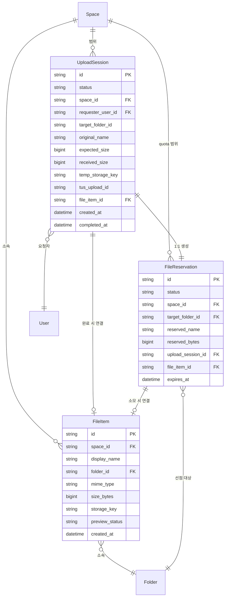

---

## 전체 파이프라인 흐름

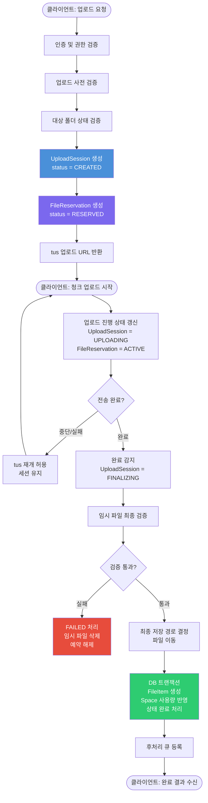

---

## 1단계 — 업로드 준비

### 1-1. 클라이언트 요청 파라미터

| 항목 | 타입 | 필수 | 설명 |
|------|------|:----:|------|
| `targetFolderId` | `string` | ✅ | 업로드 대상 폴더 식별자 |
| `originalName` | `string` | ✅ | 사용자가 선택한 원본 파일명 |
| `expectedSize` | `long` | ✅ | 전체 파일 크기 (bytes) |
| `clientMimeType` | `string` | ❌ | 브라우저 판단 MIME 타입 (**신뢰 금지**) |
| `checksum` | `string` | ❌ | 무결성 검증용 해시값 |

### 1-2. 인증 및 권한 검증

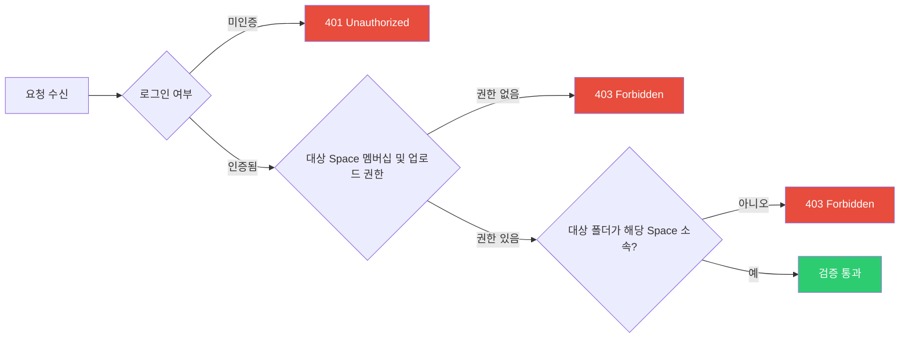

### 1-3. 업로드 사전 검증

세션 생성 **이전**에 수행하는 선행 검증이다.

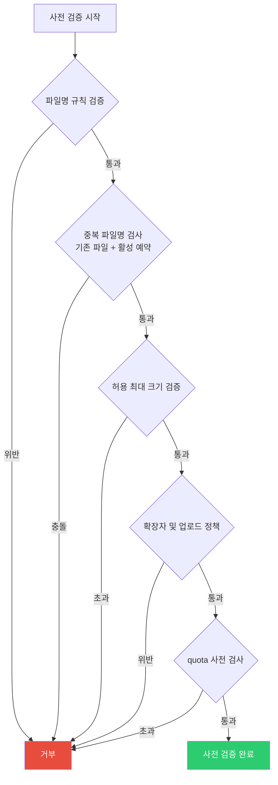

> **참고**: 중복 파일명은 동일 `Space / Folder` 범위의 기존 `FileItem`뿐 아니라, 현재 활성 상태인 `FileReservation`도 함께 검사한다. 이 단계의 검사는 **사전 검사**이며, 최종 확정 시 동일 항목을 재검증할 수 있다.

### 1-4. 대상 폴더 상태 검증

| 검증 항목 | 실패 시 |
|-----------|---------|
| 폴더 존재 여부 | `404 Not Found` |
| 삭제 상태 여부 | `410 Gone` |
| 업로드 가능 상태 | `409 Conflict` |

---

## 2단계 — 세션 및 예약 생성

### 2-1. `UploadSession` 생성


**`UploadSession` 초기 상태**

| 필드 | 값 |
|------|----|
| `status` | `CREATED` |
| `target_folder_id` | 요청의 `targetFolderId` |
| `original_name` | 원본 파일명 |
| `expected_size` | 예상 크기 |
| `temp_storage_key` | 임시 저장 경로/키 |
| `tus_upload_id` | tus 식별자 (매핑 준비) |

**`UploadSession`의 책임**

- 업로드 시작~완료까지 **진행 상태 추적**
- 오프셋 기반 **재개 처리** 지원
- 실패·중단·만료 **상태 관리**
- 최종 생성된 `FileItem`과 **연결**

### 2-2. `FileReservation` 생성

`FileReservation`은 업로드 전송 자체가 아닌, **비즈니스 자원의 선점**을 담당한다.

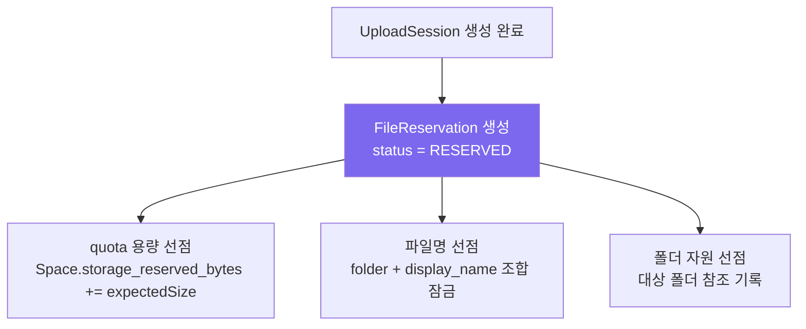

**선점 대상과 목적**

| 선점 자원 | 목적 |
|-----------|------|
| 폴더 참조 | 업로드 완료 시 소속 폴더 보장 |
| 표시 파일명 | 동일 폴더 내 파일명 충돌 사전 차단 |
| quota 예정 용량 | 동일 Space 내 동시 업로드 시 quota 경쟁 조건 방지 |

**`UploadSession`과 `FileReservation`의 관계**

```
UploadSession 1 : 1 FileReservation
```

두 엔티티는 동일한 업로드 요청의 생명주기를 **서로 다른 책임**(전송 추적 vs 자원 선점)으로 관리한다.

### 2-3. 클라이언트 응답

서버는 아래 정보를 반환한다.

| 응답 항목 | 설명 |
|-----------|------|
| 업로드 URL | tus 청크 전송 대상 엔드포인트 |
| 업로드 세션 ID | 상태 조회·취소에 사용 |
| 재개 메타데이터 | 중단 후 재개에 필요한 정보 |

---

## 3단계 — 파일 전송

### 3-1. tus 청크 업로드

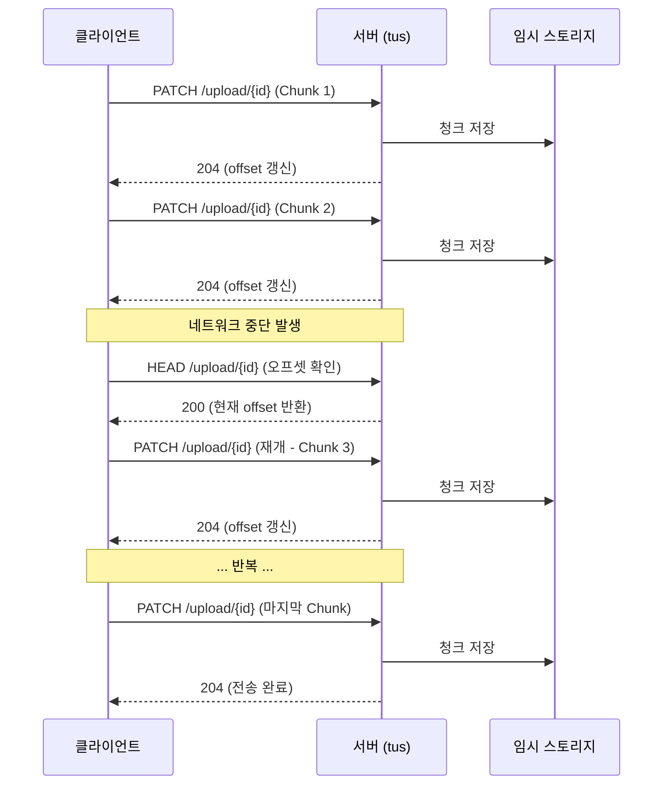

**전송 특성**

| 항목 | 설명 |
|------|------|
| 청크 단위 전송 | 파일을 분할하여 순차 전송 |
| 오프셋 검증 | 매 청크마다 서버 offset과 대조 |
| 네트워크 중단 시 재개 | `HEAD` 요청으로 현재 offset 확인 후 이어받기 |
| 진행 상태 반영 | `UploadSession.received_size` 등에 보조 기록 |

> **참고**: `received_size`는 모니터링 보조 지표로 활용한다. 실제 재개 기준 오프셋은 **tus 저장소 상태**를 기준으로 판단하는 것이 바람직하다.

### 3-2. 진행 상태 갱신

업로드가 시작되면 양 엔티티의 상태가 전이된다.

| 엔티티 | 이전 상태 | 이후 상태 |
|--------|-----------|-----------|
| `UploadSession` | `CREATED` | `UPLOADING` |
| `FileReservation` | `RESERVED` | `ACTIVE` |

---

## 4단계 — 업로드 완료 확정

> tus 전송이 종료되었다고 해서 곧바로 파일 등록이 완료되지 않는다. 아래 **확정 절차**를 거쳐야 한다.

### 4-1. 완료 감지

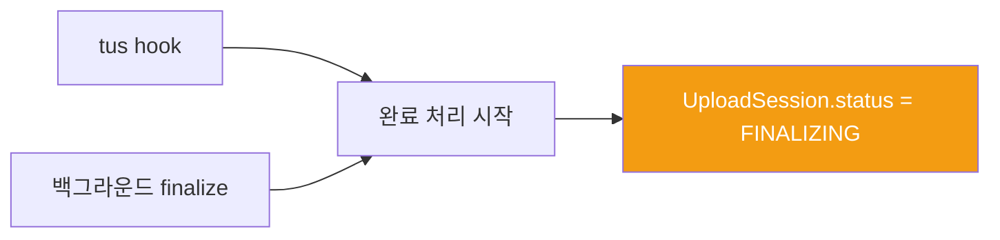

**필수 요구사항**

| 항목 | 설명 |
|------|------|
| 중복 완료 방지 | 동일 세션에 대한 finalize 재실행 차단 |
| Idempotency 보장 | 동일 요청 반복 시 동일 결과 |
| 분산 환경 보호 | 다중 서버에서 동시 finalize 방지 |
### [[finalize 중복 방지 락 전략]]

### 4-2. 임시 파일 최종 검증

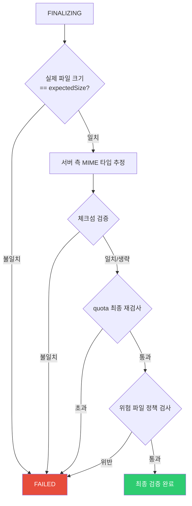

> **보안 원칙**: 클라이언트가 전달한 MIME 타입과 체크섬은 **참고용**일 뿐이며, 보안 판단의 근거로 직접 신뢰하지 않는다.

### 4-3. 최종 저장 경로 결정 및 파일 이동

| 단계 | 설명 |
|------|------|
| `storage_key` 생성 | 최종 내부 저장 경로 식별자 생성 |
| 파일 이동 | 임시 경로 → 최종 저장 경로 |
| 경로 분리 유지 | 사용자 표시 경로 ≠ 실제 저장 경로 |

> 동일 파일시스템 내에서는 원자적 `rename`을 사용할 수 있으나, 스토리지 유형에 따라 `copy + delete` 절차가 필요할 수 있다.

### 4-4. `FileItem` 생성 및 Space 사용량 반영

**`FileItem` 메타데이터**

| 필드 | 설명 |
|------|------|
| `display_name` | 사용자에게 표시되는 파일명 |
| `folder_id` | 소속 폴더 ID |
| `mime_type` | 서버 측 추정 MIME 타입 |
| `size_bytes` | 실제 파일 크기 |
| `storage_key` | 내부 저장 경로 식별자 |
| `preview_status` | 초기값 `PENDING` |

**함께 반영되는 항목**

| 작업 | 설명 |
|------|------|
| `storage_used_bytes` 증가 | Space 실사용량 반영 |
| `storage_reserved_bytes` 차감 | 예약분 해제 |
| `FileReservation` 소모 처리 | `CONSUMED` 전이 |
| `UploadSession.file_item_id` 연결 | 세션과 최종 파일 연결 |

### 4-5. 상태 완료 반영

| 항목 | 값 |
|------|----|
| `UploadSession.status` | `COMPLETED` |
| `UploadSession.completed_at` | 완료 시각 |
| `UploadSession.file_item_id` | 생성된 `FileItem` ID |
| `FileReservation.status` | `CONSUMED` |
| `FileReservation.file_item_id` | 생성된 `FileItem` ID |

---

## 5단계 — 후처리

### 5-1. 비동기 후처리 작업

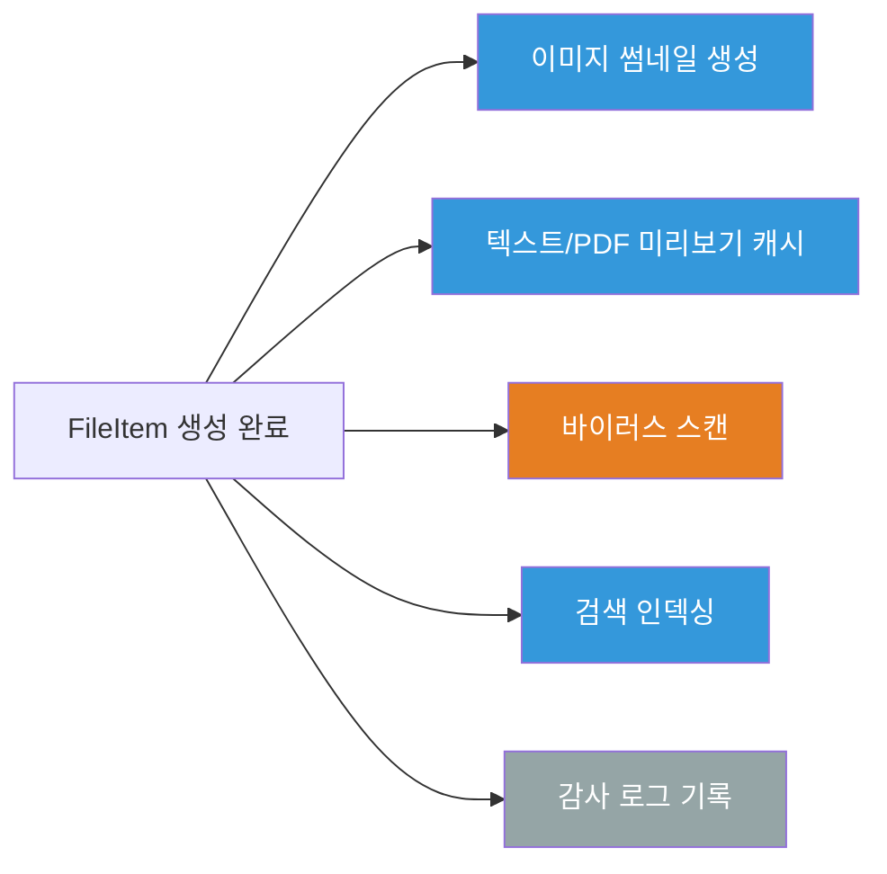

| 작업 | 처리 유형 |
|------|-----------|
| 이미지 썸네일 생성 | 큐 기반 또는 경량 동기 |
| 텍스트/PDF 미리보기 캐시 | 큐 기반 |
| 바이러스 스캔 | 비동기 |
| 검색 인덱싱 | 비동기 |
| 감사 로그 기록 | 동기 또는 큐 기반 |

### 5-2. 클라이언트 응답

최종 확정 이후 클라이언트에 제공하는 정보:

| 항목 | 설명 |
|------|------|
| `FileItem` 정보 | 생성된 파일의 메타데이터 |
| 목록 갱신 메타데이터 | UI 갱신에 필요한 최소 정보 |
| 업로드 결과 및 후처리 상태 | 성공 여부, 후처리 진행 상태 |

> 이 응답은 tus 마지막 `PATCH` 응답과 분리된 **별도 finalize 결과 응답** 또는 **상태 조회 응답**으로 제공하는 것이 자연스럽다.

---

## 상태 전이

### `UploadSession` 상태 전이

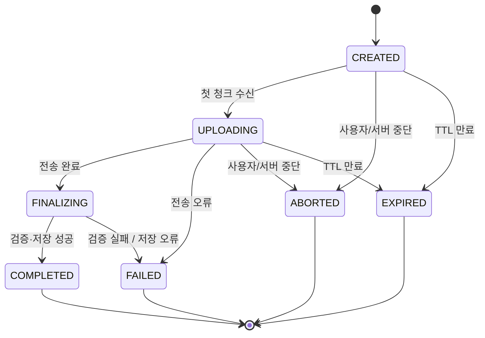

| 상태 | 설명 |
|------|------|
| `CREATED` | 세션 생성 완료, 전송 시작 전 |
| `UPLOADING` | 청크 전송 진행 중 |
| `FINALIZING` | 전송 완료, 검증·이동·DB 반영 전 |
| `COMPLETED` | 모든 검증 및 저장 완료 |
| `FAILED` | 검증 실패 또는 저장 오류 |
| `ABORTED` | 명시적 중단 |
| `EXPIRED` | 세션 TTL 만료 |

### `FileReservation` 상태 전이

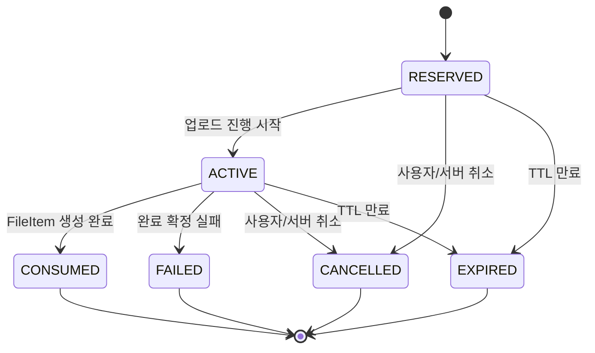

| 상태 | 설명 |
|------|------|
| `RESERVED` | quota·파일명·폴더 자원 선점 완료 |
| `ACTIVE` | 연결된 업로드 세션 진행 중 |
| `CONSUMED` | 최종 `FileItem` 생성에 사용됨 |
| `CANCELLED` | 사용자 또는 서버에 의해 취소됨 |
| `EXPIRED` | 예약 TTL 만료 |
| `FAILED` | 완료 확정 실패로 예약 소멸 |

### 상태 전이 연동 매핑

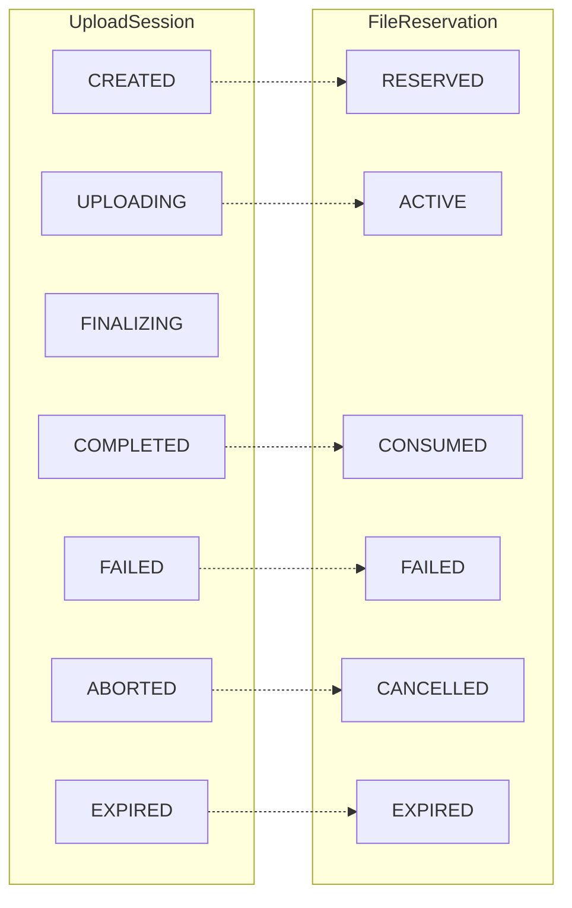

---

## 트랜잭션 경계

파일 이동은 DB 트랜잭션에 포함될 수 없으므로, 아래와 같이 경계를 명확히 분리한다.

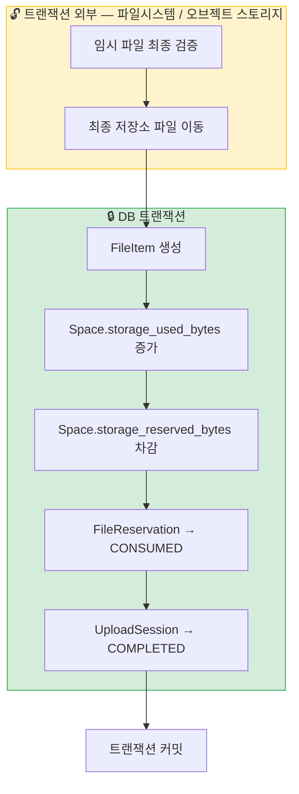

> **⚠️ 주의**: 파일 이동 성공 후 DB 트랜잭션이 실패하면 **고아 파일**이 발생할 수 있다. 정기 정리 배치 또는 보상 절차를 반드시 설계해야 한다.

---

## 실패 처리

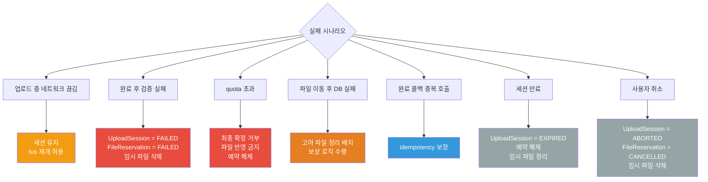

| 시나리오 | 처리 방식 |
|----------|-----------|
| 업로드 중 네트워크 끊김 | 세션 유지, tus 재개 허용 |
| 완료 후 검증 실패 | `UploadSession = FAILED`, `FileReservation = FAILED`, 임시 파일 삭제 |
| quota 초과 | 최종 확정 거부, 파일 반영 금지, 예약 해제 |
| 파일 이동 성공 후 DB 저장 실패 | 고아 파일 정리 배치 또는 보상 로직 수행 |
| 완료 콜백 중복 호출 | idempotency 보장 |
| 세션 만료 | `UploadSession = EXPIRED`, 예약 해제, 임시 파일 정리 |
| 사용자 취소 | `UploadSession = ABORTED`, `FileReservation = CANCELLED`, 임시 파일 삭제 |

---

## 보안 체크리스트

| 항목 | 대응 방식 |
|------|-----------|
| 클라이언트 MIME 신뢰 금지 | 서버에서 직접 MIME 타입 추정 |
| 사용자 입력 파일명 검증 | 특수문자, 예약어, 인코딩 우회 등 검사 |
| Path Traversal 방지 | `../` 등 경로 탈출 시도 차단 |
| 내부 경로 외부 노출 금지 | `storage_key`와 응답 경로 분리 |
| 최종 저장 경로 격리 | 사용자 표시 폴더 구조 ≠ 실제 저장 구조 |
| tus 메타데이터 검증 | `Upload-Metadata`는 허용 키만 수용, 길이·형식 제한 |
| 완료 처리 중복 방지 | 동일 세션 finalize 중복 실행 차단 |
| 예약 자원 해제 보장 | 실패·취소·만료 시 quota 및 파일명 예약 반환 |

---

## 설계 요약

### 핵심 엔티티 역할 분리

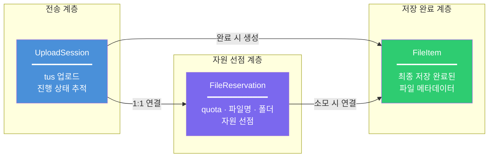

### 전체 파이프라인 요약


