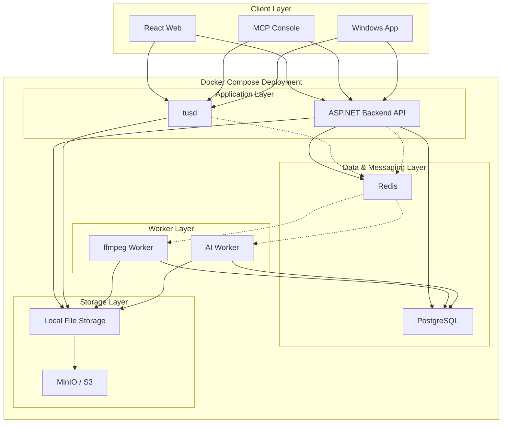

# MVP 기술 아키텍처 표

|영역|MVP 기술 스택|역할|MVP 채택 이유|추후 확장 방향|
|---|---|---|---|---|
|사용자 웹 프론트|**React**|파일 탐색, Space 진입, 공유 링크, 멤버 관리, 업로드 UI|상호작용이 많은 파일 서비스에 적합하고 생산성이 높음|PWA, 고급 탐색, 오프라인 일부 지원|
|사용자 콘솔 / MCP 콘솔|**Console UI + MCP 연동 구조**|사용자용 명령형 콘솔, 자동화 진입점, AI/RAG 친화 인터페이스|웹 UI와 별개로 파워유저 경험 제공, 서비스 차별화 요소|AI agent, 워크플로 자동화, 외부 도구 연계|
|데스크톱 클라이언트|**초기 제외 또는 최소 프로토타입**|탐색기 연동, 백그라운드 업로드/동기화|MVP 범위 집중을 위해 우선순위 낮춤|Windows 전용 앱, 동기화 클라이언트|
|백엔드 API / 도메인 서버|**[ASP.NET](http://ASP.NET)**|Space, Member, Role, ShareLink, Quota, UploadSession, 검색 API, 정책 처리|서비스 핵심 비즈니스 로직의 중심|서비스 분리, 내부 모듈화, API 게이트웨이|
|업로드 서버|**tusd (Go)**|재개 가능한 대용량 업로드 처리|tus 표준 기반 안정적 업로드, 백엔드와 역할 분리 가능|업로드 노드 확장, 멀티 스토리지 연동|
|메인 DB|**PostgreSQL**|Space/파일/폴더/멤버십/공유링크/업로드세션/Audit 저장|메타데이터 중심 구조에 적합, 관계형 + JSON 확장성 우수|파티셔닝, 읽기 복제, 전문 검색 보조|
|캐시 / 세션 / 경량 메시징|**Redis**|캐시, 업로드 상태 보조, rate limit, 임시 상태 저장|빠르고 단순하며 MVP 운영 부담이 낮음|Redis Cluster, 세션/락 고도화|
|이벤트 버스|**Redis Pub/Sub**|업로드 완료, 썸네일 생성 요청, 인덱싱 요청, 알림 이벤트 전달|MVP에서 가장 빠르게 붙일 수 있는 이벤트 전달 방식|Redis Streams 또는 Kafka로 전환|
|검색|**PostgreSQL 기본 검색**|파일명/메타데이터/기본 필터 검색|MVP에서는 별도 검색 엔진 없이도 충분히 시작 가능|OpenSearch 도입|
|검색 인덱스 엔진|**초기 선택적 / 후순위**|본문 검색, OCR 검색, 통합 검색|MVP에서는 복잡도 대비 효익이 낮음|**OpenSearch** 정식 도입|
|객체/파일 저장소|**Local FS**|실제 파일 바이트 저장|MVP에서 가장 단순하고 셀프호스트 친화적|MinIO, S3 호환 스토리지|
|확장 저장소|**MinIO / S3 (후속)**|대용량 운영, 다중 노드, 외부 스토리지 확장|저장 추상화 이후 자연스럽게 확장 가능|멀티 버킷, 티어드 스토리지|
|미리보기 / 미디어 워커|**ffmpeg worker**|썸네일, 비디오 처리, 미리보기 생성|파일 서비스 체감 품질에 직접 영향|분산 워커, 큐 기반 처리|
|AI 워커|**AI Worker**|OCR, 태깅, 요약, 문서 임베딩, 검색 보조|AI 친화 구조를 MVP부터 열어둘 수 있음|RAG, 분류 자동화, 추천|
|인증/인가|**[ASP.NET](http://ASP.NET) 기반 Auth + Space Role 모델**|로그인, Space 접근 제어, Role 기반 권한|문서의 Space 중심 권한 모델과 일치|SSO, 기업용 IAM 연동|
|백그라운드 작업 오케스트레이션|**Redis Pub/Sub + Worker 소비 구조**|후처리 비동기 실행|단순하고 빠르게 구축 가능|Streams/Kafka + 작업 상태 추적|
|운영/배포|**Docker Compose**|셀프호스트 배포, 서비스 묶음 관리|MVP와 셀프호스트 목표에 가장 현실적|Kubernetes, Helm, 멀티노드|
|관측성|**기본 로그 + 메트릭 수집**|오류 추적, 업로드/워커 상태 확인|초기 운영 필수|OpenTelemetry, Grafana, 중앙 로그|

---

# MVP 아키텍처 한 줄 요약

**React 웹 + MCP 사용자 콘솔 + [ASP.NET](http://ASP.NET) 도메인 서버 + tusd 업로드 서버 + PostgreSQL + Redis Pub/Sub + Local FS + ffmpeg/AI Worker** 조합으로 시작하고, 이후 **OpenSearch / Redis Streams / Kafka / MinIO / S3** 방향으로 확장하는 구조입니다.

---

# MVP 권장 구성도

|계층|구성|
|---|---|
|사용자 접점|React 웹, MCP Console|
|핵심 API|[ASP.NET](http://ASP.NET)|
|업로드 plane|tusd|
|데이터 저장|PostgreSQL|
|캐시 / 이벤트|Redis + Redis Pub/Sub|
|파일 저장|Local FS|
|비동기 처리|ffmpeg Worker, AI Worker|
|추후 확장|OpenSearch, Redis Streams/Kafka, MinIO/S3|

---

# MVP에서의 역할 분리 원칙

|컴포넌트|책임|
|---|---|
|React|일반 사용자용 GUI|
|MCP Console|파워유저/명령형/AI 친화 인터페이스|
|[ASP.NET](http://ASP.NET)|권한, 정책, 메타데이터, finalize, 공유/검색 API|
|tusd|파일 청크 업로드 수신|
|PostgreSQL|서비스의 진실 원천|
|Redis Pub/Sub|이벤트 전달|
|Worker|후처리 실행|
|Local FS|물리 파일 저장|

---

# 지금 기준 추천 판단

## 반드시 MVP에 포함

- React
- **MCP Console**
- [ASP.NET](http://ASP.NET)
- PostgreSQL
- Redis
- **Redis Pub/Sub**
- tusd
- Local FS
- ffmpeg worker
- AI worker 기본 골격

## MVP에서는 가볍게 두거나 후순위

- OpenSearch
- Redis Streams
- Kafka
- MinIO
- S3
- Windows 앱 정식화

