# CAS 기반 Finalize 설계안 정리

## 1. 설계 목적

> **핵심 목표**: 업로드 완료 후 저장 확정(finalize)을 **단 한 번만, 중복 없이** 수행하고,
> 장애 발생 시에도 **복구 가능한 상태 기반 처리**를 보장한다.

| 설계 원칙 | 설명 |
|-----------|------|
| **CAS 기반 점유** | `UploadSession.status`의 원자적 상태 전이로 finalize 소유권 확보 |
| **트랜잭션 경계 분리** | 파일 I/O는 트랜잭션 밖, 메타데이터 반영만 짧은 트랜잭션 |
| **외부 락 미사용** | 분산 락·장시간 DB 락 없이 상태 머신만으로 동시성 제어 |
| **자동 복구** | Recovery Worker가 중간 상태에 머문 세션을 자동 보정 |

---

## 2. 엔티티 관계 및 상태 머신

### 2.1 엔티티 관계도

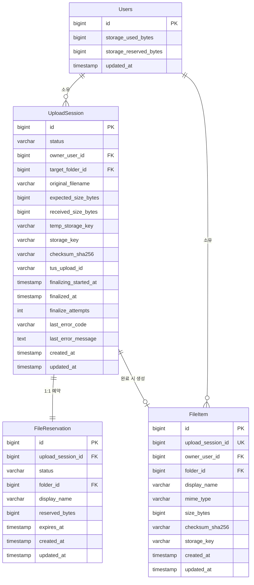

### 2.2 UploadSession 상태 머신

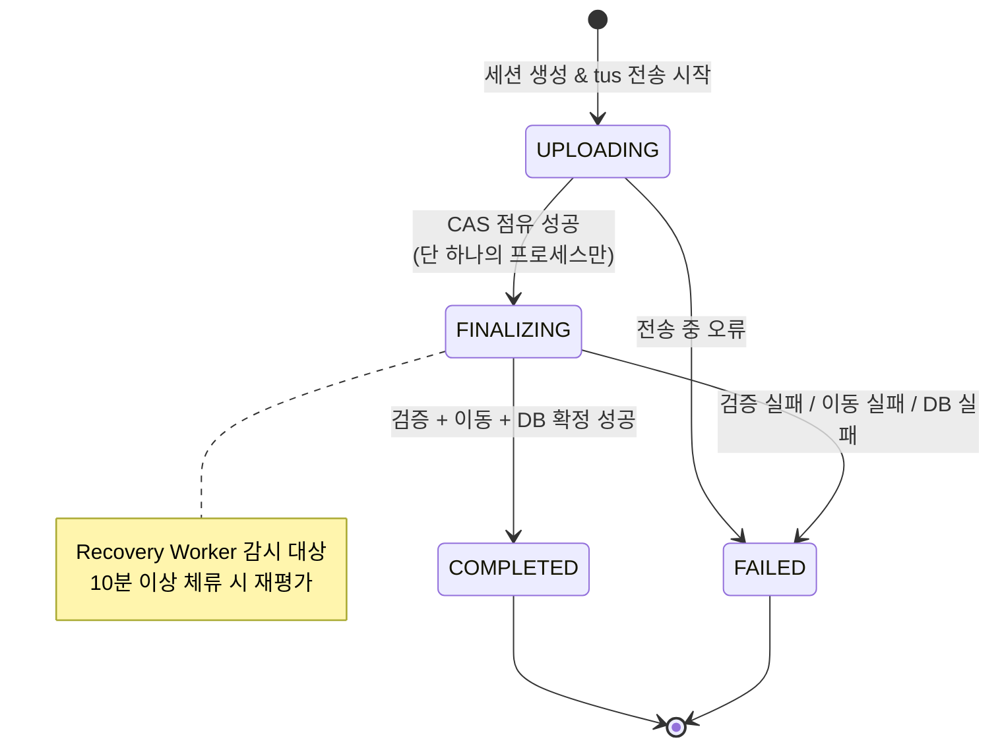

### 2.3 FileReservation 상태 머신

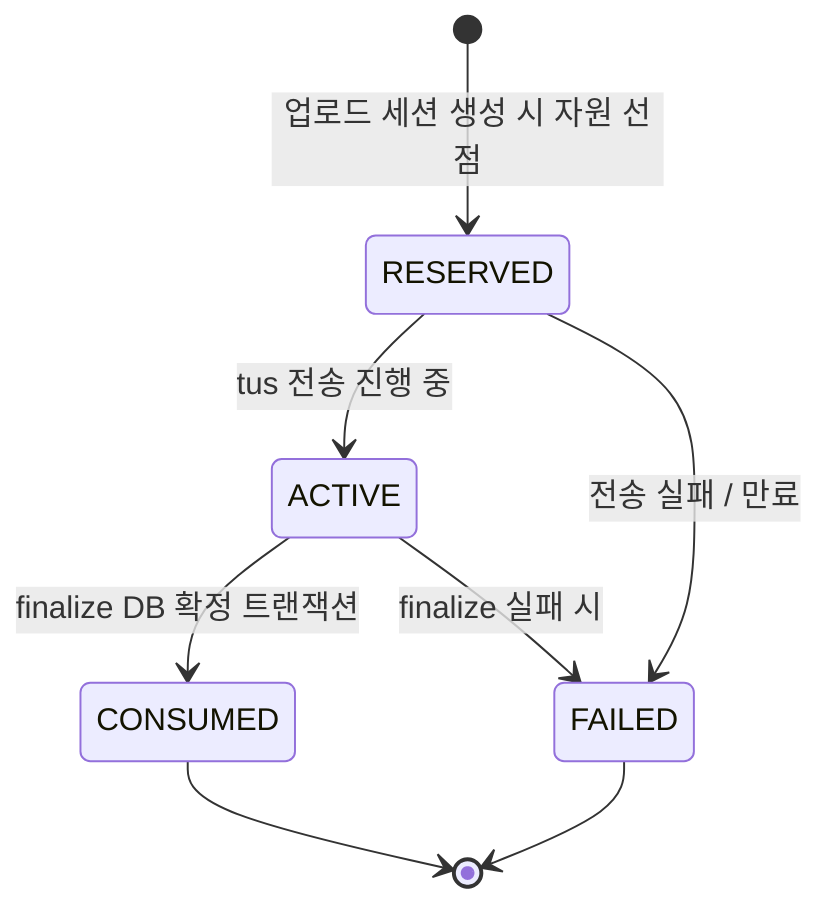

---

## 3. Finalize 전체 처리 흐름

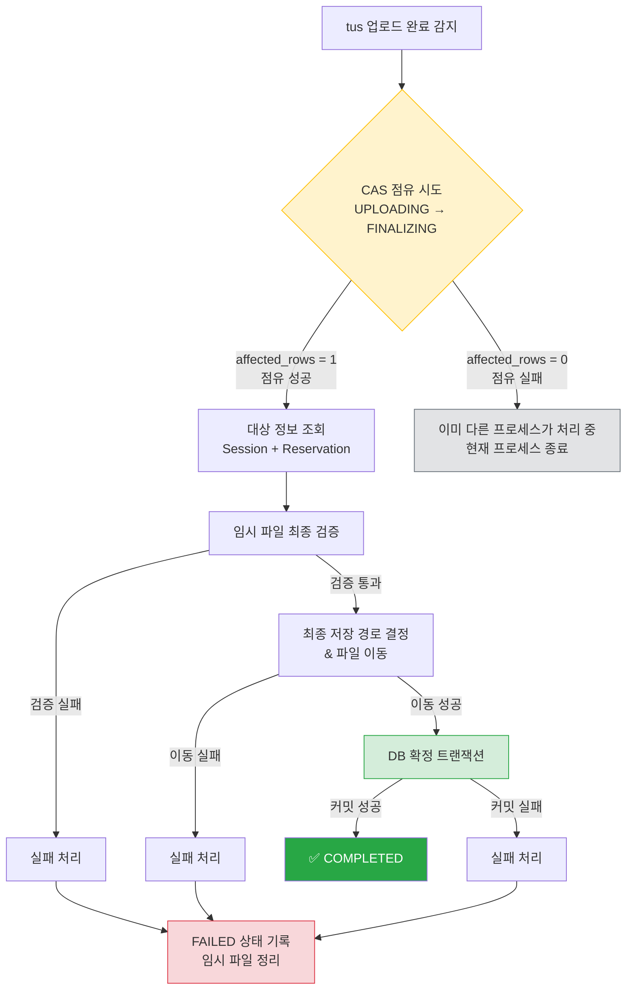

---

## 4. 시퀀스 다이어그램

### 4.1 정상 처리 흐름

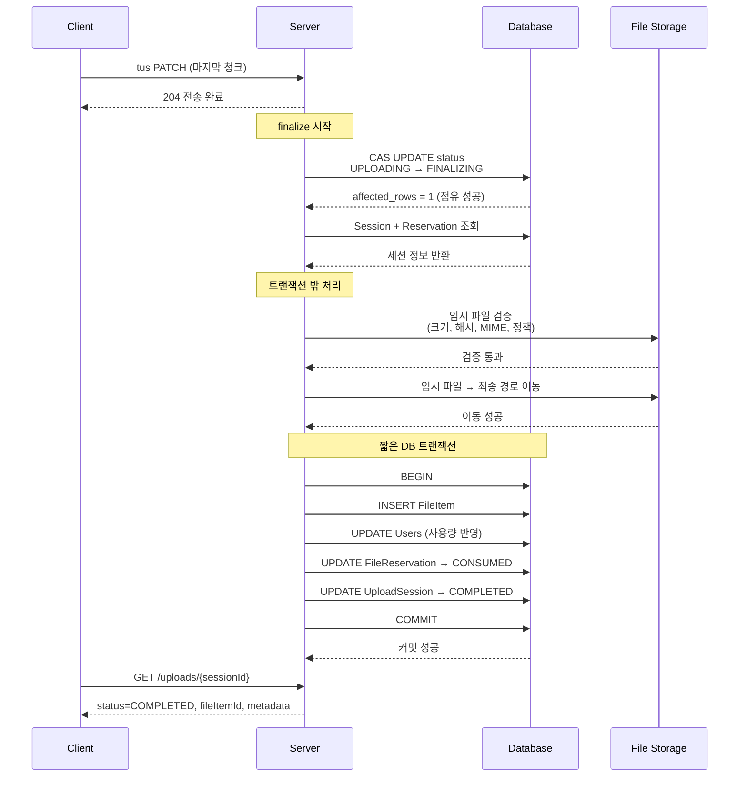

### 4.2 중복 요청 차단 흐름

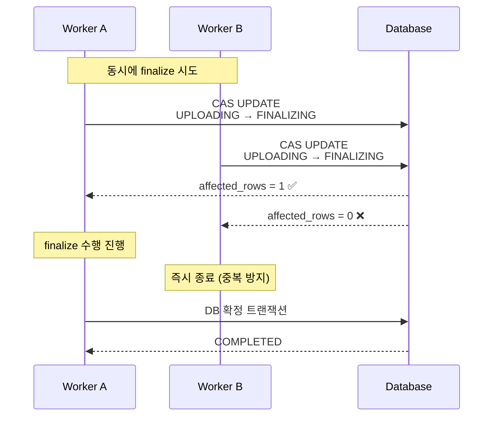

---

## 5. 단계별 상세

### 5.1 CAS 점유 (Step 1)

```sql
UPDATE upload_session
SET    status               = 'FINALIZING',
       finalizing_started_at = now(),
       finalize_attempts     = finalize_attempts + 1,
       updated_at            = now()
WHERE  id     = :session_id
  AND  status = 'UPLOADING';
-- affected_rows = 1 → 점유 성공
-- affected_rows = 0 → 점유 실패 (이미 처리 중)
```

### 5.2 임시 파일 최종 검증 (Step 2)

| 검증 항목 | 설명 | 실패 코드 |
|-----------|------|-----------|
| 파일 존재 여부 | 임시 경로에 파일이 실제로 있는지 | `FILE_NOT_FOUND` |
| 크기 일치 | `received_size == expected_size` | `SIZE_MISMATCH` |
| 체크섬 | SHA-256 해시 비교 | `CHECKSUM_MISMATCH` |
| MIME 판별 | 서버 기준 magic bytes 검사 | `MIME_BLOCKED` |
| Quota 최종 확인 | 사용량 + 파일 크기 ≤ 한도 | `QUOTA_EXCEEDED` |
| 위험 파일 정책 | 확장자·내용 기반 차단 규칙 | `POLICY_VIOLATION` |

### 5.3 파일 이동 (Step 3) — 트랜잭션 밖


### 5.4 DB 확정 트랜잭션 (Step 4)

```sql
BEGIN;

-- 1) FileItem 생성
INSERT INTO file_item (
    upload_session_id, owner_user_id, folder_id,
    display_name, mime_type, size_bytes,
    checksum_sha256, storage_key, created_at, updated_at
) VALUES (
    :session_id, :owner_user_id, :target_folder_id,
    :display_name, :mime_type, :size_bytes,
    :checksum_sha256, :storage_key, now(), now()
);

-- 2) 사용량 반영
UPDATE users
SET    storage_used_bytes     = storage_used_bytes + :size_bytes,
       storage_reserved_bytes = storage_reserved_bytes - :size_bytes,
       updated_at             = now()
WHERE  id = :owner_user_id;

-- 3) 예약 소비
UPDATE file_reservation
SET    status = 'CONSUMED', updated_at = now()
WHERE  id = :reservation_id AND status = 'ACTIVE';

-- 4) 세션 완료
UPDATE upload_session
SET    status          = 'COMPLETED',
       finalized_at    = now(),
       storage_key     = :storage_key,
       checksum_sha256 = :checksum_sha256,
       updated_at      = now()
WHERE  id = :session_id AND status = 'FINALIZING';

COMMIT;
```

> **`file_item.upload_session_id`에 UNIQUE 제약**을 걸어
> 동일 세션에서 FileItem이 2개 생성되는 것을 DB 레벨에서 차단한다.

---

## 6. 실패 처리

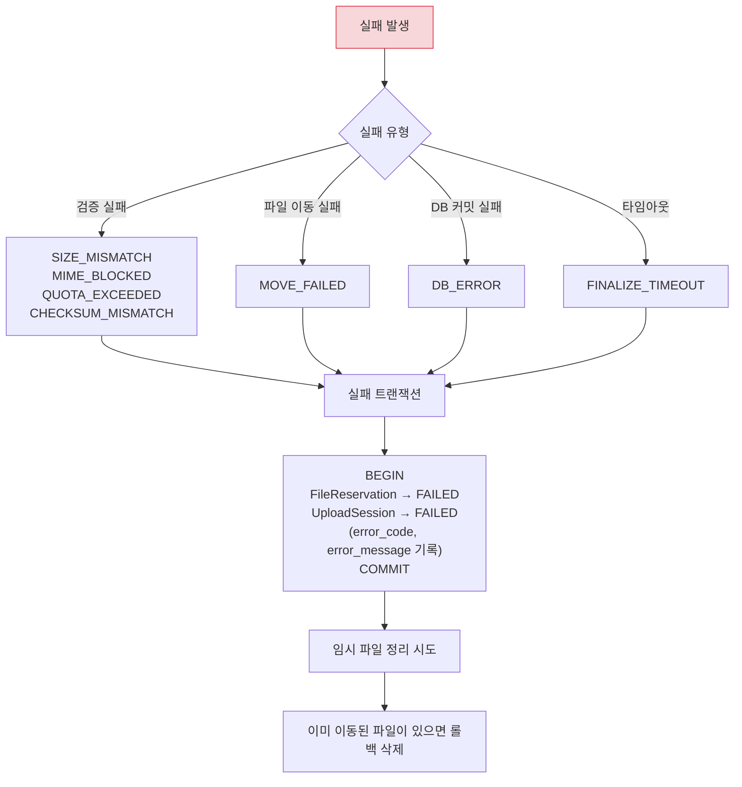

```sql
BEGIN;

UPDATE file_reservation
SET    status = 'FAILED', updated_at = now()
WHERE  id = :reservation_id
  AND  status IN ('ACTIVE', 'RESERVED');

UPDATE upload_session
SET    status             = 'FAILED',
       last_error_code    = :error_code,
       last_error_message = :error_message,
       updated_at         = now()
WHERE  id = :session_id AND status = 'FINALIZING';

COMMIT;
```

---

## 7. Recovery Worker

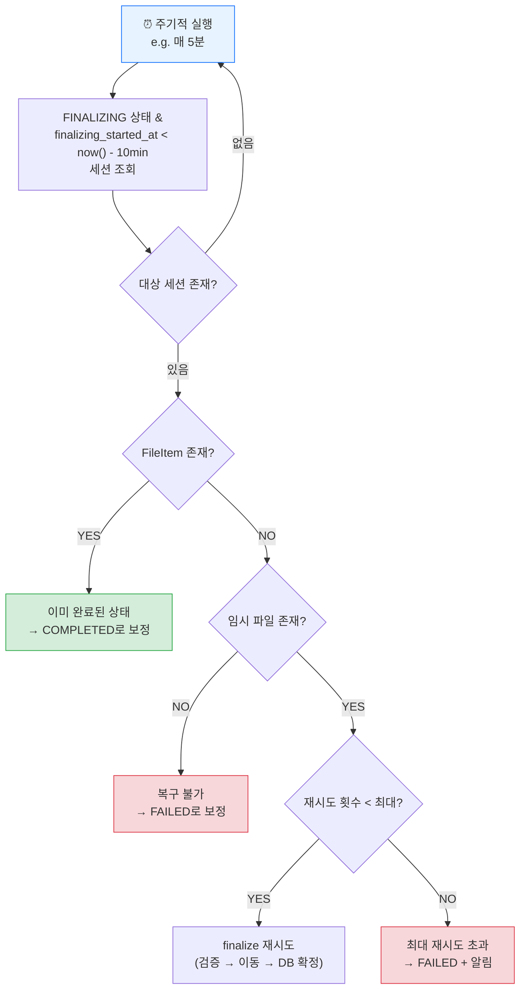

```sql
-- Recovery 대상 조회
SELECT id, finalize_attempts
FROM   upload_session
WHERE  status = 'FINALIZING'
  AND  finalizing_started_at < now() - interval '10 minutes'
ORDER BY finalizing_started_at
LIMIT  100;
```

| 판단 조건 | 조치 |
|-----------|------|
| `FileItem` 이미 존재 | → `COMPLETED`로 보정 |
| 임시 파일도 최종 파일도 없음 | → `FAILED`로 보정 |
| 임시 파일 존재 & 재시도 가능 | → finalize 재시도 |
| 최대 재시도 초과 | → `FAILED` + 운영 알림 |

---

## 8. 클라이언트 응답 설계

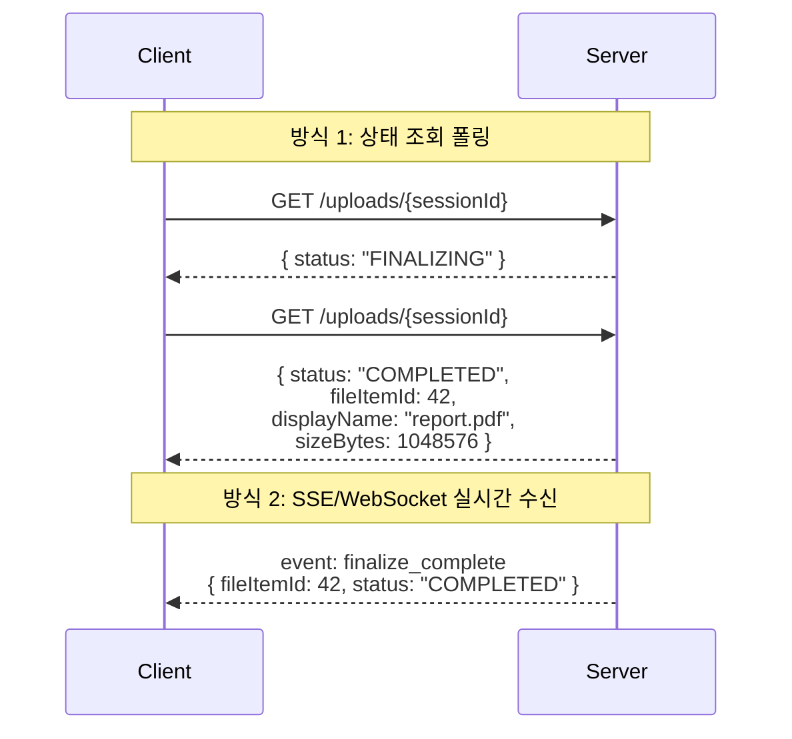

**상태 조회 응답 구조**

```json
{
  "sessionId": "abc-123",
  "status": "COMPLETED",
  "fileItem": {
    "id": 42,
    "displayName": "report.pdf",
    "mimeType": "application/pdf",
    "sizeBytes": 1048576,
    "storageKey": "files/2024/01/abc123.pdf",
    "createdAt": "2024-01-15T10:30:00Z"
  },
  "error": null,
  "postProcessing": {
    "thumbnail": "PENDING",
    "virusScan": "IN_PROGRESS"
  }
}
```

---

## 9. 설계 장점 요약

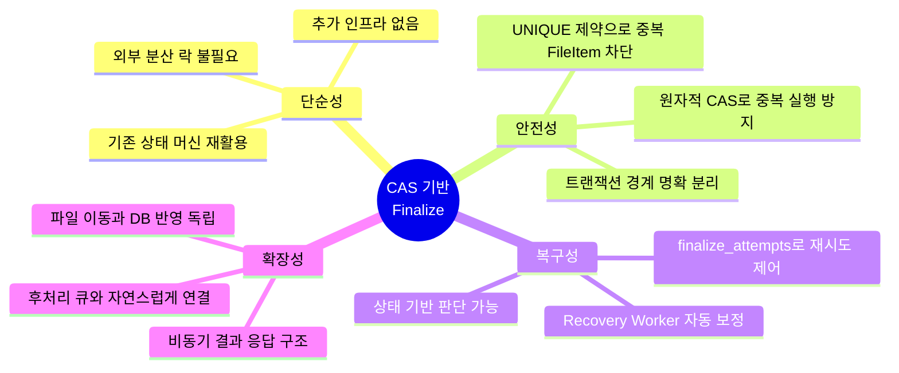

| 항목 | 설명 |
|------|------|
| **기존 구조 정합성** | `UploadSession` 상태 머신을 그대로 실행 제어로 활용 |
| **장시간 락 회피** | 파일 이동 같은 느린 I/O 중에도 DB 락을 잡지 않음 |
| **트랜잭션 경계 분리** | 파일 I/O ↔ DB 반영의 책임 영역 명확 |
| **자동 복구** | Recovery Worker로 중간 실패 상태 자동 정리 |
| **중복 방지 이중 안전장치** | CAS 상태 전이 + DB UNIQUE 제약 |

---

## 10. 한눈에 보는 전체 파이프라인

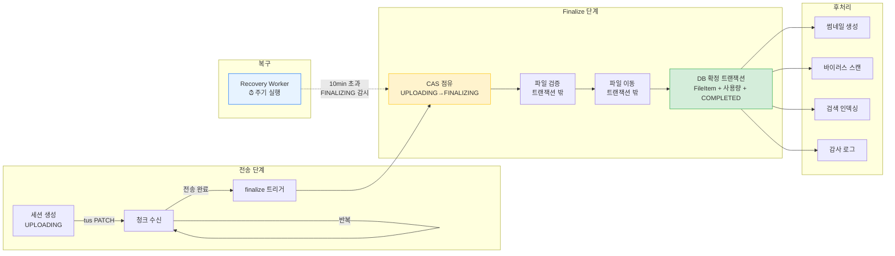
