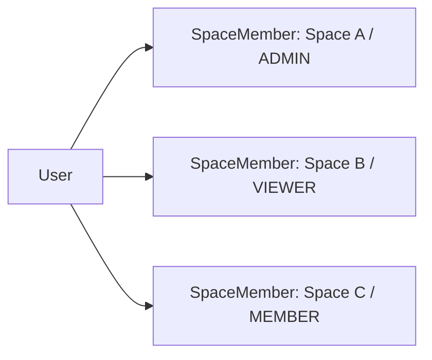
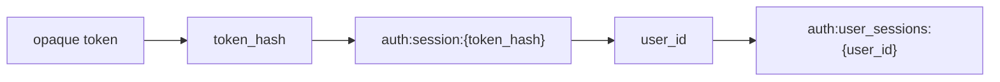
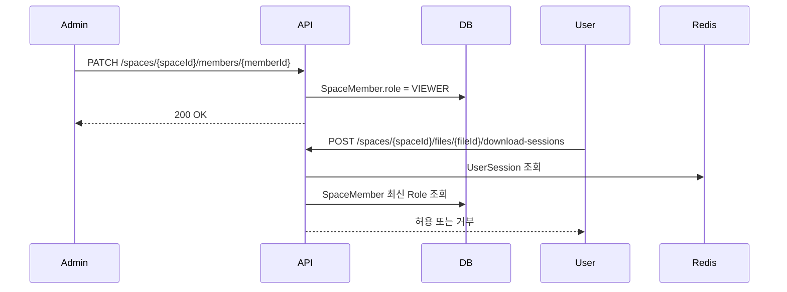
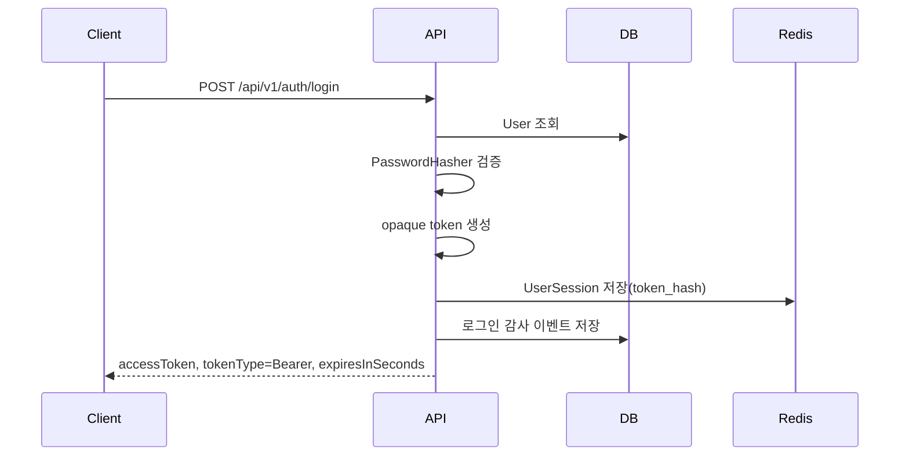

# 사용자 인증 및 인가 정책

> **문서 분류:** 보안 정책 / 사용자 인증·인가
> **상태:** 권장안
> **적용 범위:** 로그인 사용자 인증, 내부 API 인가, Space Role 기반 접근 제어

---

## 1. 결론

CloudSharp의 내부 사용자 인증은 **opaque session token 기반 Bearer 인증**을 사용한다.

```
Authorization: Bearer {opaque_session_token}
```

토큰은 사용자를 식별하기 위한 무작위 문자열이며, 권한 정보는 토큰 안에 넣지 않는다. 내부 API는 토큰으로 사용자를 인증한 뒤, 각 요청의 `spaceId`와 작업 종류에 따라 최신 `SpaceMember` 및 `Role`을 조회해 인가를 판단한다.

이 결정은 다음 프로젝트 전제에 맞춘 것이다.

| 전제 | 설계 영향 |
|---|---|
| 파일과 폴더의 실질 소유자는 `User`가 아니라 `Space`다 | 사용자의 전역 권한만으로 접근을 판단할 수 없다 |
| 권한 판단의 기본 단위는 `SpaceMember`다 | 요청마다 대상 Space 기준의 멤버십을 봐야 한다 |
| 한 사용자는 여러 Space에서 서로 다른 Role을 가질 수 있다 | 토큰 하나에 모든 권한을 고정해 담기 어렵다 |
| Space Role 변경, 멤버 제거, 정지가 즉시 반영되어야 한다 | self-contained JWT 권한 claim은 stale 권한 문제가 생긴다 |
| 다운로드 세션은 별도 단명 토큰 정책을 가진다 | 일반 로그인 세션과 다운로드 스트리밍 세션을 분리해야 한다 |

관련 내부 문서:

- [ERD 설계서](../db/ERD%20설계서.md)
- [API 명세](../API%20명세.md)
- [다운로드 세션 권한 변경·강제 revoke 정책](다운로드%20세션%20권한%20변경·강제%20revoke%20정책.md)

---

## 2. 토큰 종류 구분

CloudSharp에는 목적이 다른 토큰이 여럿 존재한다. 이 문서는 그중 **로그인 사용자 세션 토큰**을 다룬다.

| 토큰 | 용도 | 권장 형식 | 권한 변경 반영 |
|---|---|---|---|
| 사용자 세션 토큰 | 내부 API 로그인 상태 유지 | opaque random token | 다음 요청부터 즉시 반영 |
| 다운로드 세션 토큰 | 실제 파일 스트리밍 | 단명 opaque 또는 서명 토큰 | TTL 내 즉시 revoke 미지원 |
| 공유 링크 토큰 | 외부 공유 링크 접근 | opaque random token | 링크 상태 조회 시 반영 |
| 초대 토큰 | Space 초대 수락 | opaque random token | 초대 상태 조회 시 반영 |

중요한 구분은 다음과 같다.

- **사용자 세션 토큰**은 인증 상태만 표현한다.
- **Space 권한**은 토큰이 아니라 서버의 최신 DB 상태가 표현한다.
- **다운로드 세션 토큰**은 브라우저 다운로드 호환성 때문에 짧은 TTL 동안 발급 시점 권한을 허용한다.

---

## 3. 왜 opaque session token인가

### 3.1 권한 변경 즉시 반영

JWT에 Space Role을 claim으로 담으면 토큰 만료 전까지 기존 권한이 남는다.

```json
{
  "sub": "usr_123",
  "spaces": {
    "spc_10": "ADMIN",
    "spc_20": "MEMBER"
  },
  "exp": 1760000000
}
```

예를 들어 `spc_10`에서 사용자를 `ADMIN`에서 `VIEWER`로 낮춰도, 이미 발급된 JWT는 만료 전까지 `ADMIN` claim을 가진다. 이를 막으려면 매 요청마다 DB 또는 revocation/version 저장소를 확인해야 한다.

그렇게 되면 JWT의 핵심 장점인 stateless 검증 이점이 약해진다. 반면 opaque session token은 처음부터 서버 세션 상태 조회를 전제로 하므로, 권한 변경 반영과 설계 방향이 충돌하지 않는다.

### 3.2 Space별 Role 모델과의 적합성

CloudSharp의 권한은 전역 `User.role` 하나로 끝나지 않는다.



이 구조에서는 모든 Space Role을 토큰에 넣는 방식이 불리하다.

| 방식 | 문제 |
|---|---|
| 모든 Space Role을 JWT에 포함 | 토큰 크기 증가, 권한 변경 시 stale claim 발생 |
| 현재 Space Role만 JWT에 포함 | Space 전환마다 재발급 필요 |
| userId만 JWT에 포함 | 결국 DB에서 Space 권한을 조회해야 하므로 opaque token과 이점 차이가 작음 |

따라서 토큰은 `userId`를 찾는 키로만 사용하고, 권한은 최신 `SpaceMember`를 조회하는 편이 단순하다.

### 3.3 로그아웃과 강제 차단

사용자 세션에서는 아래 기능이 필요하다.

- 현재 기기 로그아웃
- 전체 기기 로그아웃
- 탈취 의심 세션 차단
- 계정 정지 시 즉시 차단
- 비밀번호 변경 후 기존 세션 만료

self-contained JWT는 발급 후 만료 전까지 독립적으로 유효하기 때문에 이런 기능을 구현하려면 blacklist, token version, session id 저장소가 필요하다. 이 저장소를 운영할 거라면 처음부터 `UserSession`을 진실 원천으로 두는 opaque 방식이 더 직접적이다.

### 3.4 토큰 정보 노출 최소화

일반적인 JWT payload는 암호화가 아니라 인코딩이다. 토큰을 가진 주체는 payload를 읽을 수 있다.

CloudSharp에서 JWT에 Space 목록, Role, 정책, 플랜, 권한 플래그 등을 넣으면 다음 정보가 클라이언트와 로그에 노출될 수 있다.

- 사용자가 속한 Space 식별자
- Space별 Role
- 시스템 Role
- 권한 정책 버전
- 계정 상태 힌트

opaque token은 무작위 문자열이므로 토큰 자체에서 의미 있는 정보를 얻을 수 없다.

### 3.5 ASP.NET Core 구현 적합성

ASP.NET Core는 인증과 인가를 분리한다. 인증 핸들러가 `ClaimsPrincipal`을 만들고, 인가 정책 또는 핸들러가 리소스 접근 여부를 판단한다.

CloudSharp는 이 구조에 잘 맞는다.

- 인증 핸들러: opaque token을 검증하고 `UserId`, `SystemRole`, `SessionId` claim만 생성
- 인가 핸들러: 요청의 `spaceId`와 작업 요구 권한을 기준으로 `SpaceMember` 최신 상태 조회
- 유스케이스: 권한 검증 결과를 바탕으로 비즈니스 규칙 실행

---

## 4. 인증 모델

### 4.1 인증 원칙

| 원칙 | 설명 |
|---|---|
| 세션 토큰은 opaque 값이다 | 토큰 자체에는 사용자 정보나 권한 정보를 담지 않는다 |
| 원문 토큰은 저장하지 않는다 | Redis에도 토큰 해시만 저장한다 |
| 인증은 사용자 식별까지만 담당한다 | Space 접근 가능 여부는 인가 계층에서 판단한다 |
| 세션은 서버에서 revoke 가능해야 한다 | 로그아웃, 계정 정지, 보안 사고에 즉시 대응한다 |
| 세션 수명은 idle timeout과 absolute timeout을 함께 둔다 | 장기 방치 세션과 무기한 세션을 모두 방지한다 |

### 4.2 Redis UserSession 모델

MVP에서는 `UserSession`을 **Redis에 저장**한다. Redis가 사용자 세션의 진실 원천이며, PostgreSQL에는 필요 시 로그인/로그아웃/revoke 같은 보안 이벤트를 감사 로그로만 남긴다.



권장 Redis key는 다음과 같다.

| Key | Type | 설명 |
|---|---|---|
| `auth:session:{token_hash}` | Hash | 단일 세션 본문 |
| `auth:user_sessions:{user_id}` | Set | 특정 사용자의 활성 세션 인덱스 |
| `auth:revoked_session:{token_hash}` | String | 짧은 TTL의 revoke marker, 선택 사항 |

`auth:session:{token_hash}` Hash 필드는 다음과 같다.

| 필드 | 설명 |
|---|---|
| `session_id` | 내부 세션 ID |
| `user_id` | 인증된 사용자 |
| `token_hash` | 세션 토큰 원문이 아닌 해시 |
| `status` | `ACTIVE`, `REVOKED`, `EXPIRED` |
| `created_at` | 세션 생성 시각 |
| `last_seen_at` | 마지막 사용 시각 |
| `idle_expires_at` | 미사용 만료 시각 |
| `absolute_expires_at` | 절대 만료 시각 |
| `revoked_at` | 명시적 revoke 시각 |
| `revoked_reason` | `LOGOUT`, `PASSWORD_CHANGED`, `ADMIN_REVOKED`, `ACCOUNT_DISABLED` 등 |
| `user_agent_hash` | 기기 식별 보조값 |
| `ip_address` | 감사 로그 및 이상 징후 분석용 |

Redis TTL은 `idle_expires_at`에 맞춘다. `absolute_expires_at`은 Hash 필드로 저장하고 인증 시 별도로 검사한다. Sliding renewal이 발생하면 Hash의 `last_seen_at`, `idle_expires_at`을 갱신하고 Redis key TTL도 함께 연장한다.

사용자 단위 revoke를 위해 `auth:user_sessions:{user_id}` Set에 활성 세션의 `token_hash`를 등록한다. 로그아웃, 비밀번호 재설정, 계정 정지, 관리자 강제 로그아웃 시 이 Set을 순회해 관련 세션 key를 삭제하거나 `status = REVOKED`로 갱신한다.

### 4.3 토큰 생성 규칙

| 항목 | 권장 |
|---|---|
| 엔트로피 | 최소 256-bit 이상 |
| 생성 API | `RandomNumberGenerator.GetBytes` |
| 외부 표현 | base64url 또는 유사한 URL-safe 인코딩 |
| Redis key용 해시 | HMAC-SHA-256 권장 |
| 저장 | 원문 저장 금지, `token_hash`만 저장 |
| 비교 | 상수 시간 비교 사용 |
| 로그 | 토큰 원문 기록 금지, 필요 시 앞/뒤 일부도 남기지 않는다 |

토큰 원문은 UUID를 기반으로 만들지 않는다. UUID v4를 SHA-256으로 해싱해도 원래 엔트로피가 늘어나지는 않으며, UUID v1/v7처럼 시간 또는 순서 정보가 섞일 수 있는 형식은 세션 토큰에 부적합하다. 세션 토큰은 처음부터 CSPRNG로 충분한 길이의 난수를 생성한다.

권장 생성 방식은 다음과 같다.

```text
randomBytes = RandomNumberGenerator.GetBytes(32)
accessToken = "cs_sess_" + base64url(randomBytes)
tokenHash = base64url(HMAC-SHA-256(accessToken, serverSecret))
redisKey = "auth:session:" + tokenHash
```

토큰 prefix는 아래처럼 둘 수 있다.

```text
cs_sess_{random}
```

prefix는 운영자가 토큰 종류를 구분하기 위한 힌트일 뿐이며, 보안 판단 근거로 사용하지 않는다.

ASP.NET Core 구현 예시는 다음과 같다.

```csharp
using System.Security.Cryptography;
using System.Text;
using Microsoft.AspNetCore.WebUtilities;

public sealed class SessionTokenFactory
{
    private readonly byte[] _hashSecret;

    public SessionTokenFactory(IConfiguration configuration)
    {
        var encodedSecret = configuration["Auth:SessionTokenHashSecret"]
            ?? throw new InvalidOperationException("Missing session token hash secret.");

        _hashSecret = WebEncoders.Base64UrlDecode(encodedSecret);
    }

    public string CreateToken()
    {
        var bytes = RandomNumberGenerator.GetBytes(32);
        return "cs_sess_" + WebEncoders.Base64UrlEncode(bytes);
    }

    public string ComputeTokenHash(string token)
    {
        using var hmac = new HMACSHA256(_hashSecret);
        var hash = hmac.ComputeHash(Encoding.UTF8.GetBytes(token));
        return WebEncoders.Base64UrlEncode(hash);
    }
}
```

`Auth:SessionTokenHashSecret`은 운영 환경의 secret store에서 주입한다. 소스 코드, 이미지, 문서 저장소에 고정값으로 넣지 않는다.

Redis 저장 예시는 다음과 같다.

```text
HSET auth:session:{token_hash}
  session_id {session_id}
  user_id {user_id}
  status ACTIVE
  created_at {utc}
  last_seen_at {utc}
  idle_expires_at {utc}
  absolute_expires_at {utc}

EXPIREAT auth:session:{token_hash} {idle_expires_at_epoch}
SADD auth:user_sessions:{user_id} {token_hash}
```

### 4.4 세션 수명 정책

MVP 권장값은 다음과 같다.

| 항목 | 값 | 설명 |
|---|---:|---|
| Idle timeout | 12시간 | 사용이 없으면 만료 |
| Absolute timeout | 30일 | 계속 사용해도 최대 수명 제한 |
| Remember me | 후순위 | MVP에서는 기본 세션만 둔다 |
| Sliding renewal | 허용 | idle 만료 시각만 연장하고 absolute 만료는 연장하지 않는다 |

세션 만료 판정은 다음 조건 중 하나라도 만족하면 실패다.

```text
status != ACTIVE
now >= idle_expires_at
now >= absolute_expires_at
user.status != ACTIVE
```

---

## 5. 인가 모델

### 5.1 인가 원칙

CloudSharp의 인가는 `UserSession`이 아니라 `SpaceMember`가 기준이다.

| 질문 | 판단 기준 |
|---|---|
| 이 사용자가 로그인했는가? | `UserSession` |
| 이 사용자가 이 Space에 접근할 수 있는가? | `SpaceMember.status = ACTIVE` |
| 이 사용자가 업로드할 수 있는가? | `SpaceMember.role >= MEMBER` |
| 이 사용자가 멤버를 초대할 수 있는가? | `SpaceMember.role >= ADMIN` |
| 이 사용자가 Quota를 변경할 수 있는가? | `SpaceMember.role = OWNER` |
| 시스템 관리자 API를 쓸 수 있는가? | `User.system_role = ADMIN` |

### 5.2 Role 매트릭스

| 작업 | OWNER | ADMIN | MEMBER | VIEWER |
|---|---:|---:|---:|---:|
| Space 조회 | O | O | O | O |
| 파일/폴더 목록 조회 | O | O | O | O |
| 다운로드 세션 발급 | O | O | O | O |
| 업로드 세션 생성 | O | O | O | X |
| 파일/폴더 수정 | O | O | O | X |
| 공유 링크 생성 | O | O | O | X |
| 멤버 목록 조회 | O | O | X | X |
| 멤버 초대 | O | O | X | X |
| Role 변경 | O | O | X | X |
| Quota 변경 | O | X | X | X |
| Space 삭제 | O | X | X | X |

Role 비교는 단순 숫자 비교로만 처리하지 않는다. 일부 작업은 예외 규칙이 있기 때문이다.

예외 예시:

- 마지막 `OWNER`는 제거할 수 없다.
- `ADMIN`이 `OWNER`를 강등하거나 제거할 수 없다.
- 자기 자신을 마지막 `OWNER`에서 해제할 수 없다.
- Space가 `ARCHIVED` 또는 `DELETED`이면 Role이 충분해도 쓰기 작업을 막는다.

### 5.3 권한 변경 반영 시점

사용자 세션 토큰은 권한 정보를 들고 있지 않으므로, 권한 변경은 다음 API 요청부터 반영된다.



단, 이미 발급된 다운로드 세션 토큰은 별도 정책에 따라 TTL 내 유효할 수 있다. 이 예외는 다운로드 스트리밍 호환성을 위한 것이며, 일반 API 인가 원칙과 분리한다.

---

## 6. ASP.NET Core 구현 가이드

### 6.1 구성 방향

ASP.NET Core에서는 커스텀 인증 스킴을 등록한다.

```csharp
builder.Services
    .AddAuthentication("CloudSharpSession")
    .AddScheme<AuthenticationSchemeOptions, CloudSharpSessionAuthenticationHandler>(
        "CloudSharpSession",
        options => { });

builder.Services.AddAuthorization(options =>
{
    options.AddPolicy("AuthenticatedUser", policy =>
    {
        policy.RequireAuthenticatedUser();
    });
});

var app = builder.Build();

app.UseAuthentication();
app.UseAuthorization();
```

Minimal API 또는 endpoint group에서는 기본적으로 인증을 요구한다.

```csharp
var api = app.MapGroup("/api/v1")
    .RequireAuthorization("AuthenticatedUser");
```

로그인, 회원가입, 외부 공유 API는 명시적으로 익명 접근을 허용한다.

```csharp
app.MapPost("/api/v1/auth/login", Login).AllowAnonymous();
app.MapPost("/api/v1/auth/register", Register).AllowAnonymous();
app.MapGroup("/public/v1").AllowAnonymous();
```

### 6.2 AuthenticationHandler 책임

`CloudSharpSessionAuthenticationHandler`는 다음 책임만 가진다.

1. `Authorization` 헤더 존재 여부 확인
2. `Bearer` 형식 확인
3. opaque token 해시 계산
4. Redis `UserSession` 조회
5. 세션 상태와 만료 확인
6. DB의 사용자 상태 및 전역 `system_role` 확인
7. 최소 claim만 담은 `ClaimsPrincipal` 생성

인증 핸들러에서 Space 권한을 판단하지 않는다. 인증 핸들러는 현재 요청이 어떤 Space 자원을 다루는지 모를 수 있고, Space 권한 판단은 리소스 기반 인가에 가깝기 때문이다.

세션은 Redis에 있지만, `User.status`와 `User.system_role`은 사용자 테이블의 최신 값을 기준으로 판단한다. 계정 정지나 전역 관리자 권한 변경이 즉시 반영되어야 하기 때문이다. 필요 시 사용자 상태만 짧게 캐시할 수 있으나, 계정 상태 변경 시 반드시 무효화해야 한다.

생성할 claim은 최소화한다.

| Claim | 설명 |
|---|---|
| `sub` | 사용자 ID |
| `sid` | 세션 ID |
| `system_role` | 전역 관리자 여부 |

넣지 않는 claim:

- Space 목록
- Space별 Role
- 파일 접근 권한
- Quota 권한
- 공유 링크 권한

### 6.3 인증 핸들러 예시

```csharp
public sealed class CloudSharpSessionAuthenticationHandler
    : AuthenticationHandler<AuthenticationSchemeOptions>
{
    private readonly IUserSessionStore _sessions;

    public CloudSharpSessionAuthenticationHandler(
        IOptionsMonitor<AuthenticationSchemeOptions> options,
        ILoggerFactory logger,
        UrlEncoder encoder,
        IUserSessionStore sessions)
        : base(options, logger, encoder)
    {
        _sessions = sessions;
    }

    protected override async Task<AuthenticateResult> HandleAuthenticateAsync()
    {
        var header = Request.Headers.Authorization.ToString();

        if (string.IsNullOrWhiteSpace(header))
            return AuthenticateResult.NoResult();

        if (!header.StartsWith("Bearer ", StringComparison.OrdinalIgnoreCase))
            return AuthenticateResult.Fail("Invalid authorization scheme.");

        var rawToken = header["Bearer ".Length..].Trim();
        if (string.IsNullOrWhiteSpace(rawToken))
            return AuthenticateResult.Fail("Missing session token.");

        var session = await _sessions.FindActiveSessionAsync(
            rawToken,
            Context.RequestAborted);

        if (session is null)
            return AuthenticateResult.Fail("Invalid or expired session.");

        var claims = new[]
        {
            new Claim(ClaimTypes.NameIdentifier, session.UserId.ToString()),
            new Claim("sub", session.UserId.ToString()),
            new Claim("sid", session.Id.ToString()),
            new Claim("system_role", session.SystemRole.ToString())
        };

        var identity = new ClaimsIdentity(claims, Scheme.Name);
        var principal = new ClaimsPrincipal(identity);
        var ticket = new AuthenticationTicket(principal, Scheme.Name);

        return AuthenticateResult.Success(ticket);
    }
}
```

### 6.4 Space 권한 서비스

인가 판단은 별도 서비스로 둔다.

```csharp
public interface ISpacePermissionService
{
    Task<bool> HasPermissionAsync(
        long userId,
        long spaceId,
        SpacePermission permission,
        CancellationToken cancellationToken);
}
```

권한 서비스는 다음을 확인한다.

1. `Space.status = ACTIVE`
2. `SpaceMember.user_id = userId`
3. `SpaceMember.space_id = spaceId`
4. `SpaceMember.status = ACTIVE`
5. 요청 작업에 필요한 Role 충족
6. 작업별 예외 규칙 충족

권한 enum 예시:

```csharp
public enum SpacePermission
{
    ViewSpace,
    ReadFiles,
    DownloadFile,
    UploadFile,
    ModifyFile,
    CreateShareLink,
    ViewMembers,
    InviteMember,
    ChangeMemberRole,
    ChangeQuota,
    DeleteSpace
}
```

### 6.5 AuthorizationHandler 적용

고정된 전역 권한은 ASP.NET Core policy로 처리할 수 있다. 하지만 `spaceId`가 필요한 권한은 endpoint filter, resource-based authorization, 또는 유스케이스 내부 권한 서비스 호출 중 하나로 처리한다.

MVP에서는 다음 방식을 권장한다.

| 계층 | 책임 |
|---|---|
| AuthenticationHandler | 사용자 인증 |
| Endpoint / Filter | `spaceId`, `fileId`, `folderId` 같은 라우트 값 추출 |
| UseCase | 대상 리소스 로드 및 Space 소속 검증 |
| PermissionService | 최신 SpaceMember 기반 권한 판단 |

Minimal API filter 예시:

```csharp
public sealed class RequireSpacePermissionFilter : IEndpointFilter
{
    private readonly SpacePermission _permission;

    public RequireSpacePermissionFilter(SpacePermission permission)
    {
        _permission = permission;
    }

    public async ValueTask<object?> InvokeAsync(
        EndpointFilterInvocationContext context,
        EndpointFilterDelegate next)
    {
        var http = context.HttpContext;
        var userId = http.User.GetUserId();
        var spaceId = http.Request.RouteValues.GetSpaceId();

        var permissions = http.RequestServices
            .GetRequiredService<ISpacePermissionService>();

        var allowed = await permissions.HasPermissionAsync(
            userId,
            spaceId,
            _permission,
            http.RequestAborted);

        if (!allowed)
            return Results.Forbid();

        return await next(context);
    }
}
```

파일과 폴더처럼 `fileId`, `folderId`가 함께 들어오는 API는 유스케이스에서 리소스를 조회한 뒤 `resource.space_id == route.spaceId`를 검증해야 한다. 라우트의 `spaceId`만 믿고 파일 접근을 허용하면 안 된다.

### 6.6 로그인 흐름



로그인 응답 예시:

```json
{
  "accessToken": "cs_sess_...",
  "tokenType": "Bearer",
  "expiresInSeconds": 43200,
  "user": {
    "id": "usr_123",
    "email": "user@example.com",
    "displayName": "User",
    "systemRole": "USER"
  }
}
```

필드명은 기존 `AuthResponse.accessToken`을 유지해도 된다. 단, 의미는 JWT가 아니라 opaque session token이다.

### 6.7 로그아웃 흐름

현재 세션 로그아웃:

```text
POST /api/v1/auth/logout
Authorization: Bearer {sessionToken}
```

처리:

1. 토큰 인증
2. Redis에서 현재 `token_hash`의 `auth:session:{token_hash}` 삭제 또는 `status = REVOKED` 갱신
3. `auth:user_sessions:{user_id}` Set에서 현재 세션 제거
4. 이후 같은 토큰은 인증 실패

전체 기기 로그아웃은 후속 API로 분리한다.

```text
POST /api/v1/auth/logout-all
```

처리:

- Redis의 `auth:user_sessions:{user_id}` Set을 기준으로 모든 활성 세션 revoke
- 현재 요청 세션도 포함

### 6.8 비밀번호 변경 및 계정 정지

비밀번호 변경 시 정책:

| 상황 | 처리 |
|---|---|
| 사용자가 직접 비밀번호 변경 | 현재 세션을 제외한 모든 세션 revoke 권장 |
| 비밀번호 재설정 | 모든 세션 revoke |
| 관리자 계정 정지 | 모든 세션 즉시 인증 실패 |
| 계정 삭제 또는 비활성화 | 모든 세션 즉시 인증 실패 |

세션을 직접 모두 업데이트하지 않아도, 인증 핸들러가 매번 `User.status`를 확인하면 계정 정지는 즉시 반영된다. 다만 감사와 관리 편의를 위해 Redis의 활성 세션도 `REVOKED`로 정리하거나 삭제하는 것을 권장한다.

---

## 7. Redis 및 캐시 전략

### 7.1 세션 저장소

MVP에서는 사용자 세션을 Redis에 저장한다. Redis는 세션 캐시가 아니라 세션의 primary store다.

| 항목 | 권장 |
|---|---|
| session key | `auth:session:{token_hash}` |
| user index key | `auth:user_sessions:{user_id}` |
| value | `session_id`, `user_id`, `created_at`, `last_seen_at`, `idle_expires_at`, `absolute_expires_at`, `status` |
| TTL | `idle_expires_at`까지 |
| revoke 시 | session key 삭제 또는 `status = REVOKED`, user index에서 제거 |
| 감사 이력 | PostgreSQL audit log에 이벤트성으로 저장 |

로그아웃과 관리자 revoke는 Redis에 즉시 반영되어야 한다. PostgreSQL audit log 저장이 실패하더라도 세션 revoke 자체가 실패해서는 안 된다. 단, 감사 로그 실패는 운영 경고로 남긴다.

### 7.2 Space 권한 캐시

Space 권한은 자주 바뀌지 않을 수 있지만, 변경 즉시 반영 요구가 있으므로 캐시 사용에 주의한다.

권장 우선순위:

1. MVP: 매 요청 DB 조회
2. 필요 시: `(userId, spaceId)` 권한 캐시
3. Role 변경/멤버 제거/Space 상태 변경 시 해당 캐시 즉시 삭제
4. 더 커지면 `membership_version` 또는 `space_permission_version` 도입

권한 캐시 TTL만으로 stale 권한을 방치하지 않는다.

---

## 8. 보안 운영 규칙

### 8.1 필수 보안 규칙

| 항목 | 규칙 |
|---|---|
| HTTPS | 운영 환경에서는 HTTPS 필수 |
| 토큰 저장 | 원문 저장 금지 |
| 토큰 로그 | access log, error log, audit log에 원문 기록 금지 |
| CORS | 허용 origin을 명시한다 |
| Rate limit | 로그인, 토큰 검증 실패, 공유 링크 검증에 적용 |
| Password hashing | ASP.NET Core Identity `PasswordHasher<TUser>` 또는 동등 수준 사용 |
| Audit log | 로그인 성공/실패, 로그아웃, 세션 revoke, Role 변경 기록 |
| Error response | 인증 실패와 인가 실패를 구분하되 외부 공개 API는 정보 노출을 마스킹한다 |

### 8.2 HTTP 상태 코드

| 상황 | 응답 |
|---|---|
| 인증 토큰 없음 | `401 Unauthorized` |
| 인증 토큰 위조 또는 만료 | `401 Unauthorized` |
| 로그인은 됐지만 내부 API 권한 없음 | `403 Forbidden` |
| 외부 공개 API에서 권한 없음 또는 리소스 없음 | `404 Not Found` |
| Space 내부 리소스가 없거나 접근 불가 마스킹 필요 | API별 정책에 따라 `404` 가능 |

### 8.3 Rate limiting

ASP.NET Core rate limiting middleware를 사용할 경우 `AddRateLimiter`와 `UseRateLimiter`를 함께 구성한다.

적용 대상:

- `/api/v1/auth/login`
- `/api/v1/auth/register`
- `/api/v1/auth/password-reset*`
- `/public/v1/share-links/{shareToken}/verify`
- 인증 실패가 반복되는 IP 또는 계정

---

## 9. API 문서 표현 기준

API 문서와 설계 문서에서는 사용자 인증 방식을 아래 표현으로 통일한다.

| 지양 표현 | 표준 표현 |
|---|---|
| `Authorization: Bearer {JWT}` | `Authorization: Bearer {opaque_session_token}` |
| `JWT 발급` | `사용자 세션 토큰 발급` |
| `bearerFormat: JWT` | `bearerFormat: opaque` 또는 생략 |
| `인증 토큰` | 문맥에 따라 `사용자 세션 토큰`으로 명확화 |

OpenAPI의 security scheme은 아래처럼 둔다.

```yaml
components:
  securitySchemes:
    bearerAuth:
      type: http
      scheme: bearer
      bearerFormat: opaque
```

---

## 10. 구현 체크리스트

### 인증

- [ ] Redis `auth:session:{token_hash}` key schema 정의
- [ ] Redis `auth:user_sessions:{user_id}` 인덱스 정의
- [ ] opaque token 생성기 구현
- [ ] token hash 저장 방식 확정
- [ ] `CloudSharpSessionAuthenticationHandler` 구현
- [ ] 로그인 성공 시 Redis에 `UserSession` 저장
- [ ] 로그아웃 시 현재 Redis 세션 revoke
- [ ] 계정 정지 시 모든 세션 차단
- [ ] 비밀번호 재설정 시 모든 세션 revoke

### 인가

- [ ] `SpacePermission` enum 정의
- [ ] Role별 permission 매핑 정의
- [ ] `ISpacePermissionService` 구현
- [ ] Space 상태와 SpaceMember 상태를 함께 검증
- [ ] 마지막 Owner 보호 규칙 구현
- [ ] 파일/폴더 API에서 리소스의 `space_id` 검증
- [ ] 다운로드 세션 발급 시 최신 권한 검증

### 운영

- [ ] 토큰 원문 로그 마스킹
- [ ] 로그인 rate limit 적용
- [ ] 인증 실패 audit log 기록
- [ ] Role 변경 audit log 기록
- [ ] Redis 만료 세션 인덱스 정리 배치 추가
- [ ] API/OpenAPI 문서에서 사용자 인증 방식을 opaque session token으로 유지

---

## 11. 참고 자료

- [ASP.NET Core Authentication 개요](https://learn.microsoft.com/en-us/aspnet/core/security/authentication/)
- [ASP.NET Core cookie authentication](https://learn.microsoft.com/en-us/aspnet/core/security/authentication/cookie)
- [ASP.NET Core authorization policies](https://learn.microsoft.com/en-us/dotnet/architecture/microservices/secure-net-microservices-web-applications/authorization-net-microservices-web-applications)
- [ASP.NET Core rate limiting middleware 변경 사항](https://learn.microsoft.com/en-us/aspnet/core/breaking-changes/8/addratelimiter-requirement)
